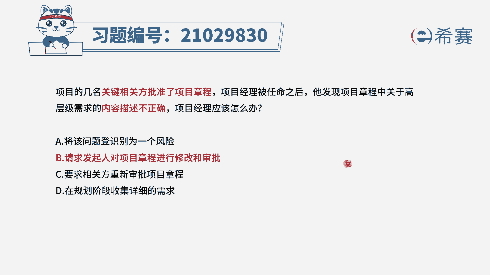
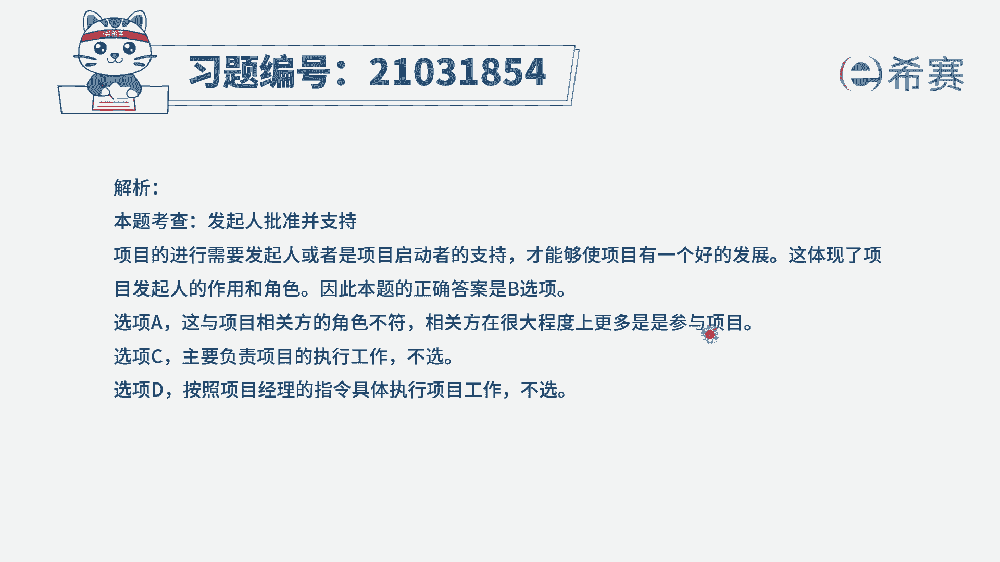
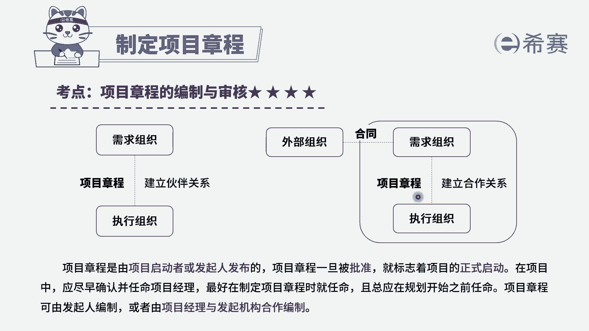

# 24年PMP模拟题-PMP付费模拟题100道免费视频新手教程-从零开始刷题 - P24：24 - 冬x溪 - BV1Fs4y137Ya

项目的几名关键相关方批准了项目章程，项目经理被任命之后，他发现项目章程中关于高层级需求的内容，描述不正确，项目经理应该怎么办，选项a将该问题登记识别为一个风险选项b，请求发起人对项目章程进行修改和审批。

选项c要求相关方重新审批项目章程，选项d在规划阶段收集详细的需求，读完题目，我们来提炼一下信息，此时是相关方批准了项目章程，项目经理在此时被任命，但是项目章程的内容不正确。

这道题很明显属于启动过程组的制定项目章程，并且是关于项目章程的审批和修改，题干的意思是，项目章程经过相关方审批，但还未经发起人批准签发的时候，出现了内容上的问题，我们回顾一下知识点。

项目章程是由项目发起人或联合项目经理编制，由管理层签发，一般是由相关方和发行的审批，谁签发的项目章程，谁才有权修改项目章程，项目经理无权进行修改，清楚了这些之后，我们再来看一下选项。

选项a将这个问题登记识别为风险，风险是未发生的，题目中的这些问题明显是已经发生，遇到风险，我们要重点判断是未来可能发生还是已经发生，此时项目章程虽然还未经发行人签发，但也不能把已经发生的问题识别为风险。

因此a选项排除选项b请求发起人修改审批，这是符合题意的，不管项目章程是否有问题，项目经理都是需要提交给发起人进行审批，因此b选项正确，再来看一下剩下的选项，选项c重新审批是不合适的。

因为相关方已经审批过了，重新审批这个错误的内容还是没法更改，因为只有发起人才有权限更改项目章程，因此c选项排除选项d，现在题干是启动阶段，而且题干是需求的内容不正确，而不是不够详细。

因此收集详细的需求也不能解决题干的问题。

因此d选项也不符合题意解析。

在这里需要的同学可以自行查看，本题是考察项目章程的批准和修改，大家要记住谁先发谁修改，还有一个点需要注意，就是相关方审批完项目章程，并不代表项目章程就被签发。

