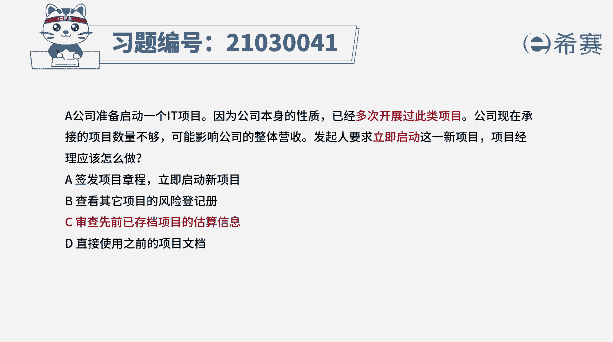
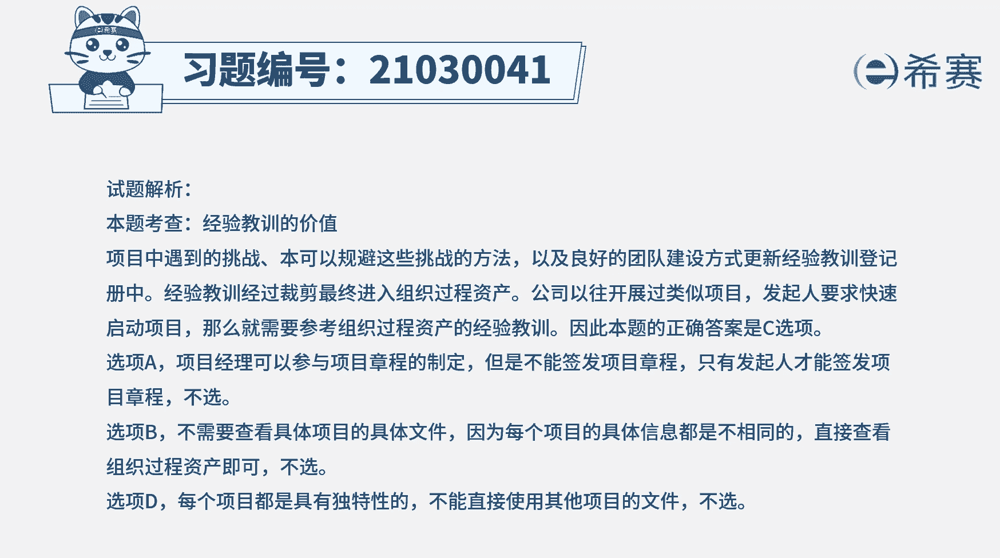
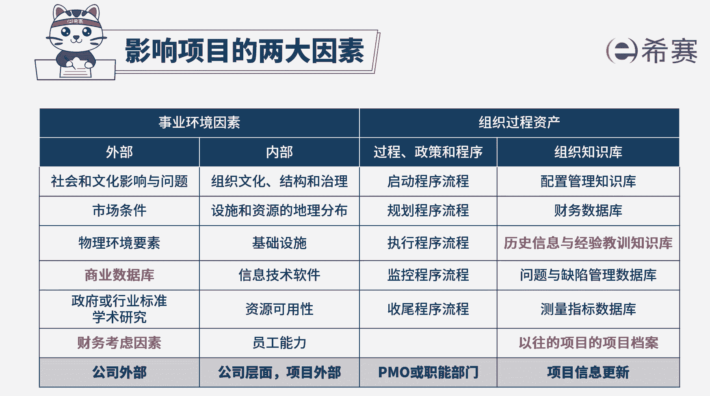

# 24年PMP模拟题-PMP付费模拟题100道免费视频新手教程-从零开始刷题 - P25：25 - 冬x溪 - BV1Fs4y137Ya

a公司准备启动一个it项目，因为公司本身的性质已经多次开展过此类项目，公司现在承接的项目数量不够，可能影响公司的整体营收，发起人要求立即启动这一新项目，项目经理应该怎么做，a签发项目章程。

立即启动新项目，b查看其他项目的风险登记册，c审查先前已存的项目的估算信息，d直接使用之前的项目文档好读完题目，我们找到题干中的关键词，公司多次开展此类项目，现在发起人要求立即启动该项目。

项目经理应该怎么做，公司多次开展过此类项目，那这些项目中遇到的挑战，采取的应对措施以及良好的团队建设方式，都会更新到经验教训登记册中，经验教训最终经过裁剪，会更新到组织过程资产中。

现在发起人要立即启动项目，可以参考过往的经验教训，以便加深对新项目的了解，所以本题的正确选项是c选项，再来看一下其他选项，选项a项目经理可以参与项目章程的制定，但他没有权利签发项目章程。

只有发起人才能签发项目章程，所以a的表述是错误的选项b项目具有独特性，项目风险登记册，重的风险是根据项目的特点一一识别出来的，每个项目的具体信息都是不同的，所以无需查看具体某个项目的具体文件。

直接查看组织过程资产就可以了，选项d项目具有独特性，过往类似项目的经验教训只是参考或借鉴，不能直接使用之前其他项目的文件。

代替本项目的文件，所以d选项也不正确，好了，我们此题先讲解到这里，大家可以自行参考一下相关的文字解析。

整个题目讲解下来，我们可以知道本题考察的知识点就是经验。

