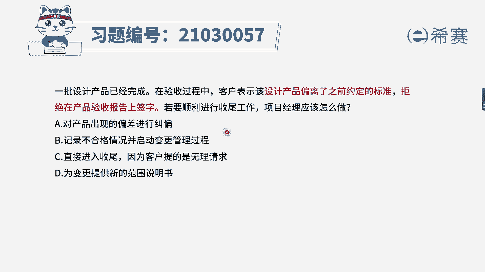
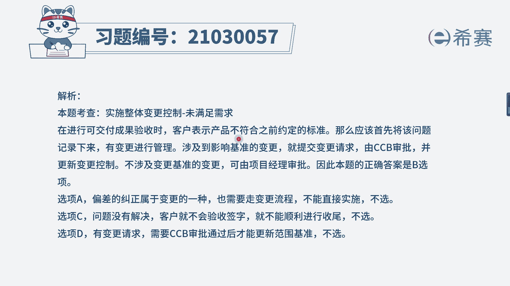
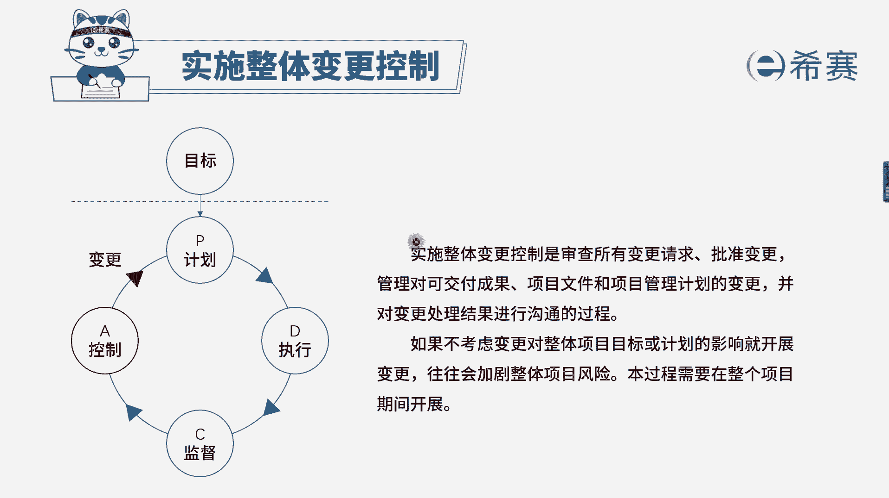

# 24年PMP模拟题-PMP付费模拟题100道免费视频新手教程-从零开始刷题 - P29：29 - 冬x溪 - BV1Fs4y137Ya

一批设计产品已经完成，在验收过程中，客户表示该设计产品偏离了之前约定的标准，拒绝在产品验收报告上签字，若要顺利地进行收尾工作，项目经理应该怎么做，选项a对产品出现了偏差进行纠偏，选项b记录部合格情况。

并启动变更管理过程，选项c直接进入收尾，因为客户提的是无理请求，选项d微变更提供新的范围说明书，好，我们来看一下现在是不是在验收过程中，客户拒绝在验收报告上签字，说明验收还没有完成，他拒绝的理由是说。

你的产品偏离了之前约定的一个标准，提纲问的是，如果你要顺利的进行收尾，要顺利收尾，是不是首先要获得客户的验收，你要获得他的验收，你肯定要对这个产品去进行一个纠正，而看一下几个选项。

首先要排除的就是cd选项，c选项是直接不管他的需求了，肯定是不合适的，d选项为变更提供新的范围说明书，项目经理他是无权直接去修改范围说明书，或者在执行阶段再去做一个新的范围说明书的。

因此cd选项都是错误的，而剩下ab选项，a选项对产品出现了偏差进行纠偏，看上去好像没有什么大问题，但是产品结果出现问题，我们应该进行缺陷补救，并且应该走变更流程，所以对比b选项记录不合格情况。

并启动变更管理过程，这是一个解决方案，并且是遵循的流程的一个解决方案，对比下来，b选项会更加的合适。

大家可以看一下文字解析部分。

