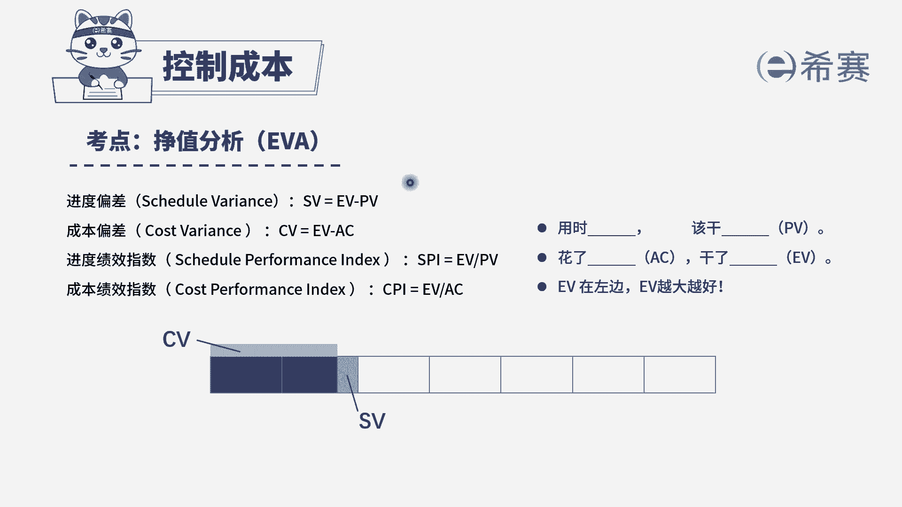

# 24年PMP模拟题-PMP付费模拟题100道免费视频新手教程-从零开始刷题 - P31：31 - 冬x溪 - BV1Fs4y137Ya

项目经理负责一家公司改装办公楼的项目，该项目的预算为160万美元，客户要求在八个月内完成，在项目开始四个月后，高级管理层视察项目工作，需要知道项目当前的情况，项目经理得知当前已经花费90万美元。

完成了40%的工作，以下对成本绩效指数，cpi和进度状态描述哪一项是正确的，四个选项，分别给出了不同的成本绩效指数和进度情况，那么我们一起来看一下，我们如果要知道成本的绩效指数和进度状态。

需要知道三个数据分别是计划价值，pv正值ev以及实际成本ac我们来看一下，首先是pv指的是计划价值，计划价值是指我们原计划准备花多少钱，这个项目是不是预算是160万，要求八个月内完成。

现在是已经开始四个月，相当于是做到了一半，那么一半的计划价值是不是160万，除以2=800000，再来看ev，ev是指的实际做了多少东西，题干说实际完成了40%的工作。

因此政治ev是等于1600000x40%，等于64万，ac是指实际花了多少钱，实际成本等于90万美元，题干已经给出来了，那么知道三个数据之后就很好计算了，我们来算一下cpi，cpi是成本绩效指数。

它是用e v比上a c用实际做了多少东西，比上我们实际花了多少钱，发现等于0。71，因此排除cd选项，再来看进度，进度的话，我们已经知道了计划价值和正值，可以利用spi或者s v计算。

这里我们使用spi的话，就是用e v比上pv，用我们实际做了多少东西，比上计划价值等于0。8。

知道了spr是0。8之后，我们来看一下如何判断s p i以一为基准，如果等于一，说明它和基准是保持一致的，如果小于一，说明进度落后，因此在剩余的两个选项中，b选项是符合的，我们选择b选项。

大家可以看一下文字解析。

本题考察的是政治分析中。

