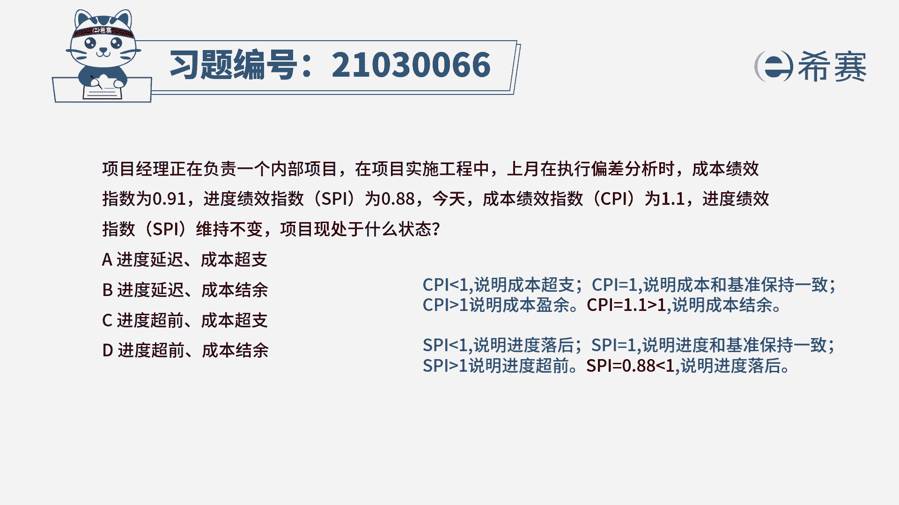

# 24年PMP模拟题-PMP付费模拟题100道免费视频新手教程-从零开始刷题 - P32：32 - 冬x溪 - BV1Fs4y137Ya

项目经理正在负责一个内部项目，在项目实施工程中，上月在执行偏差分析时，成本绩效指数为0。9，一进度绩效指数pi为0。88，今天成本绩效指数cpi为1。1，进度绩效指数s p i维持不变。

项目现处于什么样的状态，a进度延迟，成本超支，b进度延迟，成本结余，成本超支，第一进度超前成本结余，首先我们看到题干的关键词，上月执行偏差分析时，成本绩效指数为0。9，一季度绩效指数s p i为0。

88，目前项目的成本绩效指数cpi为1。1，进度绩效指数和上月的进度绩效指数是一样的，那么说明现在的精度绩效指数也是为0。88，题目问的是项目现在的状态是什么，因此不需要再考虑之前的项目绩效数据。

直接从目前的绩效指数来判断，项目的状态是如何的，由成本绩效指数公式我们可以得知，当cpi小于一时，说明项目成本和基准相比是超支的，当cpi等于一时，说明项目成本和基准保持一致，当cpi大于一时。

说明项目成本和基准相比是盈余的，根据题干cpi等于1。1大于一，那么说明项目成本跟基准相比就是结余的，同理我们有进度绩效指数公式可以得知，当spi小于一时，说明项目进度跟基准相比是落后的。

当spi等于一时，说明项目进度和基准保持一致，当spi大于一时，说明项目进度与基准相比是超前的，根据题干spi等于0。88小于一，说明项目进度与基准相比就是落后的。

因此本题的正确答案就是b选项。

进度延迟成本结余，本题的考察点是成本管理，控制成本政治分析的内容，政治分析可以将实际进度和成本，绩效与绩效测量基准进行比较。

