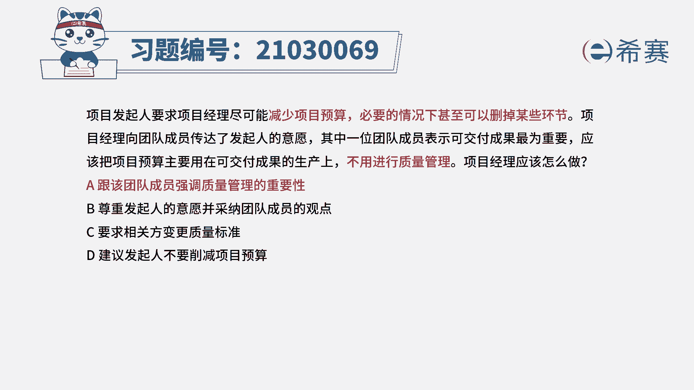
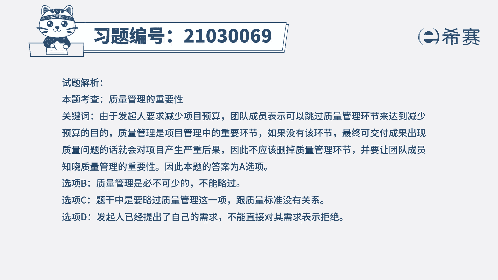
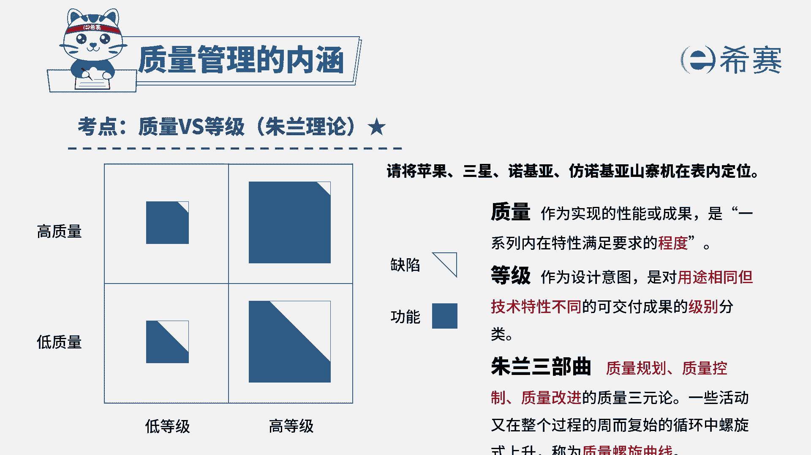

# 24年PMP模拟题-PMP付费模拟题100道免费视频新手教程-从零开始刷题 - P33：33 - 冬x溪 - BV1Fs4y137Ya

项目发起人要求项目经理尽可能减少项目预算，必要的情况下，甚至可以删掉某些环节，项目经理向团队成员传达了发起人的意愿，其中一位团队成员表示，可交付成果最为重要，应该把项目预算主要用在可交付成果的生产上。

不用进行质量管理，项目经理应该怎么做，a跟该团队成员强调质量管理的重要性，b尊重发起的音乐，并采纳团队成员的观点，要求相关方变更质量标准，d建议发起人不要削减项目预算，读完题目，回答题干。

我们来看一下这道题目，它的关键词，现在发起人他已经是想要减少这个项目的预算，在必要的情况下，甚至可以删减掉某一些环节，然后就有团队成员表示了，可以不用进行质量管理的环节，问项目经理应该怎么做。

那这个地方它其实考察的是质量管理，它的一个重要性，质量管理，它其实是我们整个项目当中最重要的一个环节，如果要是没有这个环节的话，那最终的可消费成果它出现质量问题的话，这将会对项目产生非常严重的后果。

所以这个环节它是肯定不能删除的，并且我们还要让团队成员知道这个环节，它的重要性，所以这道题目正确选项是a选项，跟该团队成员强调质量管理的重要性，我们再来看一下其他的三个选项，b选项尊重发起人的意愿。

并采纳团队成员的观点，那我们刚刚都已经说了，质量管理这个环节是非常重要的，这个是整个项目当中必不可少的一个内容，它是不能够省略等选项当中，他就是已经说要采纳团队成员的观点。

所以这跟我们质量管理它必不可少，这个相矛盾，所以b选项排除，再看一下c选项，要求发起人变更质量标准，项目经理他其实是没有权利，并且他也不能够直接要求相关方去办事的。

并且质量标准它也是不能够随意进行更改的，要更改它应该要走变更流程，所以c选项排除，最后看到d选项，建议发起人不要削减项目预算，发起人他是已经提出了，要减少这个项目预算的一个需求，项目经理。

他没有办法直接拒绝这个相关方的需求，就算他要拒绝这个相关方的需求的话，他也要找出相关的证据，证明这个需求是不合理的，是不可行的，所以d选项也排除，所以这道题最佳选项是a选项。

这是这道题的文字解析，有需要的同学可以暂停看一下。

整个题目，讲解完之后，我们可以知道这道题目，它考察的知识点是质量管理的重要性。

