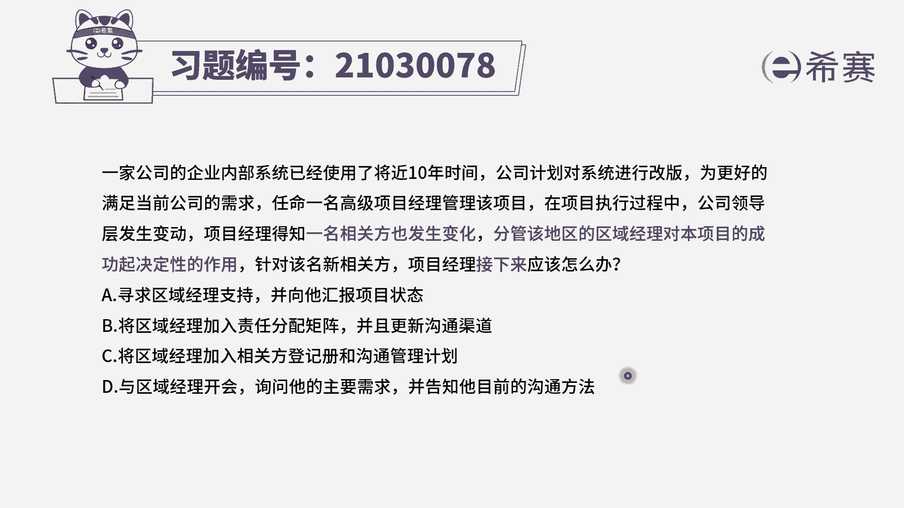
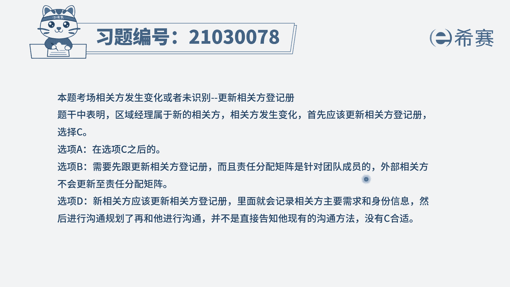
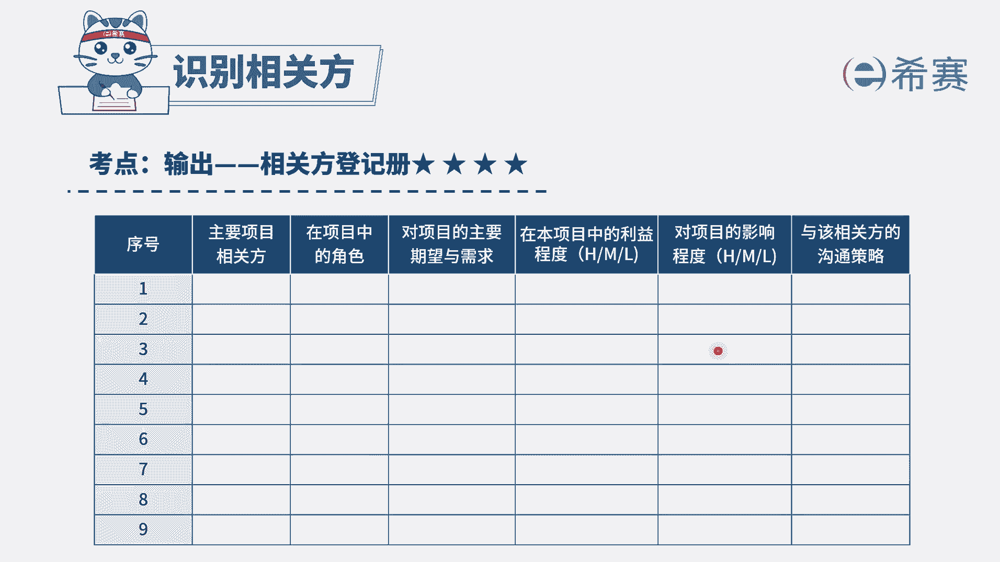

# 24年PMP模拟题-PMP付费模拟题100道免费视频新手教程-从零开始刷题 - P35：35 - 冬x溪 - BV1Fs4y137Ya

一家公司的企业内部系统，已经使用了将近10年时间，公司计划对系统进行改版，为了更好地满足当前公司的需求，任命一名高级项目经理管理该项目，在项目执行过程中，项目经理得知一名相关方也发生变化。

分管该地区的区域经理，对本项目的成功起到决定性的作用，针对该明星相关方，项目经理接下来应该怎么办，选项a寻求区域经理的支持，并向他汇报项目状态，选项b将区域经理加入责任分配，举证并更新沟通渠道，选项c。

将区域经理加入相关方登记册和沟通管理计划，选项d与区域经理开会，询问他的主要需求，并告知他目前的沟通方法，我们来看到题干题干比较长，但是其实关键点就一个，就是项目的相关方发生了变化。

你识别到了一个相关方，这个强化方，他对项目起着一个决定性的作用，问你接下来怎么办，我们看到接下来就一定要考虑选项之间的顺序，关系，一定是选择最优先的那个选项，识别的相关方。

我们最优先是不是肯定要先更新相关方登记册，所以来看一下四个选项，a选项寻求区域经理支持，并向他汇报项目的状态，这个选项本身没有错，但是他肯定是我们在更新完相关方登记册之后。

并且你是更新了沟通管理计划之后，才会去做具体的沟通，a选项它不是首先要做的，b选项，将区域经理加入责任分配举证并更新沟通渠道，前半句是错误的，责任分配举证，它是指团队成员对于工作任务的一个分配对象。

是资源，并不是相关方，c选项，将区域经理加入相关方登记册和沟通管理计划，这就是我们首先要做的识别的相关方，先要记录他的已知的信息，我们需要给它制定对应的沟通方式，好最后看一下d选项。

与区域经理开会询问他的主要需求，并告知他目前的沟通方法，这个选项其实它也是c选项之后我们要做的，因为你要先更新沟通管理计划，你才能告知他我们确定的沟通方法是什么，你需要先把它识别为相关方。

登记他已有的信息，然后再去询问他的主要需求，因此四个选项中顺序最优先的为c选项。

大家可以看一下文字解析。

本题考察的是识别到相关方后。

