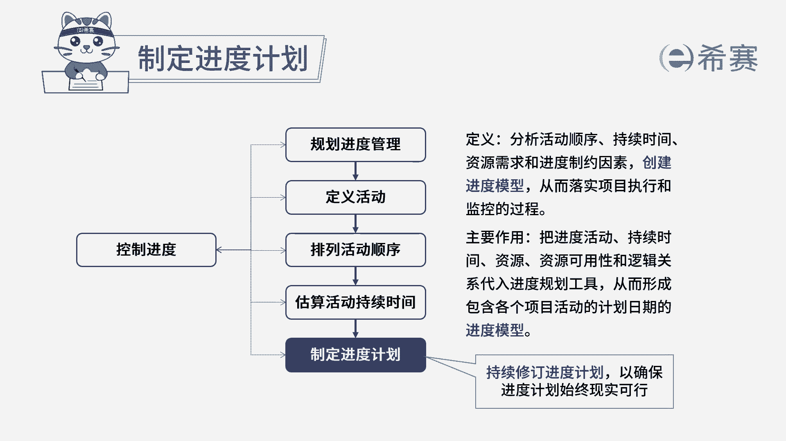

# 24年PMP模拟题-PMP付费模拟题100道免费视频新手教程-从零开始刷题 - P36：36 - 冬x溪 - BV1Fs4y137Ya

组织启动了一个软件研发项目，项目经理正在制定项目管理计划，由于项目的紧急性要求在六个月内完成项目，但项目经理通过关键路径法发现，项目要七个月的时间才能完成，项目经理应该怎么办，a请示发起人延长项目工期。

b减少项目范围，以满足工期需求，c通过倒排工期，合理安排各活动所需时间，d协调资源经理增加资源，读完题目，我们可以找到题干中的关键句，题干说，由于项目的紧急性要求在六个月内完成项目。

但是项目经理发现要在七个月的时间才能完成，问项目经理应该怎么做，我们看一下选项，首先ab选项是可以排除的，题干中已经明确了，项目不能延期，必须要在六个月内完成，而且项目经理也不可以随意去删减项目范围。

所以ab都不选，我们再看c选项，c选项说的倒排工期，就是直接从项目确定结束的时间开始，从后往前去推算活动时间，一般情况下，我们是根据时间的先后来排项目的活动时间，所以现在这里是反过来的。

所以c选项通过这种方式，也是可以去合理安排工期，因此c选项是符合的，我们再看d选项，增加资源是属于赶工的方式，用来解决进度延期的问题，要在进度计划确定之后可能才会采取的措施，所以d也不选。

因此本题最佳的答案就是c选项，本题考察的知识点是项目进度管理中。

