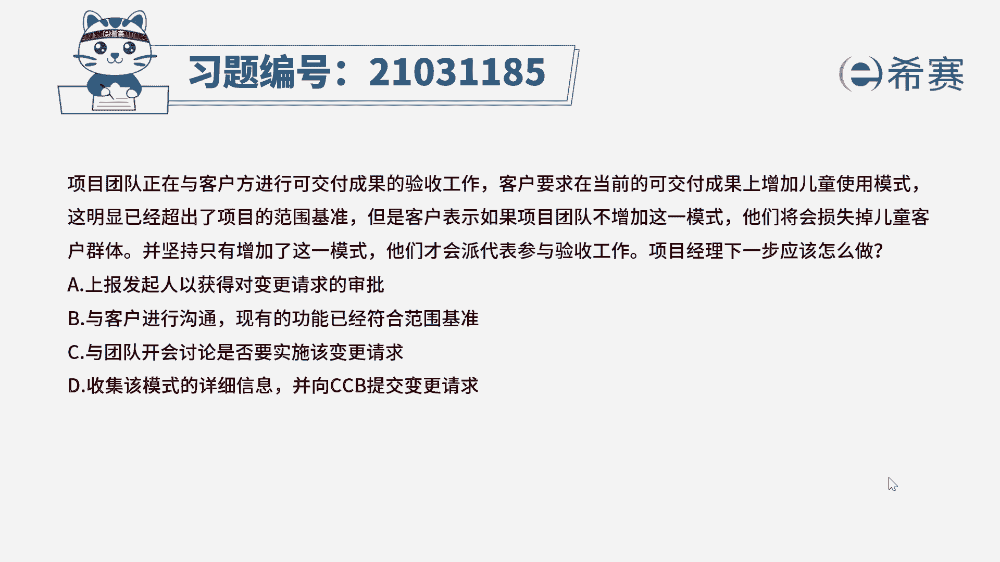
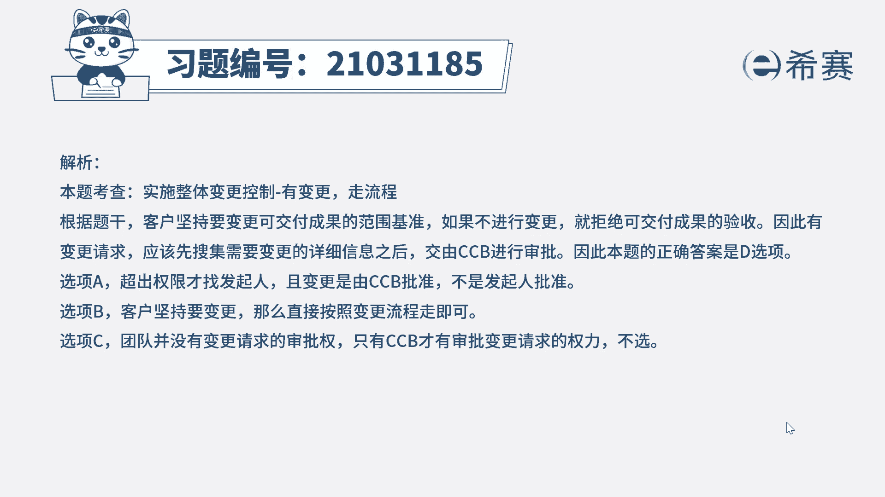
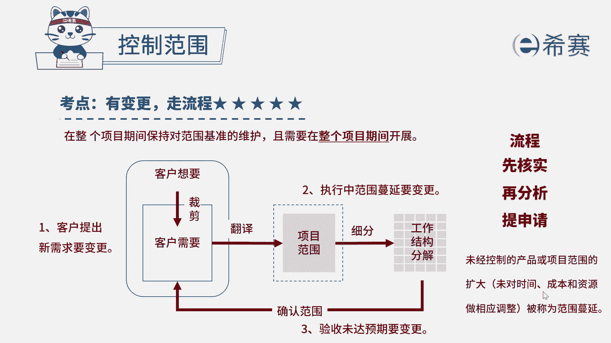

# 24年PMP模拟题-PMP付费模拟题100道免费视频新手教程-从零开始刷题 - P41：41 - 冬x溪 - BV1Fs4y137Ya

项目团队正在与客户方，进行可交付成果的验收工作，客户要求，在当前的可交付成果上增加儿童使用模式，这明显已经超出了项目的范围基准，但是客户表示，如果项目团队不增加这一模式，他们将损失掉儿童客户群体。

并坚持只有增加了这一模式，他们才会派代表参与验收工作，项目经理下一步应该做什么，a上报发起人已获得对变更请求的审批，b与客户进行沟通，现有的功能以符合范围基准，c与客户开会讨论是否要实施该变更请求。

d收集该模式的详细信息，并向c c b提交变更请求，好回到题干，我们来看一下题目的关键词，客户他当前要求增加儿童模式，他这个他已经明显的超出了项目的基准范围，但是如果他要是不增加的话。

那他们就会拒绝验收，那项目经理下一步应该怎么做呢，如果项目经理他不进行变更的话，那他们是不是就会拒绝接受验收成果，如果有变更请求的话，我们按照流程来，应该先搜集需要变更的详细信息之后。

然后再交给ccv提交审批，所以这道题正确选项是d选项，我们来分析一下其他几个选项，a选项上报发起人已获得对变更请求的审批，这项工作他其实没有超出项目经理的权利，只有在超出项目经理权力以外的。

才去寻找发起人的帮助，并且变更它是由c c b审批的，它不是由发起人审批，所以a选项我们排除，再看b选项与客户进行沟通，现有的功能已经符合范围基准，现在客户态度非常强硬，他们就是要坚持变更。

那么就直接按照变更流程走就可以了，我们不需要再去说服他，说这个已经复合方位基准了，他现在态度非常强硬，所以b选项我们也派出c选项与团队开会讨论，是否要实施该变更请求，团队他其实并没有变更请求的审批权。

他只有cc b才有这个审批变更的权利，所以c选项也排除哪，这道题最佳选项是d选项。

这是我们这道题的文字解析，有需要的同学可以暂停看一下。

那这道题考察的知识点是第五章，项目范围管理当中，控制范围里面有变更。

