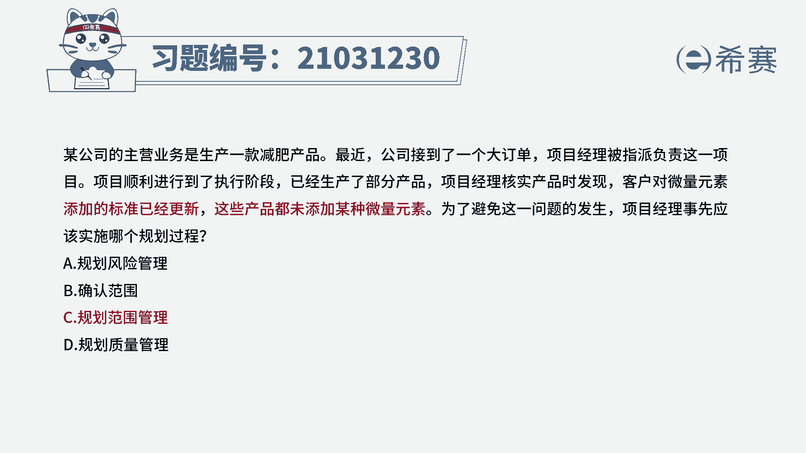
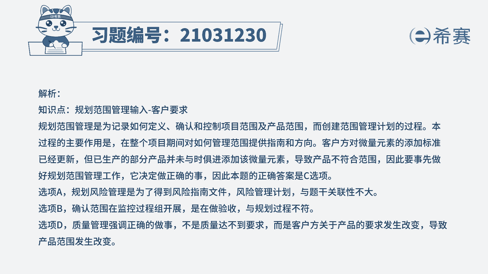
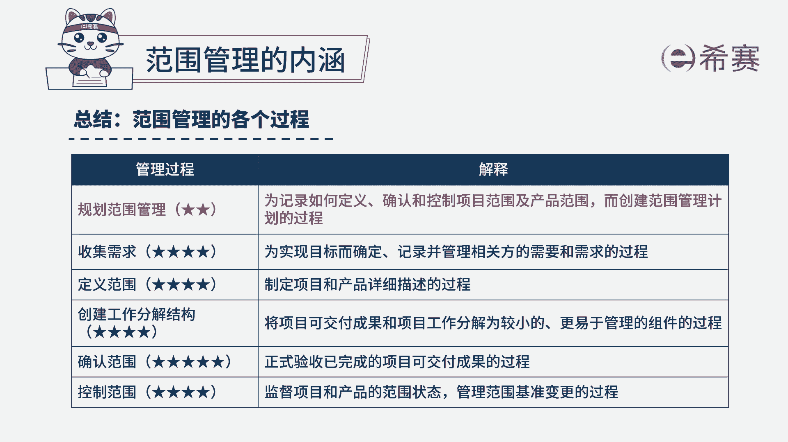

# 24年PMP模拟题-PMP付费模拟题100道免费视频新手教程-从零开始刷题 - P45：45 - 冬x溪 - BV1Fs4y137Ya

某公司的主营业务是生产一款减肥产品，最近公司接到了一个大订单，项目经理被指派负责这一项目，项目顺利进行到了执行阶段，已经生产了部分产品，项目经理核实产品时发现，客户对微量元素添加的标准已经更新。

这些产品都会添加某种微量元素，为了避免这一问题的发生，项目经理事先应该实施哪个规划过程，规划风险管理，b确认范围c规划范围管理d规划质量管理好，读完题目之后，我们发现题目比较长，但是实际上都是迷惑。

信息真实有用的，只有这两句话，客户对于微量元素的添加标准它已经更新了，但是现在生产出来的这些产品，都没有添加某种微量元素，这说明更新后的标准，项目经理知道吗，不知道，这属于产品的范围。

产品范围它是属于规划范围管理的工作，所以这道题正确选项是c选项，那我们再来分析一下其他三个选项，a选项规划风险管理是为了得到风险指南文件，风险管理计划题目出现的问题不算风险，所以无关，b选项确认范围。

确认范围是在监控过程组的时候开展，是在做验收题目，问的是规划过程，所以b也排除d选项，规划质量管理，质量管理是指管理产品达到质量标准，题目不是没有达到标准，而是因为客户关于产品的标准发生了改变。

所以才导致产品范围出现改变的，所以跟题干不符，所以我们这道题正确选项是c选项。

这道题的文字解析，有需要的同学可以暂停看一下。

好这道题目看完了之后，我们知道这道题考察的知识点是第五章里面，规划范围管理当中。

