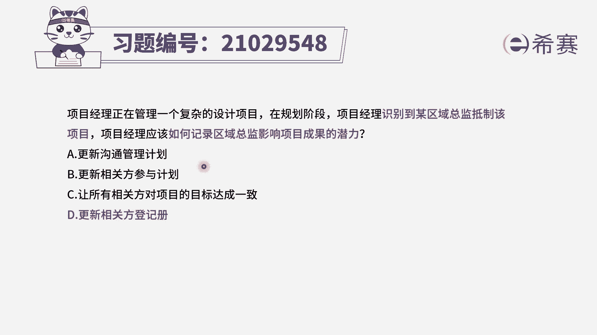
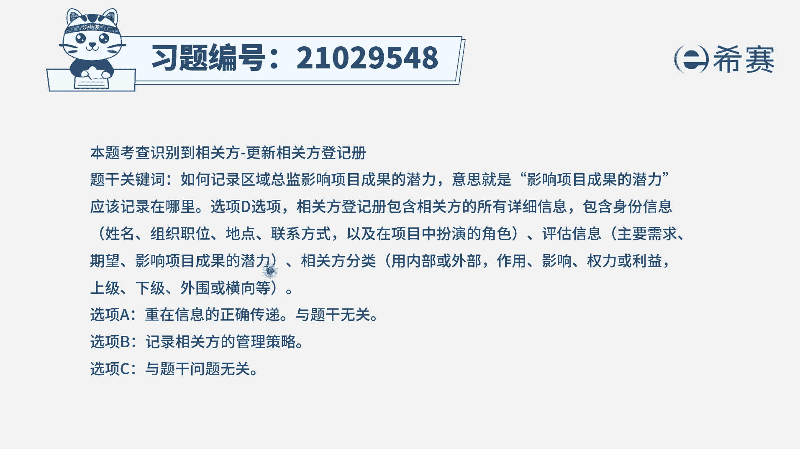
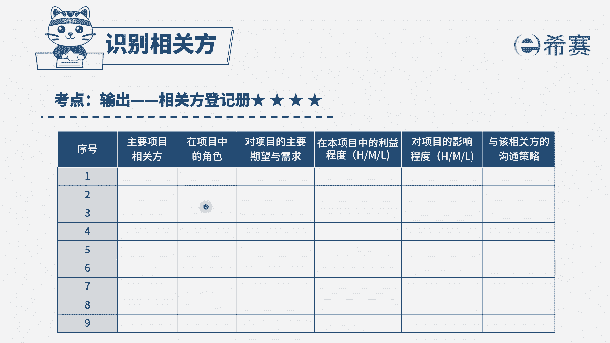

# 24年PMP模拟题-PMP付费模拟题100道免费视频新手教程-从零开始刷题 - P4：4 - 冬x溪 - BV1Fs4y137Ya

项目经理正在管理一个复杂的设计项目，在规划阶段，项目经理识别到某区域总监抵制该项目，项目经理应该如何记录，区域总监影响项目成果的潜力，选项a更新沟通管理计划选项，b更新相关方参与计划选项。

c让所有相关方对项目的目标达成一致，选项d更新相关方登记册，我们来看一下题干的问题，他问的是什么，他问的是我们应该如何记录这个区域总监，他影响项目成果的潜力，比如说他的权利职位。

会对项目造成一个什么样的影响，可能造成一个什么样的影响，那么这样的信息我们应该记录在哪里呢，首先我们是不是可以排除ac选项，a选项更新沟通管理计划，沟通管理计划，它是指的一个信息的传递。

我们为了确保信息是正确传递给正确的人，所以制定了一些沟通策略，因此a选项是不合适的，c选项让所有相关方对项目的目标达成一致，它跟题干的问题是没有关联的，而剩余的b d选项中，b选项是相关方参与计划。

d选项是相关方登记册，那么我们这个相关方，它对于项目成果影响它的一个潜力，我们应该记录在哪里，这个时候就需要大家对这两个文件，有比较细致的了解，先来看相关方参与计划，他是我们为了管理相关方。

比如说相关方不配合的时候，我们应该如何做，里面是一些管理相关方的策略，而d选项相关方登记册，他是记录了与相关方相关的所有信息，比如说他的姓名职位职权影响力等等，所以在这个题目中，他是问了你在哪里记录。

我们应该是记录在相关方登记册，选择d选项。

大家可以看一下文字解析部分，这里有说到相关方登记册，它包含的内容，比如说身份信息，姓名，职位联系方式，在项目中扮演的角色，以及他的主要需求，影响项目成果的潜力，那么这个题目考察的就是这一条。

本题考察的是相关方登记册。

