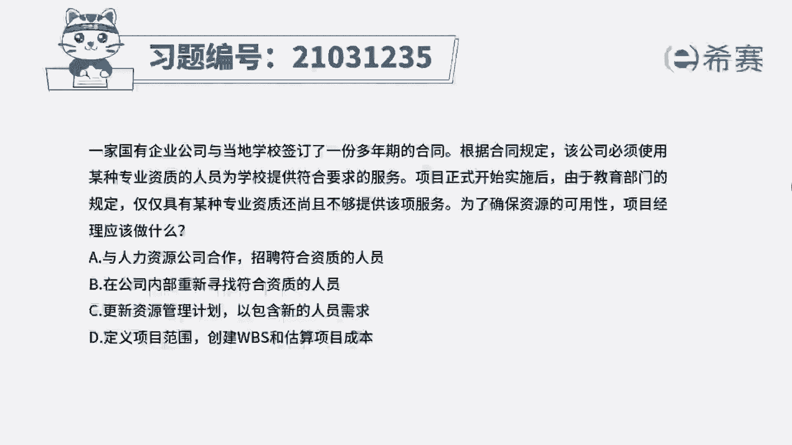
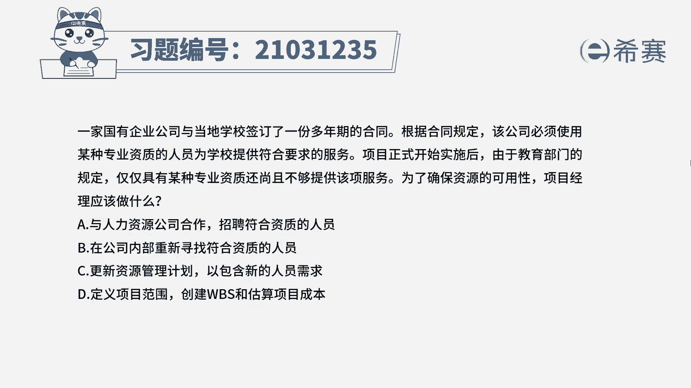

# 24年PMP模拟题-PMP付费模拟题100道免费视频新手教程-从零开始刷题 - P51：51 - 冬x溪 - BV1Fs4y137Ya

一家国有企业公司，与当地学校签订了一份多年期的合同。

根据合同规定，该公司必须使用某种专业资质的人员，为学校提供符合要求的服务，项目正式开始实施后，仅仅具有某种专业资质，还尚且不够提供该项服务，为了确保资源的可用性，项目经理应该做什么。

a与人力资源公司合作招聘符合资质的人员，b在公司内部重新寻找符合资质的人员，c更新资源管理计划，已包含新的人员需求，d定义项目范围，创建wbs和估算项目成本，读完题目，我们可以找到题干中的关键句。

题干的意思是说，以前的专业资质已经不足以支撑该项服务，为了确保资源的可用性，应该做什么，也就是说现在对于资源的要求变了，那就要对应的把最新的资源要求，更新到资源管理计划中来，确保之后的资源都符合要求。

所以c选项是符合的，我们再看一下其他选项，首先d选项是可以排除的，d选项属于规划阶段的内容，而题干中提到项目已经正式实施了，说明已经处于执行阶段了，与题干不符，所以d不选，我们再看ab选项。

a b两个选项都是属于获取资源的过程，要在更新完资源管理计划之后，才能确定以何种方式去获取资源，所以ab都不选，因此本题最佳的答案就是c选项。

本题考察的知识点是项目资源管理中。

