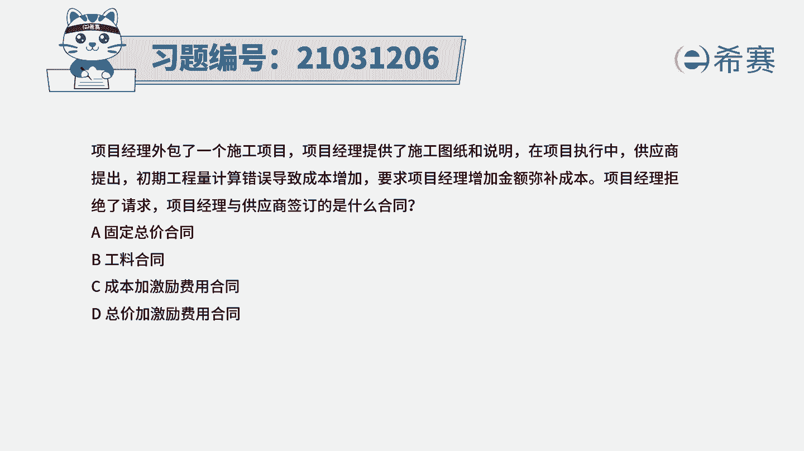
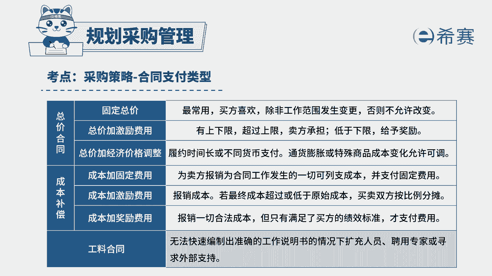

# 24年PMP模拟题-PMP付费模拟题100道免费视频新手教程-从零开始刷题 - P57：57 - 冬x溪 - BV1Fs4y137Ya

项目经理外包了一个施工项目，项目经理提供了施工图纸和说明，在项目执行中，供应商提出初期工程量计算错误导致成本增加，要求项目经理增加金额弥补成本，项目经理拒绝了，请求项目经理与供应商签订的是什么合同。

固定总价合同，b公链合同c成本加激励费用，合同总价加激励费用合同，读完题目，回答题干，我们来找一下这道题目，它的关键词是什么，因为现在计算错误导致成本增加了，那供应商他就要求项目经理来增加金额。

可以弥补成本，但是项目经理他拒绝了他的这个请求，我这是属于什么类型的合同，供应商，他提出增加成本的请求，项目经理他可以拒绝，那说明这个价格它是一开始就已经定好了的，并且后面他也没有发生变动。

而符合这种支付方式的，那就是我们的固定总价类的合同，固定总价类的合同，它的采购价格在一开始就已经被明确了，并且它不允许发生改变，除非你的工作范围发生了变更，所以如果要是因为你的合同没有履行好。

而导致任何成本的增加，那它都有卖方来承担，所以这道题最佳选项是a选项，固定总价合同，再看一下其他三个选项，b选项，工料合同，工料合同它是根据卖方在合同执行的过程当中。

实际的提供了多少的产品数量来计算总价的，在这个合同当中，他的买方要承担成本风险，工作量多少，就要按照他的做了多少来支付费用，所以工程量它增加成本的这个金额的增加，它的买方是不会拒绝的。

所以跟我们题干描述的是不相符，因为公立合同它相当于就是做多少就付多少，你用了多少材料就给多少钱，大家看到c选项，成本加激励费用合同，这种合同他会因为我们卖方而履行合同，产生的一系列的合法成本。

他都会进行报销，他不会拒绝我们供应商的这个要求，所以c选项也可以排除，再看看d选项，总价加激励费用，合同总价加激励费用，这个合同他也会在一开始设置一个总价，但是它会允许有一定的绩效偏差。

只要你的工作量没有超过价格的上限，然后超额完成的部分的这个技巧，也会给予一定的激励费用，所以他也不会直接拒绝我们供应商的这个请求，所以d选项跟我们的题干也不太相符。

所以也可以排除这是这道题的文字解析，有需要的同学可以暂停看一下，整个题目讲解下来，我们就可以知道这道题目。

