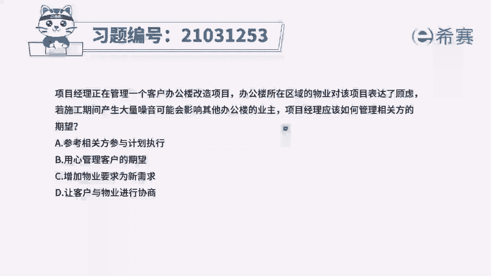
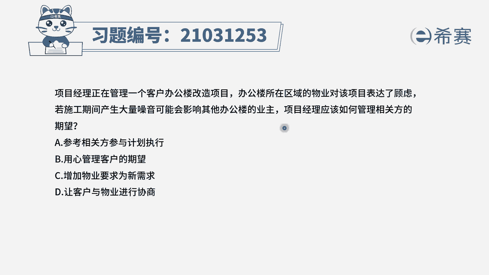
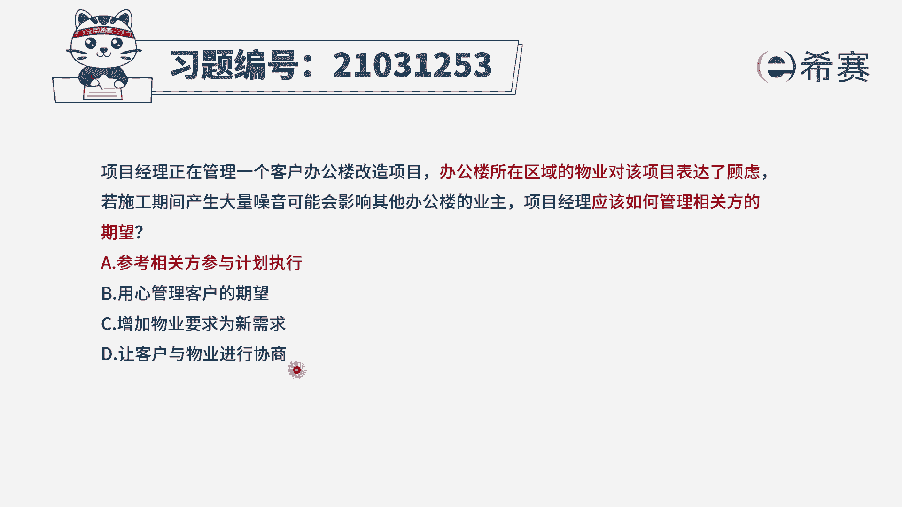
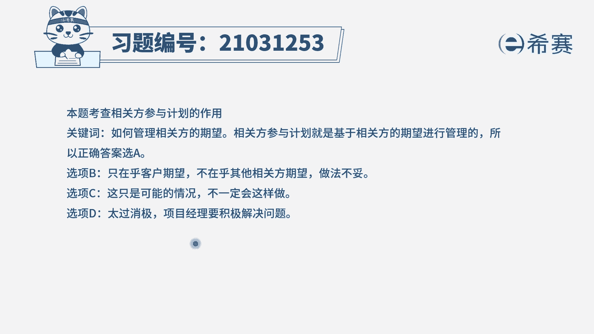

# 24年PMP模拟题-PMP付费模拟题100道免费视频新手教程-从零开始刷题 - P59：58 - 冬x溪 - BV1Fs4y137Ya

项目经理正在管理一个客户办公楼改造项目，办公楼所在区域的物业对该项目表达了顾虑。

若施工期间产生大量噪音，可能会影响到其他办公楼的业主，项目经理应该如何管理相关方的期望，选项a参考相关方参与计划执行选项b，用心管理客户的期望选项c，增加物业要求为新需求，选项d让客户与物业进行协商。

我们首先来看现在是不是，办公楼所在区域的物业，也就是相关方，他表达了对项目的一个顾虑，现在问的是如何管理相关方的期望，我们管理相关方是参照上一过程组的输出，也就是规划相关方。

管理是参照的相关方参与计划来执行的，相关方参与计划中，包含了相关的一些管理策略方法，因此a选项是正确的，再来看一下其他几个选项，b选项用心管理客户的期望，第一点是过于片面了，因为现在明明是物业。

他提出了一个顾虑，但是你b选项的对象是客户，其次这个用心管理它是没有章法依据的，再来看c选项，增加物业的要求为新需求，相当于直接接受了物业的一个需求，这只是一个可能的做法，我们管理相关方。

肯定要分析相关方各方面的信息，比如说权利利益地位期望等等，然后再做下一步动作，如果确定有新的需求要增加，也要通过变更流程来进行一个变更，所以c选项直接添加肯定是不合适的。

最后d选项让客户和物业进行一个协商，那么在考试中，重选项我们肯定是不会优先选的，因为它体现不出项目经理积极主动解决问题。

所以这一题选择a选项，大家可以看一下文字解析。

