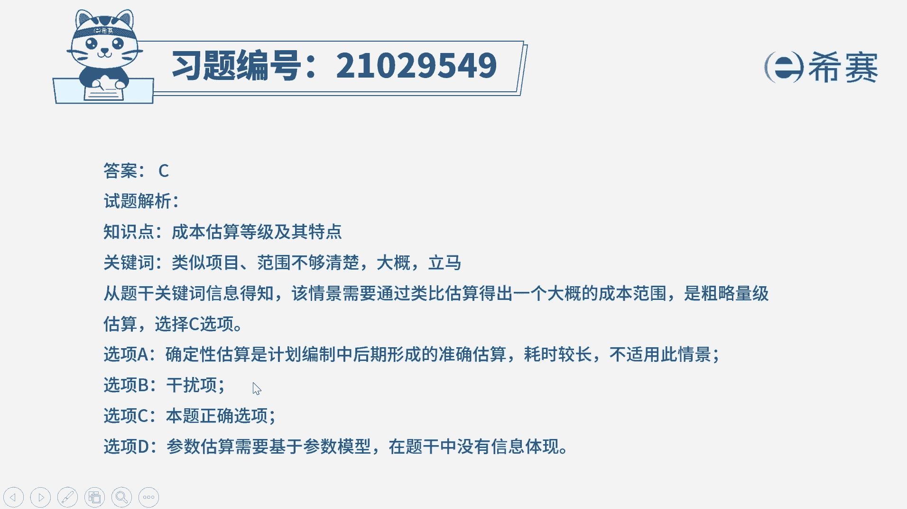
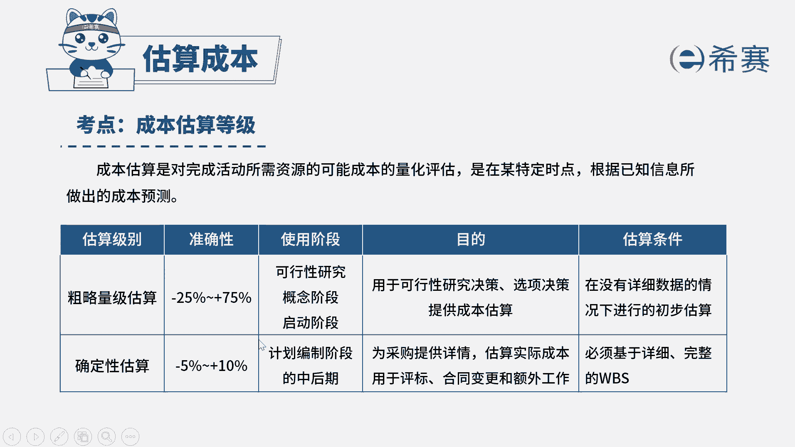

# 24年PMP模拟题-PMP付费模拟题100道免费视频新手教程-从零开始刷题 - P5：5 - 冬x溪 - BV1Fs4y137Ya

一家大型it公司的项目经理，刚升为一个复杂的软件项目，此时公司的ceo得知一个合作了多次的大客户，正需要一个类似的项目，虽然具体的范围还不够清楚，为了能够获得实施该项目的机会。

ceo需要马上去拜访该客户，ceo需要知道该项目的成本大概是多少，于是询问项目经理，需要项目经理立马告诉他一个金额，项目经理给出的可能是下列哪一项选项，a确定性估算选项，b抽象估算选项。

c粗略量级估算选项d参数估算，我们先来看一下题干的关键词，现在是不是我们为了获取这个项目，我们需要给出一个大概的成本估算，并且是立马告诉他需要进行快速的估算，但是这个项目它的具体范围不够清楚。

所以题干的情境肯定是处于项目的一个早期，我们只能进行一个粗略的估算，因此c选项是正确的，再来看一下其他几个选项，a选项确定性估算，确定性估算它是已经在计划编制的中后期。

我们基于w bs去进行一个精细的估算，肯定不是当前这个时间节点，我们需要进行的一种估算，而b选项抽象估算，这是属于一个干扰选项，考试中是没有这种说法的，最后d选项参数估算，参数估算。

它是基于历史数据和参数模型计算统计关系，没有一个关键的信息可以对应到参数估算，因此综合分析下来，我们应该选择c选项，粗略量级估算。

大家可以看一下文字解析部分。

本题考察的知识点是项目成本管理。

