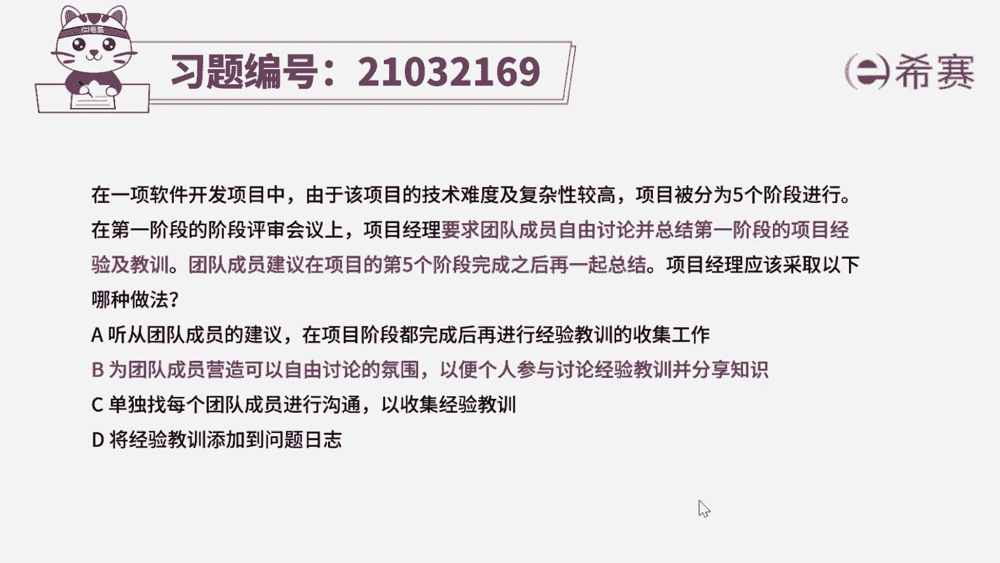
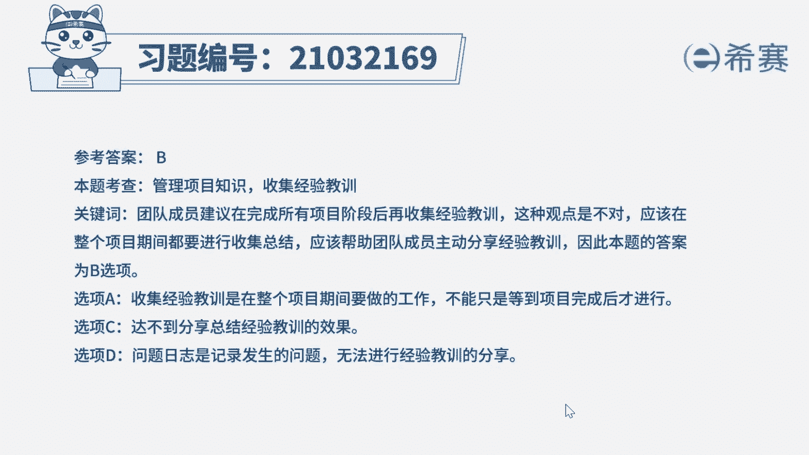
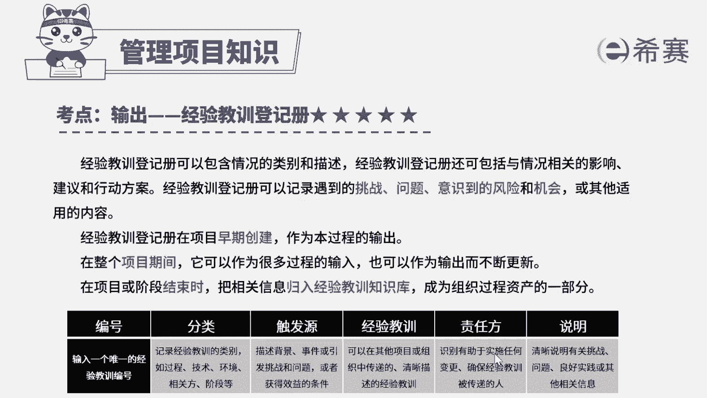

# 24年PMP模拟题-PMP付费模拟题100道免费视频新手教程-从零开始刷题 - P69：69 - 冬x溪 - BV1Fs4y137Ya

在以下软件开发项目中，由于该项目的技术难度及复杂性较高，项目被分为五个阶段进行，在第一阶段的阶段评审会议上，项目经理要求团队成员自由讨论，并总结第一阶段的项目经验及教训。

团队成员建议在项目的第五个阶段完成之后，再一起总结，项目经理应该采取以下哪种做法，听从团队成员的建议，在项目阶段都完成后，再进行经验教训的收集工作，b为团队成员营造可以自由讨论的氛围。

以便个人参与讨论经验教训并分享知识，c单独找每个团队成员进行沟通，以收集经验教训d在经验教训添加到问题日志，好，读完题目，我们先来看一下问题，应该采取以下哪种做法诶，再回到题干，可以看到一些关键词。

项目经理要求团队成员自由讨论，并总结第一阶段的项目经验及教训，团队成员建议在项目的第五个阶段完成之后，再一起总结，其实就是要确定，什么时候收集经验教训是最合适的，在整个项目期间。

经验教训登记册可以作为很多过程的输入，也可以作为输出而不断去更新，也就是说，经验教训的收集总结是在整个项目中进行的，不存在只在某个阶段才收集的情况，所以团员的观点是错误的。

那么我们这道题的最佳答案直接定位到选项b，再来看一下其他选项，选项a我们刚刚解释了，团队成员的观点是错误的，所以这里不能听取团队成员的建议，选项c这样单个的去收集经验，不能达到分享总结经验教训的效果。

而相对来说b选项会更合适一些，选项d唉说法不妥当，问题日志只记录项目中发生问题的状态。

无法进行经验教训的分享，好这道题我们就先讲解到这里，大家可以自行参考一下相关的文字解析，整个题目讲解下来。

我们可以知道本题考察的知识点就是经验教训。

