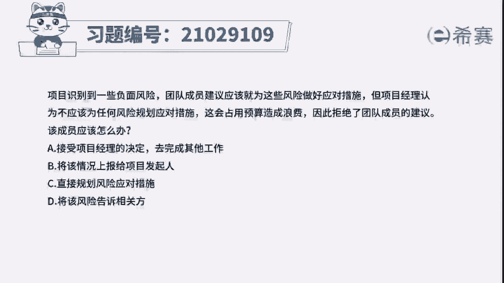
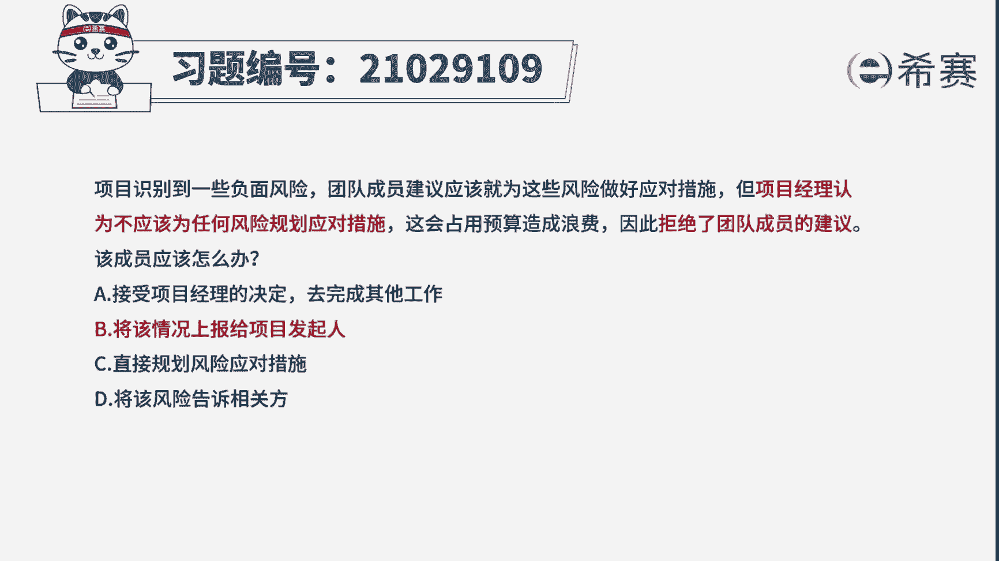
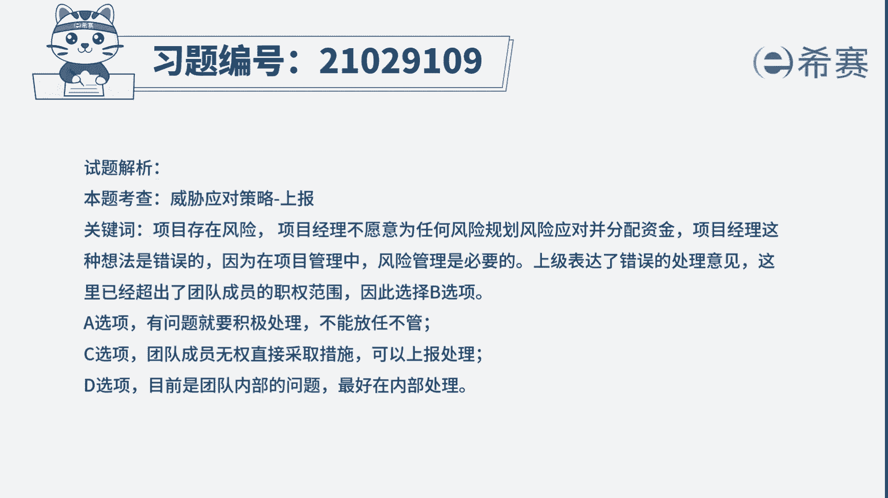
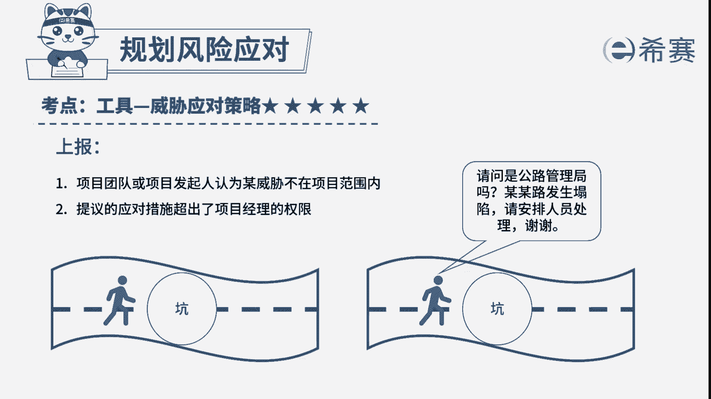

# 24年PMP模拟题-PMP付费模拟题100道免费视频新手教程-从零开始刷题 - P71：71 - 冬x溪 - BV1Fs4y137Ya

项目识别到一些负面风险。

团队成员建议应该就为这些风险做好应对措施，但项目经理认为，不应该为任何风险规划应对措施，这会占用预算造成浪费，因此拒绝了团队成员的建议，该成员应该怎么办，a接受项目经理的决定，去完成其他工作。

b将该情况上报给项目发起人，c直接规划风险应对措施，d将该风险告诉相关方，好读完题目，我们先来看一下问题应该怎么办，我们再回到题干，可以总结一下关键词，项目中存在风险，但是项目经理不愿为任何风险规划。

风险应对说明，项目经理这种做法是不对的，因为在项目管理中，风险管理是必要的，而对于团队成员来说，项目经理表达了错误的处理意见，意见超出了团队成员的全职范围了，那这时候我们就应该选择上报来解决。

因此本题的最佳选项为b，再来看看其他选项，选项a有问题要处理，不能不管，所以a选项排除选项c，项目经理是负责该项目的团队成员，不能直接跟项目经理反着干，水上帝，所有与项目相关的人都属于相关方。

没有必要大势宣扬。

所以综合下来cd就排除掉了，好了，我们这道题就先讲解到这里。

大家可以自行参考一下相关的文字解析，整个题目讲解下来，我们可以知道本题的考察知识点就是风险管理，规划。

风险应对，知危险，应对策略。