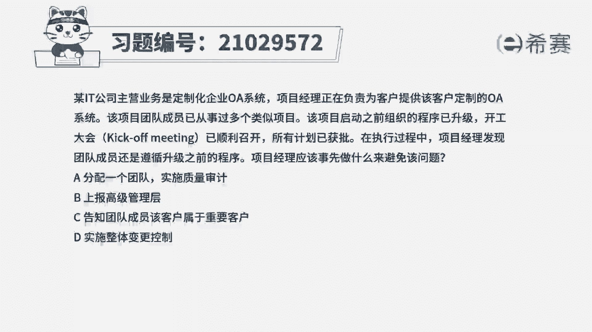
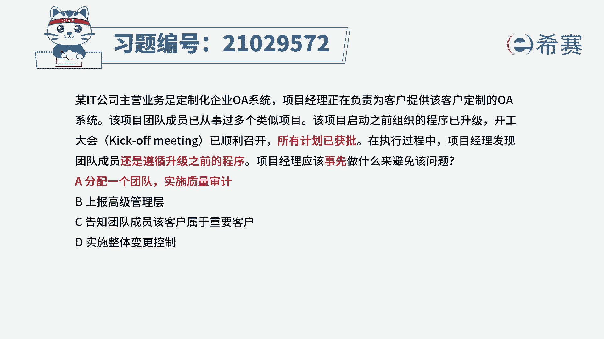
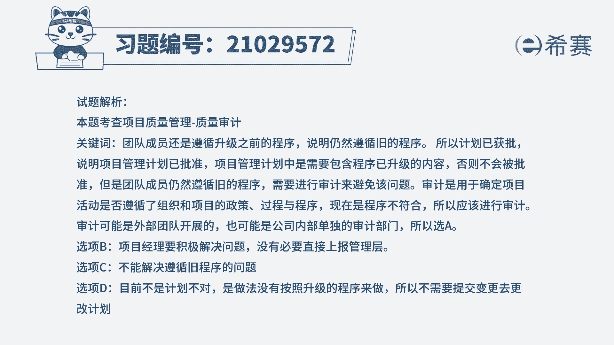
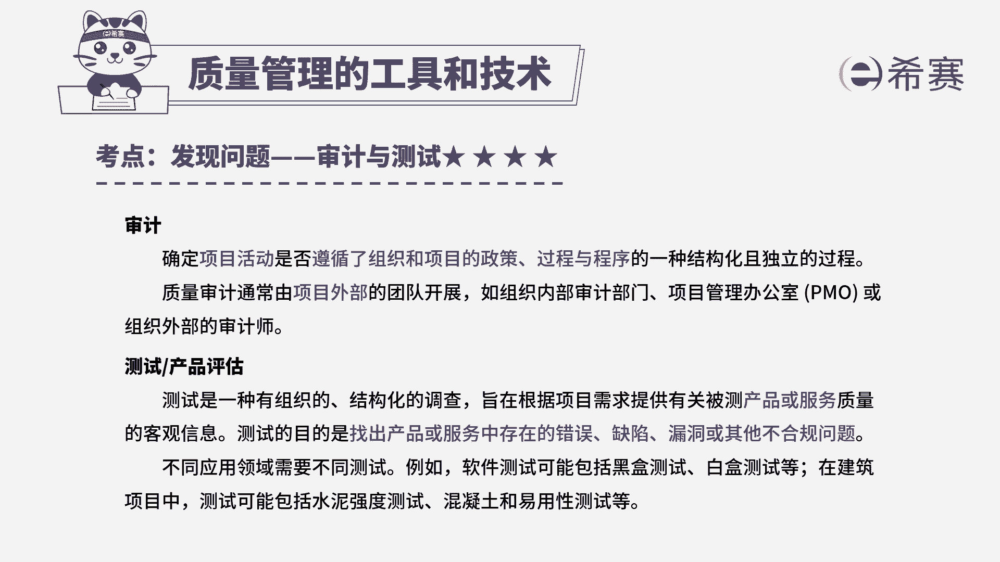

# 24年PMP模拟题-PMP付费模拟题100道免费视频新手教程-从零开始刷题 - P75：75 - 冬x溪 - BV1Fs4y137Ya

某it公司主营业务是定制化企业oa系统，项目经理，正在负责为客户提供该客户定制的oa系统，该项目团队成员已从事过多个类似项目，该项目启动之前组织的程序已升级，开工大会已顺利召开，所有计划已获批。

在执行过程中，项目经理发现，团队成员还是遵循升级之前的程序，项目经理应该事先做什么来避免该问题，a分配一个团队实施质量审计，b上报高级管理层，c告知团队成员，该客户属于重要客户，d实施整体变更控制。

读完题目，回答题干，我们来找一下这道题目，它的关键词所有的计划都已经批准了，但是团队成员，他还是在遵循升级之前的一个程序，问项目经理事先应该做什么，那现在计划都已经批准了。

说明这个程序它是包含升级之后的内容，但是团队成员他还是在遵循之前那个旧程序，那说明他们没有遵循项目的相关流程，所以事先他应该进行审计，质量审计，它是用来确定项目活动是不是符合。

组织和项目的一个政策的一个过程，所以这道题最佳选项应该是a选项，分配一个团队实施质量审计，实施质量审计之后，然后识别出违规的做法，这样子他就能够方便及时的进行改进，再看一下其他三个选项。

b选项上报高级管理层，一般像我们选项当中出现了上报高级管理层，或者是上报给发起人，这种选项，我们一般都会排除，除非这个问题超出了项目经理的权限，那一般项目经理他都会积极的去解决问题，好再来看一下c选项。

高知团队成员，该客户属于重要客户，c选项，它其实是在强调这个客户它的一个重要性，告诉团队成员它的重要性，但是他并没有办法解决，团队成员在遵循这个旧程序，这个问题，所以c选项没有实质的解决问题。

所以c排除，最后再来看一下d选项，实施整体变更控制，题目问的是事先应该怎么做，那这个地方它并不是计划出现了问题要做调整，而是没有按照升级之后的程序进行工作，所以他不需要对计划进行变更。

所以这道题最佳选项就是a选项。

这是这道题的文字解析，有需要的同学可以暂停看一下。

整个题目讲解下来，我们就可以知道这道题目。

