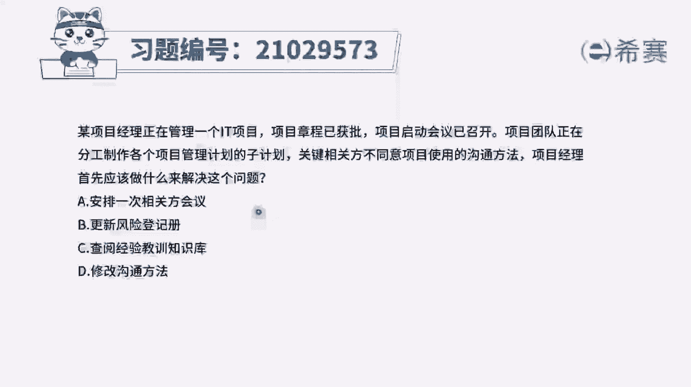
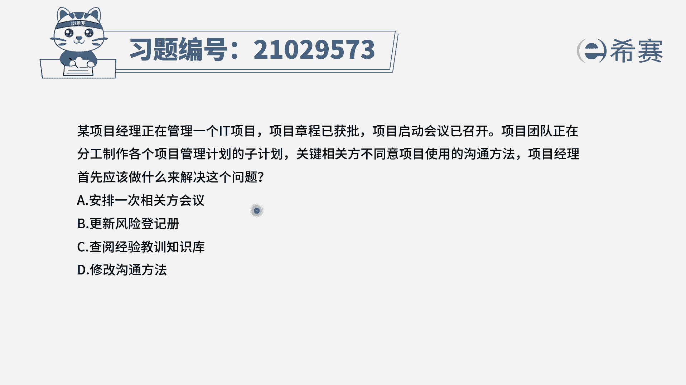
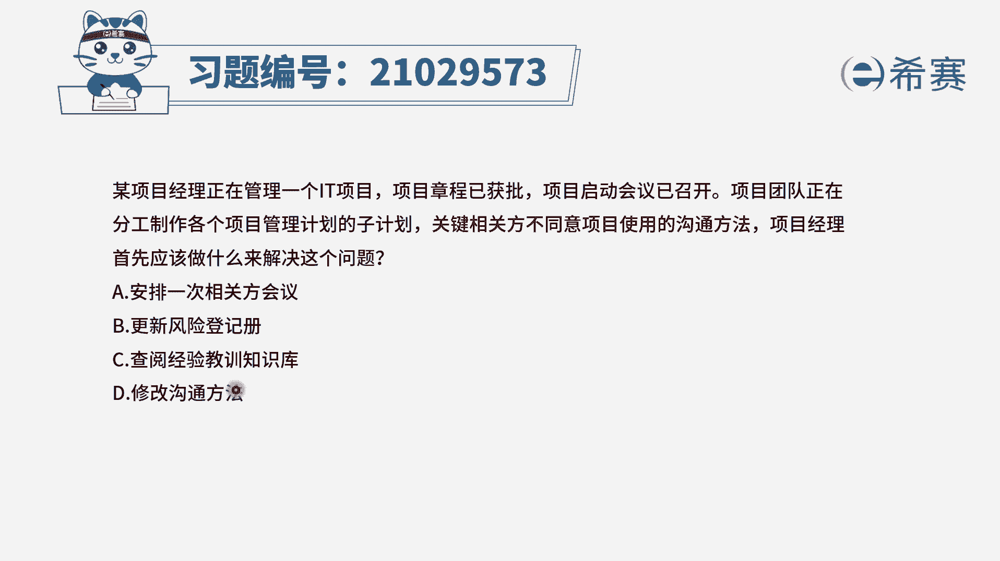
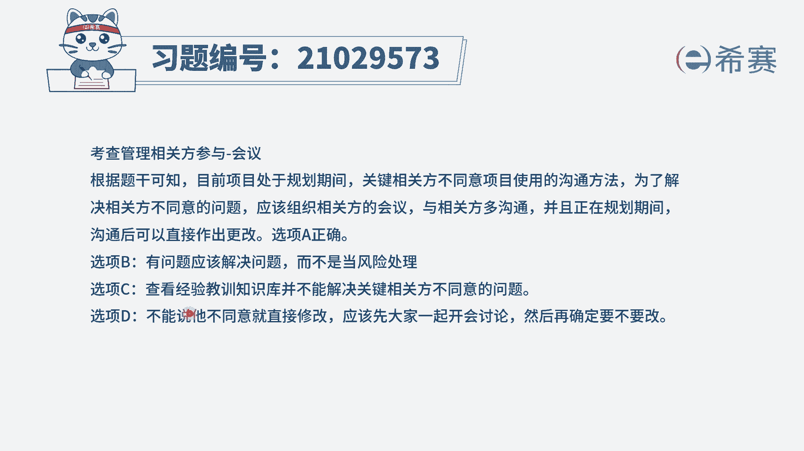
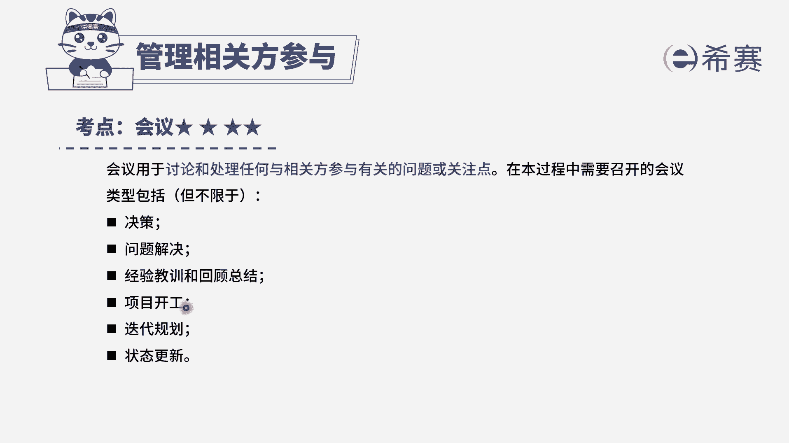

# 24年PMP模拟题-PMP付费模拟题100道免费视频新手教程-从零开始刷题 - P76：76 - 冬x溪 - BV1Fs4y137Ya

某项目经理正在管理一个it项目，项目章程已获批，项目启动会议已召开。

项目团队正在分工，制作各个项目管理计划的子计划，关键相关方不同意项目使用的沟通方法，项目经理首先应该做什么来解决这个问题，所以叫a安排一次相关方会议选项，b更新风险登记册选项。

c查阅经验教训知识库选项d修改沟通方法好，我们先来找一下题干的关键词，现在是关键相关方不同意项目使用的沟通方法，问的是项目经理首先怎么做，也就是考察选项的一个逻辑顺序，我们应该选择最优先的选项。

我们一起来看一下选项，首先可以快速排除bc选项，b选项是更新风险登记册，但是很明显，在这个题目中，关键相关方不同意项目使用沟通方法，已经是存在的问题了，当成风险来看待的话，并不能有效的解决这个问题。

而c选项查阅经验教训，除非题干已经提及到了有类似项目，我们就会优先选它，否则的话是没有一个信息依据支撑的，那么剩余d选项中一个是安排相关方会议，一个是直接修改沟通方法，虽然现在是关键相关方。

不同意项目使用的一个沟通方法，我们确实可能要改，但是是不是首先就去改呢，相关方不同意，我们首先是不是应该跟相关方去沟通讨论，去处理任何和相关方有关的问题或者关注点，因此题干问首先怎么做。

a选项是在d选项之前的，因此我们选择a选项。

大家可以看一下文字解析。

