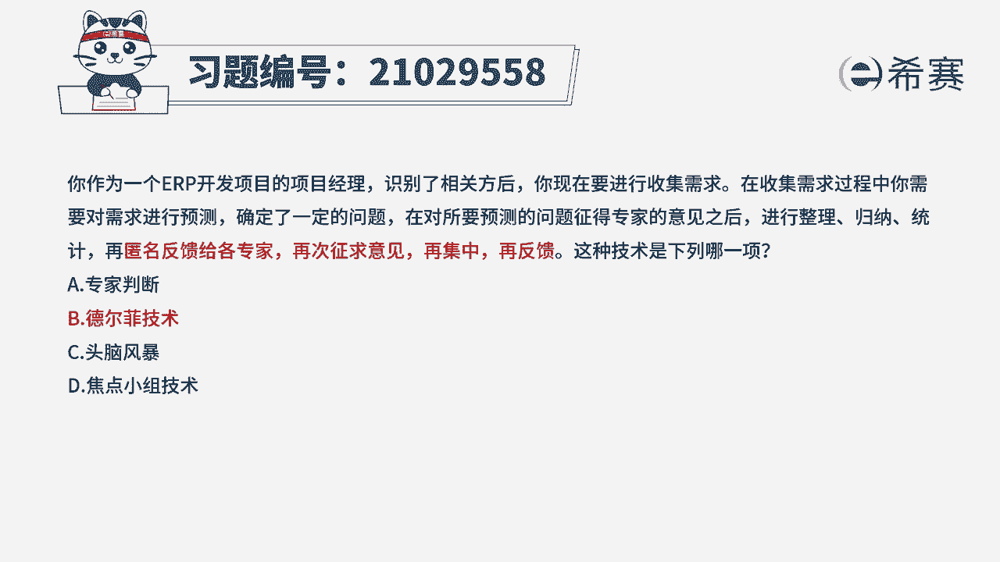
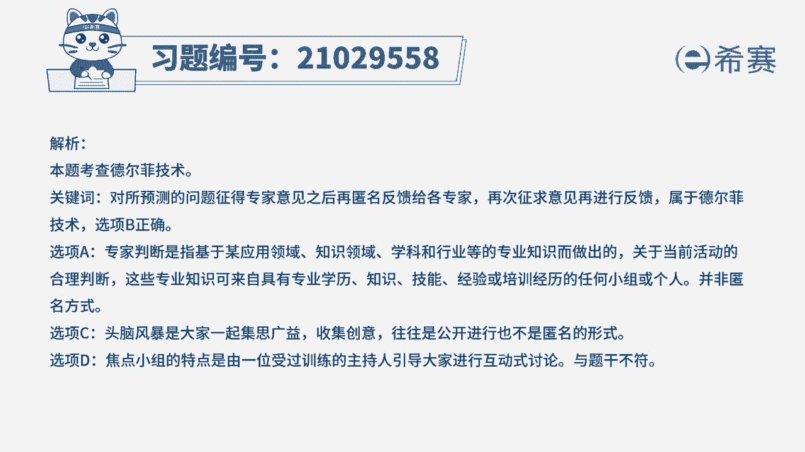
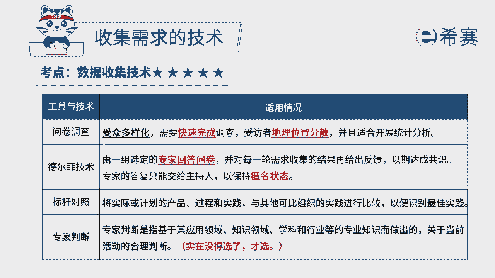

# 24年PMP模拟题-PMP付费模拟题100道免费视频新手教程-从零开始刷题 - P7：7 - 冬x溪 - BV1Fs4y137Ya

你作为一个e r p开发项目的项目经理，识别了相关方后，你现在要进行收集需求，在收集需求过程中，你需要对需求进行预测，确定了一定的问题，在对所要预测的问题正得专家的意见之后，进行整理归纳统计。

再匿名反馈给各专家，再次征求意见，再集中再反馈，这种技术是下列哪一项，专家判断b德尔菲技术，c头脑风暴d焦点小组技术，读完题目，我们来看一下这道题目的关键词，匿名反馈给各专家，再次征求意见。

再集中再反馈，我们可以总结一下，可以观察到几个关键词，第一个匿名，第二个专家，第三个再次征求，也就是说他是匿名专家，多次收集，他其实考察的就是德尔菲即熟的内容，德尔菲技术。

它其实考察的就是对于所预测的问题，征求的专家的意见，之后再次匿名反馈给各位专家，然后再次征求意见，然后再次进行反馈，也就是一个多轮，这就是属于德二费奇数，所以这道题我们最佳选项是b选项。

我们在分析一下其他三个选项，a选项专家判断，专家判断它就是基于某一个专业的应用领域，或者是知识领域，还有学科或者是行业等等这样子的一个，专业知识而做出来的，关于当前活动的一个合理的判断。

那这些专业知识它就是来自具有专业学历，知识或者是技能，或者是经验的一个小组或者是个人，那他不会是匿名，那我们其中它是匿名反馈给各专家，所以不符合，再看一下头脑风暴，那头脑风暴他就是很多人在一起。

大家一起集思广益，收集创意，并且通道风暴它也不是匿名的，他是公开的，所以c也不符合，再看一下焦点小组，技术，焦点小组，他是有一位受过专业训练的一个主持人，引导大家一起进行互动式的一种讨论。

这种一般讨论都会比较激烈，所以跟题干描述的不太相符，所以d选项也排除。

那这道题最佳选项是b选项，德尔菲技术，这是这道题的文字解析，有需要的同学可以暂停看一下。

那这道题考察的知识点是第五章，项目范围管理当中收集需求的技术。

