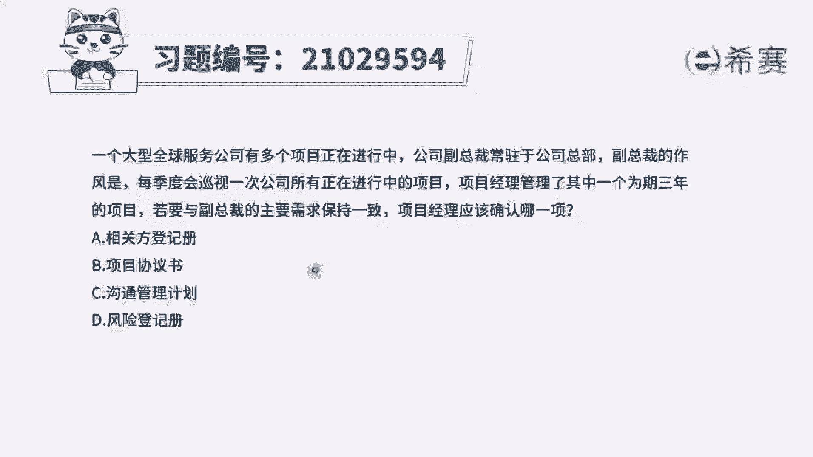
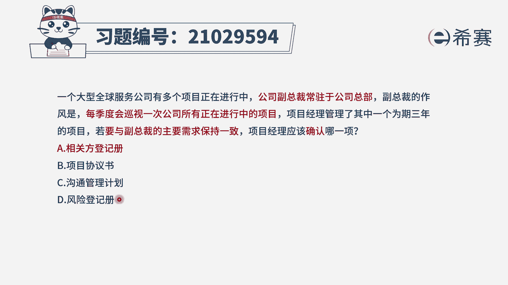
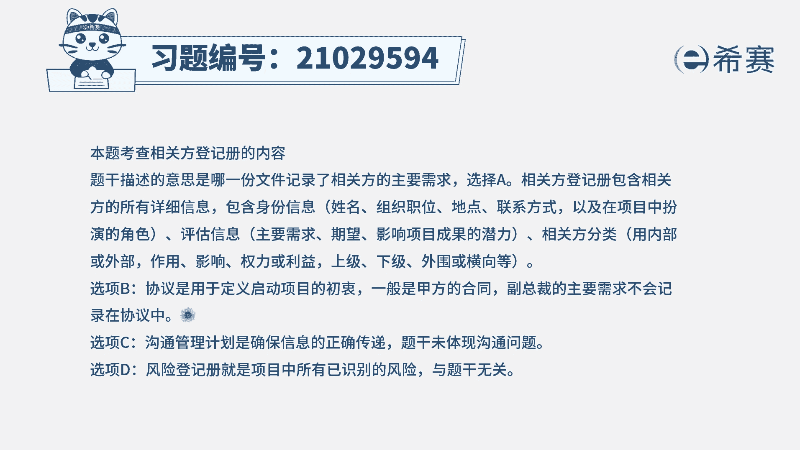
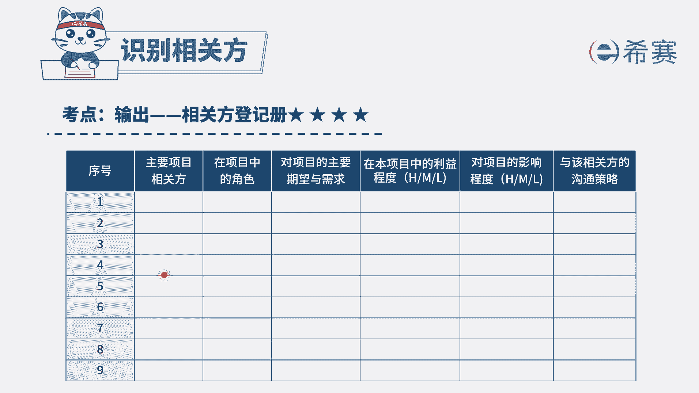

# 24年PMP模拟题-PMP付费模拟题100道免费视频新手教程-从零开始刷题 - P80：80 - 冬x溪 - BV1Fs4y137Ya

一个大型全球服务公司有多个项目正在进行，公司副总裁常驻于公司内部，副总裁的作风是每季度会巡视一次，公司所有正在进行中的项目，项目经理管理了其中一个为期3年的项目，若要与副总裁的主要需求保持一致。

项目经理应该确定哪一项选项，a相关方登记册选项，b项目协议书选项，c沟通管理计划选项d风险登记册，那么我们来看到题干的问题，是不是要保持与副总裁的主要需求一致啊，我们如何确保我们的项目。

跟他的需求保持一致呢，是不是应该先要收集到他的需求，并且记录下来，而题干问的是，你应该确认哪一项给出了四个不同的文件，相当于就是在问，你把相关方的主要需求放在哪里，那么很明显。

相关方的需求我们应该放在相关方登记册，选择a选项，看一下其他选项，b选项项目的协议书，协议书我们可以理解为合同，他一般是与甲方签订的，而副总裁他是属于组织内部的人，不会去记录到协议中。

c选项沟通管理计划，它主要是记录的沟通需求，沟通方式，是确保信息正确传递的一个管理性文件，那么在题干中，这里的主要需求它肯定不仅仅只是沟通需求，所以c选项是不能涵盖的，最后d选项风险登记册。

这是属于一个干扰选项，题干中没有与风险相关的因素。

因此本题选择a选项，大家可以看一下文字解析部分。

