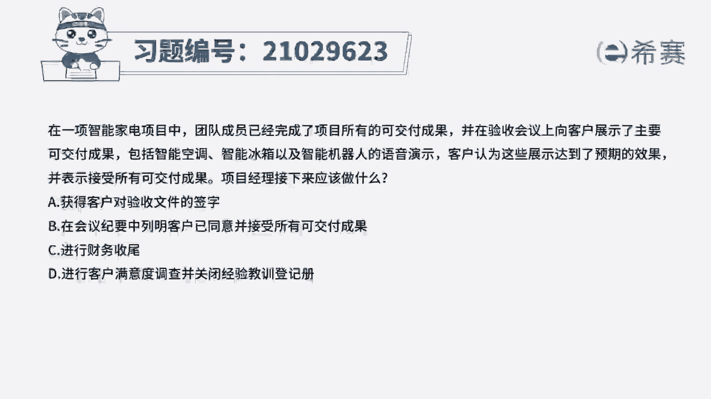
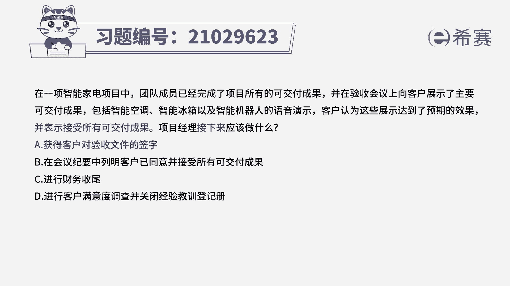

# 24年PMP模拟题-PMP付费模拟题100道免费视频新手教程-从零开始刷题 - P81：81 - 冬x溪 - BV1Fs4y137Ya

在一项智能家电项目中，团队成员已经完成了项目所有的可交付成果，并在验收会议上向客户展示，主要可交付成果，包括智能空调，智能冰箱以及智能机器人的语音演示，客户认为这些展示达到了预期的效果。

并表示接受所有可交付成果，项目经理接下来应该做什么，获得客户对验收文件的签字，b在会议纪要中列名，客户已同意并接受所有可交付成果，c进行财务收尾，d进行客户满意度调查，并关闭经验教学登记册，读完题目。

回答题干，我们来看一下这道题目的关键词，客户认为这些展示它已经达到了预期的效果，并且表示接受可交付成果，那这就是属于口头的批准，对于可造不成果的验收，他应该是要获得客户的正式验收。

也就是说让客户对验收文件进行签字，所以项目经理接下来就是应该做a选项，获得客户对验收文件的签字，我们再来分析一下其他三个选项，b选项在会议纪要中列明，客户已同意并接受所有可交付成果。

他仅仅只是列明了客户已经同意的信息，他并不代表客户正式验收了，所以不如a选项更合适，c进行财务收尾和d进行客户满意度调查，这两个选项，所以都是在a验收可交付成果之后进行的工作。

所以这道题最佳选项是a选项。

这属于这道题的文字解析。

有需要的同学可以暂停看一下，那这道题考察的知识点是第五章。

