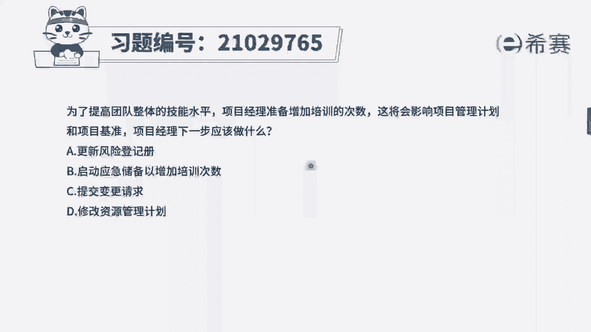
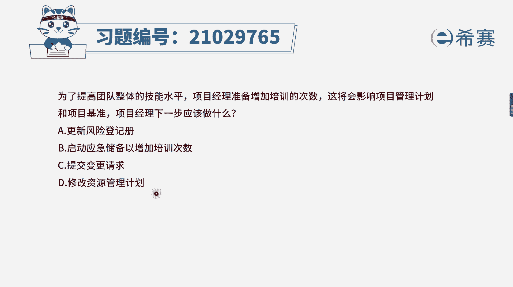
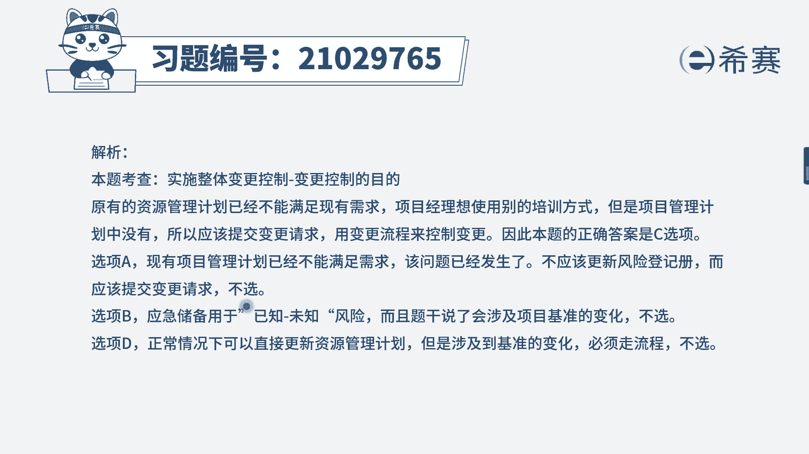
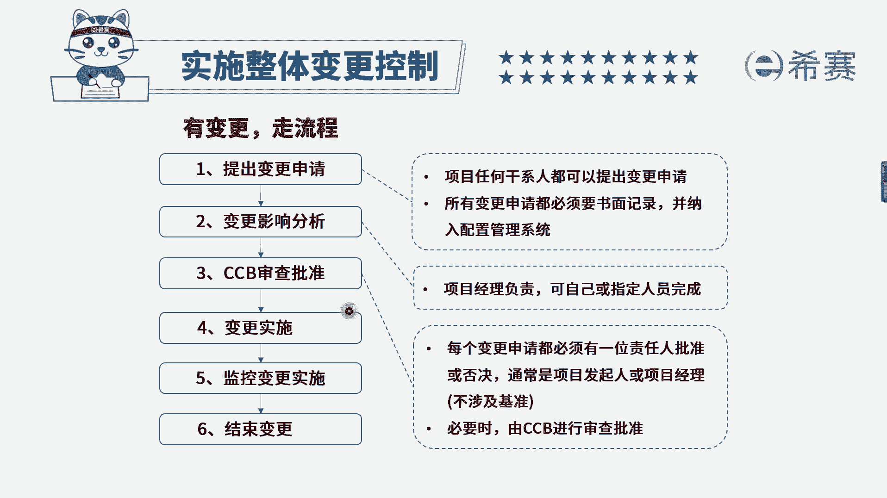

# 24年PMP模拟题-PMP付费模拟题100道免费视频新手教程-从零开始刷题 - P83：83 - 冬x溪 - BV1Fs4y137Ya

为了提高团队整体的技能水平，项目经理准备增加培训的次数，这将会影响项目管理计划和项目基准，项目经理下一步应该做什么，选项a更新风险登记册选项b启动应急储备，以增加培训次数。

选项c提交变更请求选项d修改资源管理计划，我们来看一下关键词，项目经理要进行培训，就会影响到项目管理计划和项目基准，注意在正常情况下，我们经常遇到题目，说团队缺乏技能需要培训。

我们是不是直接选择到更新资源管理计划，为什么，因为咱们类似的包括资源管理计划，相关方参与计划，沟通管理计划这一类计划的更新，一般是不是申请更新的，这个人就是项目经理啊，我们想要去改这个计划。

如果是不涉及基准的，批准的人也是项目经理，所以说我们经常会去省略变更流程，也就是直接看选项是更新某某计划，这是对的，但是在这个题目中，题干他强调了你增加这个培训次数，会涉及到项目的基准。

也就是说你钱可能都不够用，时间也可能不够用，在这种情况下，项目经理他就无权批准了，因此我们应该走流程获得cc b的批准，在四个选项中，只有c选项是符合的，再来看一下其他几个选项，a选项更新风险登记册。

我们只有在识别到风险的时候，才会更新风险的预测，大家不要看到这个将会影响你，就认为是将来会影响，把它认为是风险，注意区分风险和变更，风险是未来不确定且不可控的，而变更是可控的，它虽然会有一定的影响。

但是如果我们拒绝了，就完全没有影响，如果批准了也会考虑到它的影响，所以一定要区分清楚a选项是不对的，再来看b选项，启动应急储备已增加培训次数，因为题干说了，你增加培训次数会影响到项目的基准。

而应急储备它本身是基础类的，并不会影响到基准，所以说它跟题干是有冲突的，我们不选，最后看一下d选项，d选项修改资源管理计划，他就是在正常情况下，如果不涉及基准，我们就选d，如果设计基准。

我们必须提交变更后，申请通过之后再去更新资源管理计划，因此综上分析，我们这个题应该选择c选项。

提交变更请求，大家可以看一下文字解析部分。

本题考察的是项目整合管理。

