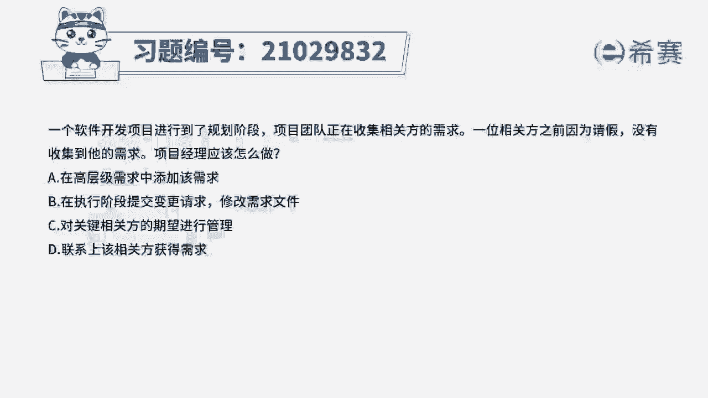
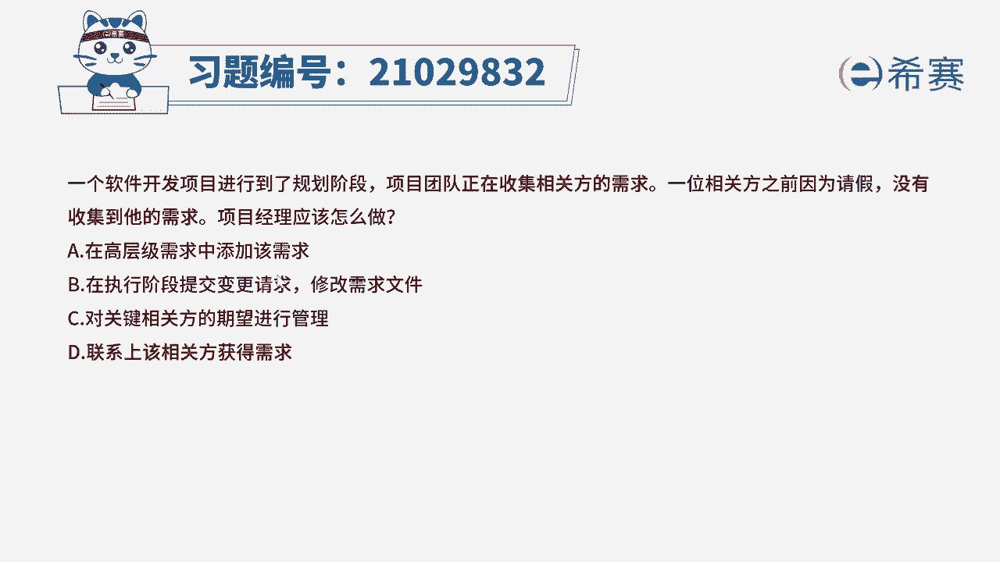
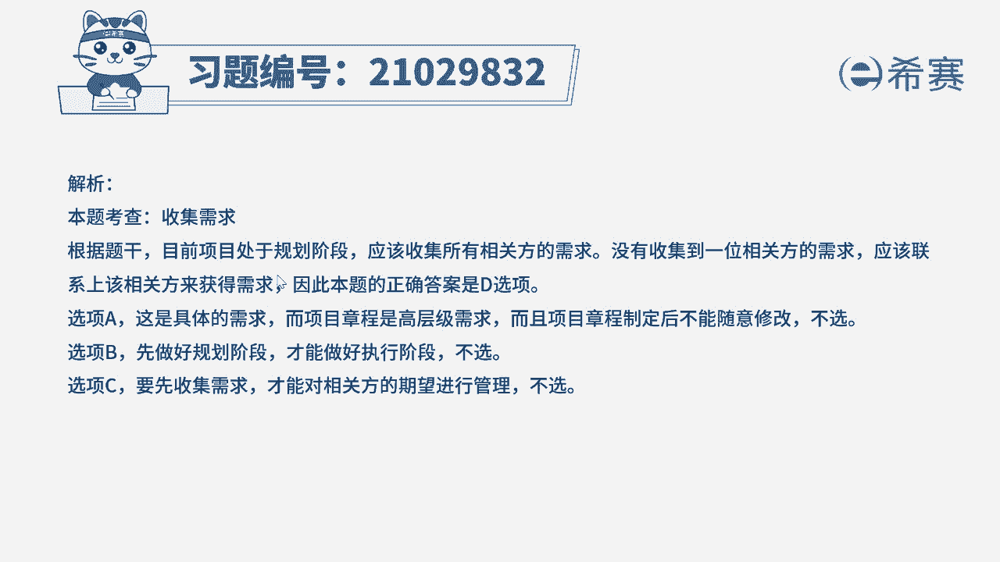
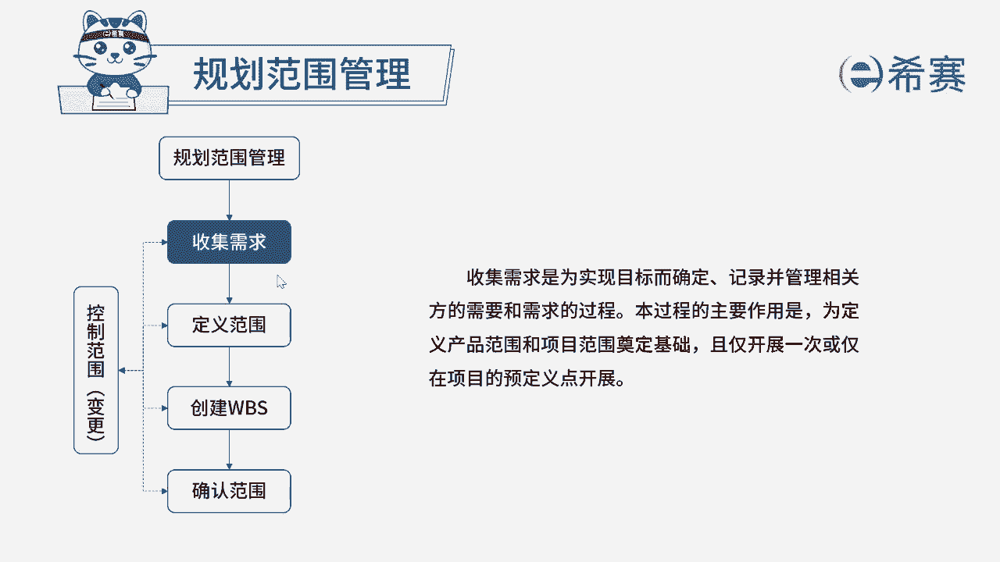

# 24年PMP模拟题-PMP付费模拟题100道免费视频新手教程-从零开始刷题 - P89：89 - 冬x溪 - BV1Fs4y137Ya

一个软件开发项目进行到了规划阶段，项目团队正在收集相关方的需求，因为相关方之前因为请假，没有收集到他的需求，项目经理应该怎么做，在高层级需求中添加该需求，在执行阶段提交变更请求，修改需求文件。

c对关键相关方的期望进行管理，d联系上该相关方获得需求，读完题目，我们回到题干来看一下这道题目的关键词，项目团队，他正在收集相关方的需求，那有一位相关方，他之前因为请假了，所以就没有收集到他的需求。

那在规划阶段收集需求的时候呢，收集需求应该收集所有相关方的需求，之前没有收集到的，我们就要联系该相关方获得需求，那这道题我们最终的选项是d选项，联系上该项官方获得他的需求，再分析下其他三个选项。

a在高层级需求中添加该需求，这里它是具体的需求，而项目章程它是高层级的需求，并且项目章程制定好之后，它不能进行随意的修改，所以a选项排除，再来看一下b选项，在执行阶段提交变更请求，修改需求文件。

我们要先做好规划阶段，才能够去做好执行阶段的事情，所以要先规划好，而不是执行之后发现有错误再去走变更流程，所以排除再看一下c选项，对关键相关方的期望进行管理，我们要先收集需求。

才能够对相关方的期望进行管理，所以c选项它有一个先后的顺序。

这是我们这道题的文字解析，有需要同学可以暂停看一下。

那这道题考察的知识点是第五章。

