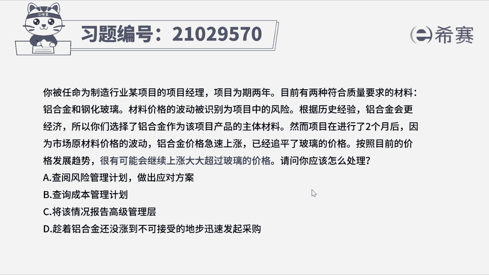
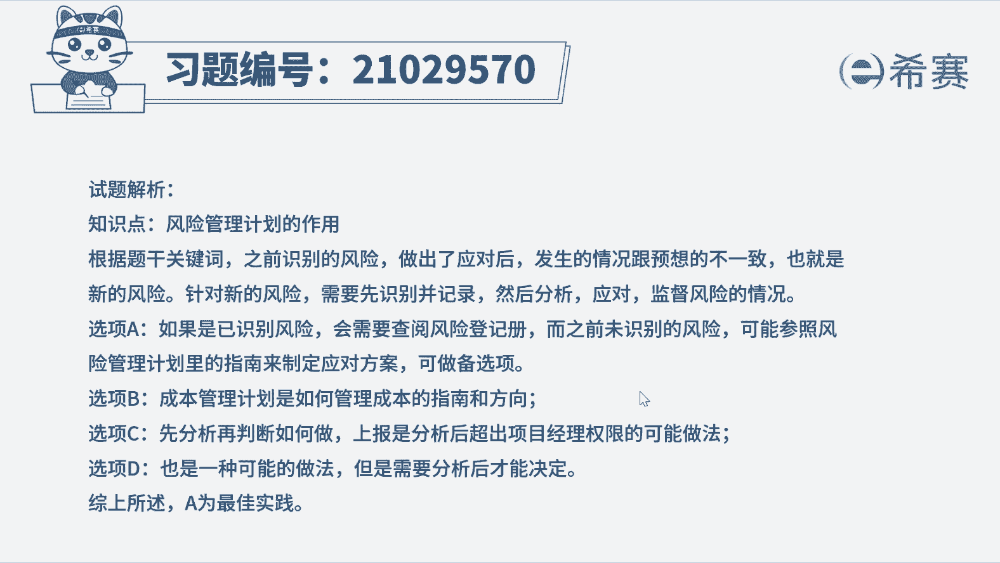
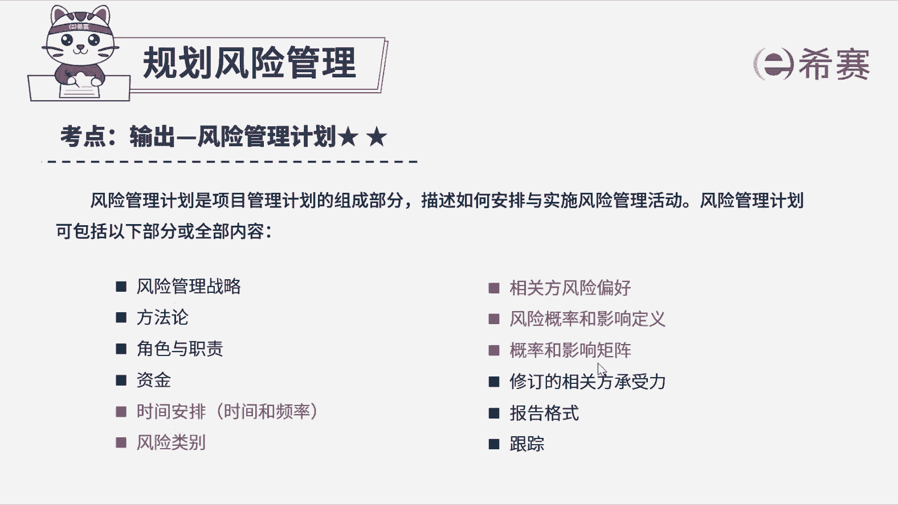

# 24年PMP模拟题-PMP付费模拟题100道免费视频新手教程-从零开始刷题 - P8：8 - 冬x溪 - BV1Fs4y137Ya

已被任命为制造行业某项目的项目经理，项目为期2年，目前有两种符合质量要求的材料，铝合金和钢化玻璃，材料价格的波动被识别为项目中的风险，根据历史经验，铝合金会更经济，所以你们选择了铝合金作为该项目。

产品的主体材料，然而项目在进行两个月后，因为市场原材料价格的波动，铝合金价格急速上涨，已经追平了玻璃的价格，按照目前的价格发展趋势，很有可能会继续上涨，大大超过玻璃的价格，请问你应该怎么处理。

a查阅风险管理计划，作出应对方案，b查询成本管理计划，c将该情况报告高级管理层，d趁着铝合金还没长到不可接受的地步，迅速发起采购，好读完题目，我们先来看一下问题，项目经理应该怎么处理，我们再回到题干。

可以总结一下关键词，之前识别到了风险，然后做出了应对，但是发生了新情况，很有可能会继续上涨，大大超过玻璃的价格，这个可能可以快速判断是识别到了风险，那么这时候应该要想到识别到风险，就要更新风险登记册。

但是选项中没有，那就来看看选项哪个更合适，选项a根据风险管理计划中的指南来做出应对，这是可行的，因为风险管理计划的作用，就是为风险管理提供指南和方向，可以作为备选项，看看有没有更好的选项。

b成本管理计划是如何管理成本的指南，这里是说识别到了风险啊，属于混淆项，选项c做法不妥，不能识别到风险就去报告给高层对吧，所以c选项就直接排除选项，d是一种具体措施，但是还有可能是其他措施。

哎没有a选项更合适，所以本题最佳选项为a好了。

我们此题就先讲解到这里，大家可以自行参考一下相关的文字解析。

整个题目讲解下来，我们可以知道。

本题考察的知识点就是项目风险管理。