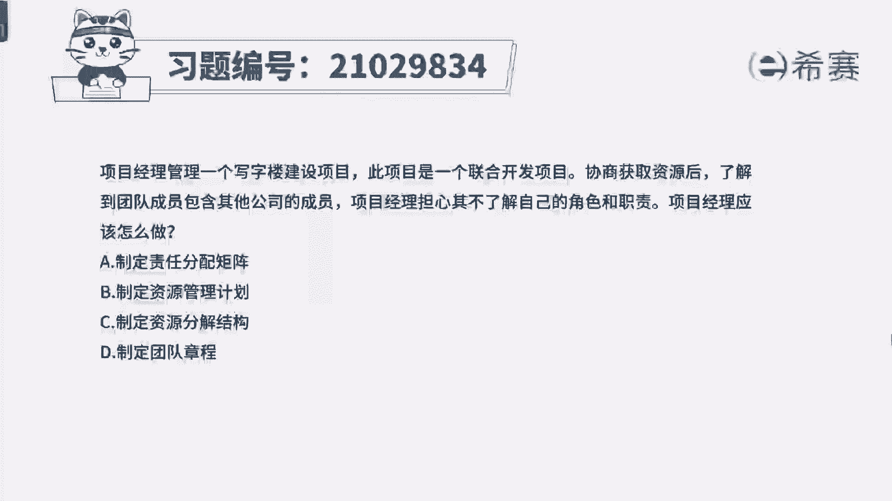
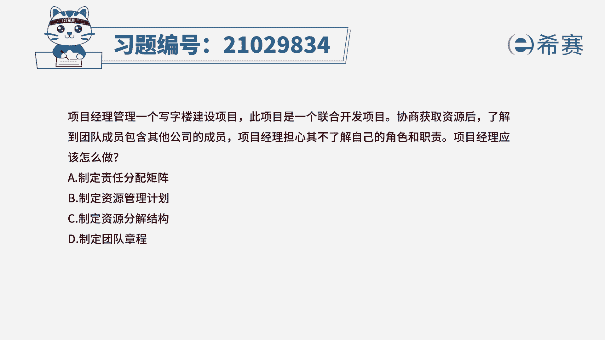
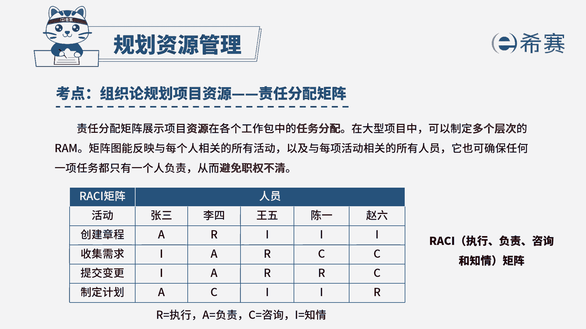

# 24年PMP模拟题-PMP付费模拟题100道免费视频新手教程-从零开始刷题 - P90：90 - 冬x溪 - BV1Fs4y137Ya

项目经理管理一个写字楼建设项目，此项目是一个联合开发项目，协商获取资源后，了解到团队成员包含其他公司的成员，项目经理担心其不了解自己的角色和职责，项目经理应该怎么做，a制定责任分配矩阵。

b制定资源管理计划，c制定资源分解结构，d制定团队章程，从题干中我们可以看到以下关键词，项目经理担心其不了解自己的角色和职责，也就是说，项目经理怕团队成员，对自己的角色和职责分不清。

那么项目经理就应该制定好，团队成员的角色和职责，我们看一下选项a制定责任分配矩阵，责任分配矩阵，展示项目资源在各个工作包的任务分配，可以确保任何一个任务都会有人负责，从而可以避免职权不清的问题。

所以a选项是可以的，我们再来看b选项，制定资源管理计划，资源管理计划中也是有角色和职责的，但是责任分配矩阵展示的是项目资源，在各个工作包中的任务分配，所以内容会更加详细，比资源管理计划会更清晰一些。

所以a选项要比b更合适一些，再看c选项，制定资源分解结构，资源分解结构是对资源的类别和类型进行的分，类，与角色和职责没有关系，所以c不选，最后看d选项，制定团队章程，团队章程是团队中的规章。

制度是团队成员需要遵守的规则，与团队的角色职责也没有关系，所以d也不选，因此本题的正确答案就是a选项。

本题中考察的是项目资源管理中。

