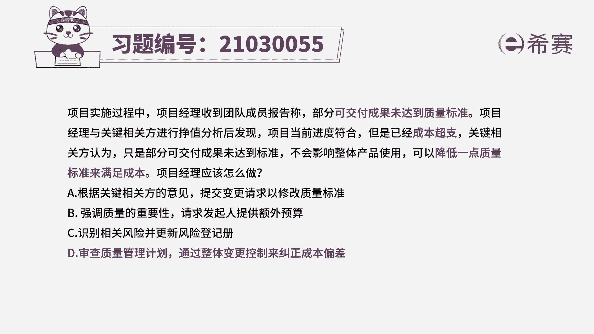
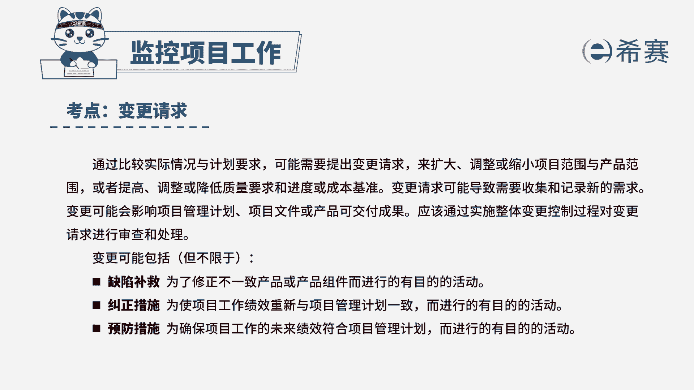

# 24年PMP模拟题-PMP付费模拟题100道免费视频新手教程-从零开始刷题 - P93：93 - 冬x溪 - BV1Fs4y137Ya

项目实施过程中，项目经理收到团队成员报告称，部分可交付成果未达到质量标准，项目经理与关键相关方进行政治分析后，发现项目当前进度符合，但是成本超支，关键相关方认为，只是部分可交付成果未达到标准。

不会影响整体产品的使用，可以降低一点质量标准来满足成本，项目经理应该怎么做，a根据关键相关方的意见提交变更请求，已修改质量标准，b强调质量的重要性，请求发起人提供额外预算。

c识别相关风险并更新风险登记册，第一审查质量管理计划，通过整体变更控制来纠正成本偏差，首先看到题干的关键词，部分可交付成果没有达到质量标准，而且成本已经超支，关键相关方认为可以降低质量标准来满足成本。

那项目经理应该怎么做，针对质量不达标的问题，可以查看质量管理计划中，关于质量不符合要求的处理流程和方法，而针对已经发生的成本超市的问题，说明现在的成本已经不符合，原有的项目成本基准。

这就需要及时走变更流程来进行纠正，所以本题的正确答案是d选项，审查质量管理计划，通过整体变更控制来纠正成本偏差，我们在看到其他的三个选项，a选项根据关键相关方的意见提交变更请求，已修改质量基准。

质量标准是规划阶段通过所有相关方审核的，不能因为成本超支就听从相关方的建议，降低质量标准，b选项强调质量的重要性，请求发起人提供额外预算，前半句强调质量的重要性是没有问题的，但是后半句描述不合适。

遇到成本超支的问题，应该优先考虑走变更流程，来更新成本基准的做法，而不是应该直接找发起人提供额外预算，再看到c选项，识别相关风险并更新风险登记册，已经发现了成本超支和质量不达标的情况。

所以这是已经出现了问题，而不是风险，那更新风险登记册的做法就是不正确的。

再来看一下题目的解析，那本题考察的知识点就是质量管理控制，质量变更请求的内容，其中使可交付成果符合质量标准，属于缺陷补救的。

