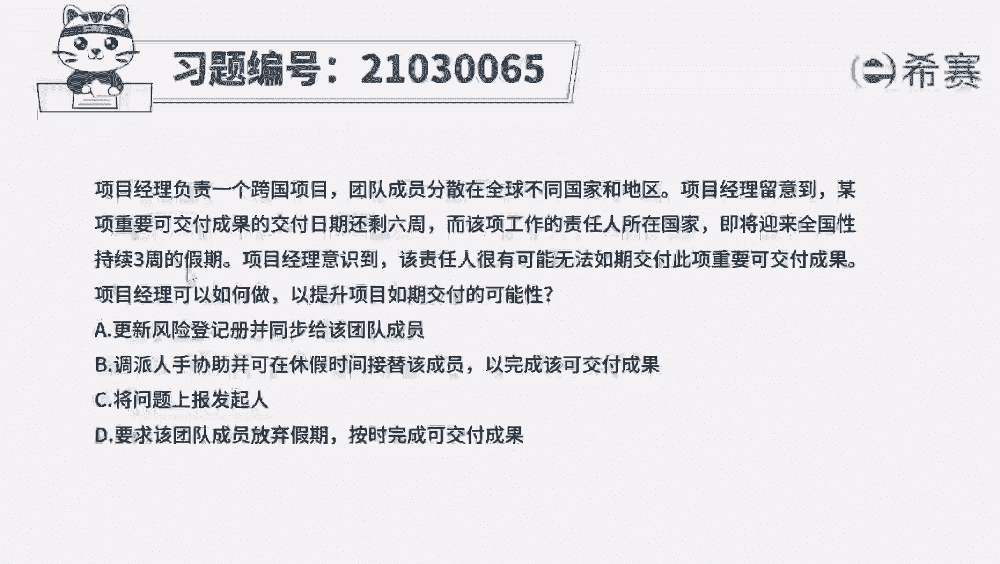
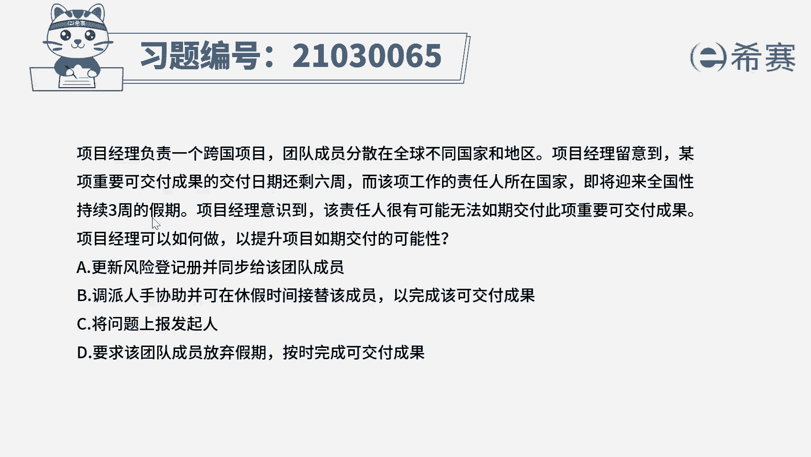
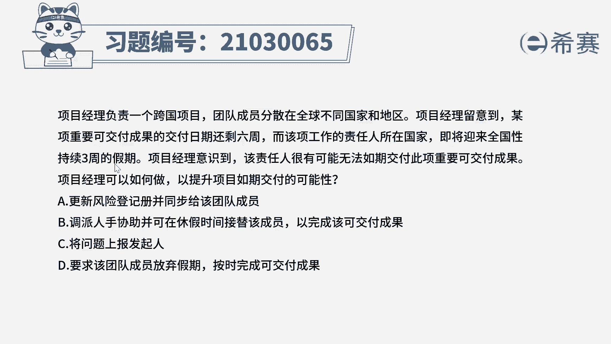
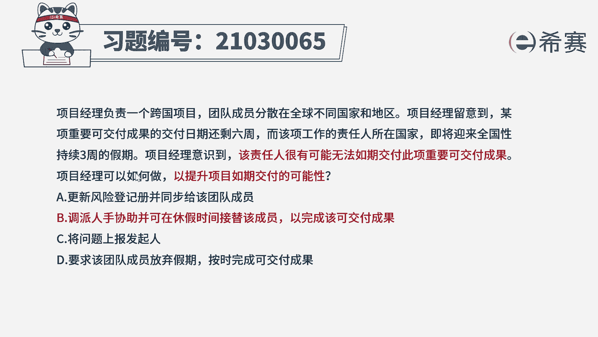
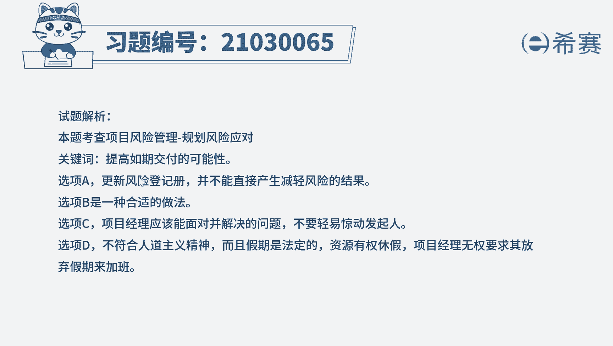

# 24年PMP模拟题-PMP付费模拟题100道免费视频新手教程-从零开始刷题 - P94：94 - 冬x溪 - BV1Fs4y137Ya

项目经理负责一个跨国项目团队。

成员分散在全球不同国家和地区，项目经理留意到。

某项重要可交付成果的交付日期还剩六周。

而该项工作的责任人所在国家，即将迎来全国性持续三周的假期。

项目经理意识到，该责任人很有可能无法如期交付，此项重要可交付成果，项目经理可以如何做，以提升项目如期交付的可能性，a更新风险单机测，并同步给该团队成员，b调配人手协助，并可在休假时间接替该成员。

已完成该可交付成果，c将问题上报发起人，d要求该团队成员放弃假期，按时完成可交付成果好，读完题目先来看一下问题，项目经理如何做，以提升项目如期交付的可能性，回到题干可以看到，很有可能无法如期交付。

此重要可交付成果说明是识别到了风险，那要提升项目如期交付的可能性，说明是要为该风险制定应对措施，那要解决问题，选项中只有b合适，再来看一下其他选项，很多同学可能会选a。

我们做题的时候一定要看清楚问题问的是什么，如果说问下一步该做什么哎那我们就可以选a，但是现在题目问的是要解决可能的风险，只是更新风险登记册就不够了，不能解决目前的问题呀。

好学校c一般项目中不超过项目经理权限的，都不需要上报发起人，我们先自行积极的去解决选项，d唉做法不太合适，团队成员有权利休假的啊，不能要求他直接放弃假期好了。

我们几道题就先讲解到这里，大家可以自行参考一下相关的文字解析。

整个题目讲解下来。

我们可以知道本题的考察知识点就是风险管理，规划。