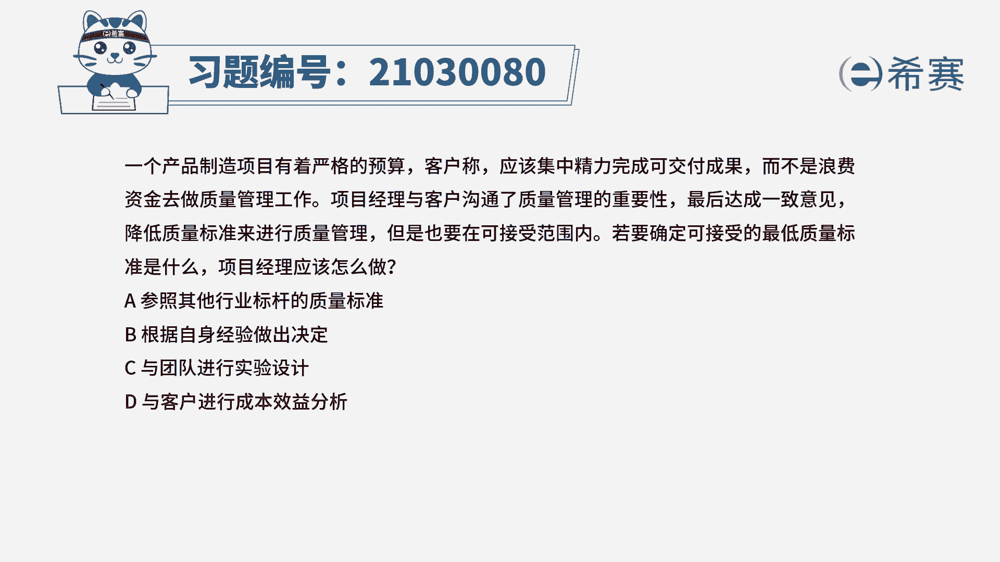
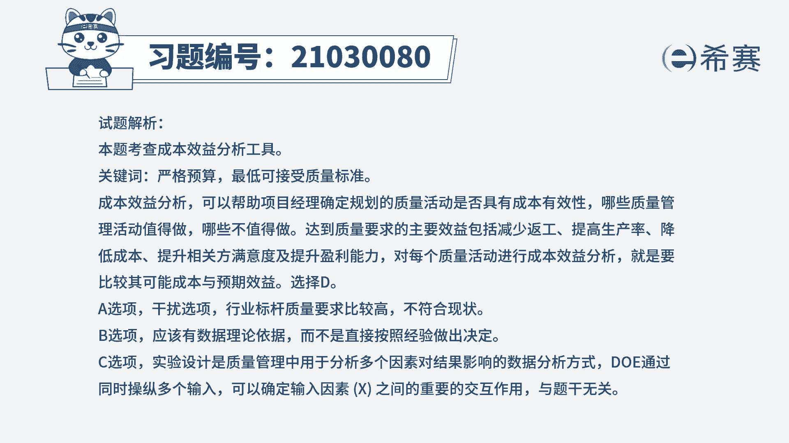
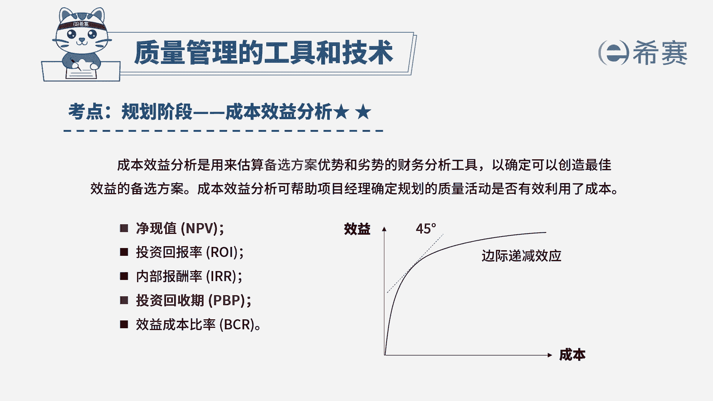

# 24年PMP模拟题-PMP付费模拟题100道免费视频新手教程-从零开始刷题 - P97：97 - 冬x溪 - BV1Fs4y137Ya

一个产品制造项目有着严格的预算，客户称应该集中精力完成可交付成果，而不是浪费资金去做质量管理工作，项目经理与客户沟通了质量管理的重要性，最后达成一致意见，降低质量标准来进行质量管理。

但是也要在可接受范围内，若要确定可接受的最低质量标准是什么，项目经理应该怎么做，a参照其他行业标杆的质量标准，根据自身经验作出决定，c与团队进行实验设计，d与客户进行成本效益分析好，那看完题目之后。

我们再来分析一下这道题，这道题目他可以得知一个条件，预算有限，那我们要降低质量标准进行质量管理，那要怎么样去确定，可接受的最低质量标准是什么呢，我们来分析一下这四个选项，a参照其他行业标杆的质量标准。

那我们知道往往行业其他标杆，它的要求都是比较高的，那这个地方题目是让我们确定最低质量标准，所以最高和最低之间它还是存在矛盾的关系，所以我们排除a选项，再来看到b选项，根据自身经验作出决定。

那么自身经验它往往是有限的，它具有局限性，那没有理论数据支持的情况下呢，我们通常不能够直接按照经验去做出决定，好在看到c选项与团队进行实验设计，实验证集，它一般是用于分析多个因素对于结果的影响。

那这里我们只是要确定最低质量标准，它两个之间它们并没有直接的联系，所以c我们也排除，最后只剩下d选项，所以这道题目选择d选项，但是我们也要来分析一下d选项，为什么正确与客户进行成本效益分析。

成本效益分析，它其实是用来估算备选方案的优势和劣势的，一个财务分析工具，那他可以确定创造最佳效益的备选方案，所以也就是说，它可以帮助项目经理去确定规划的质量活动，它是不是有效地利用了成本。

哪些质量管理活动是值得做的，那其中就包括说我们可以减少返工，提高生产率，降低成本，提升相关方满意度以及提升盈利能力，所以对于每个质量活动进行成本效益分析，就是要比较其可能的成本与预期效益。

从而可以帮助确定可接受的最低质量标准。

所以这道题目d选项是可以的好，那这个就是我们的文字解析。

有需要的同学可以暂停来看一下，好整个题目讲解下来，我们就可以知道，这道题考察的知识点是。

