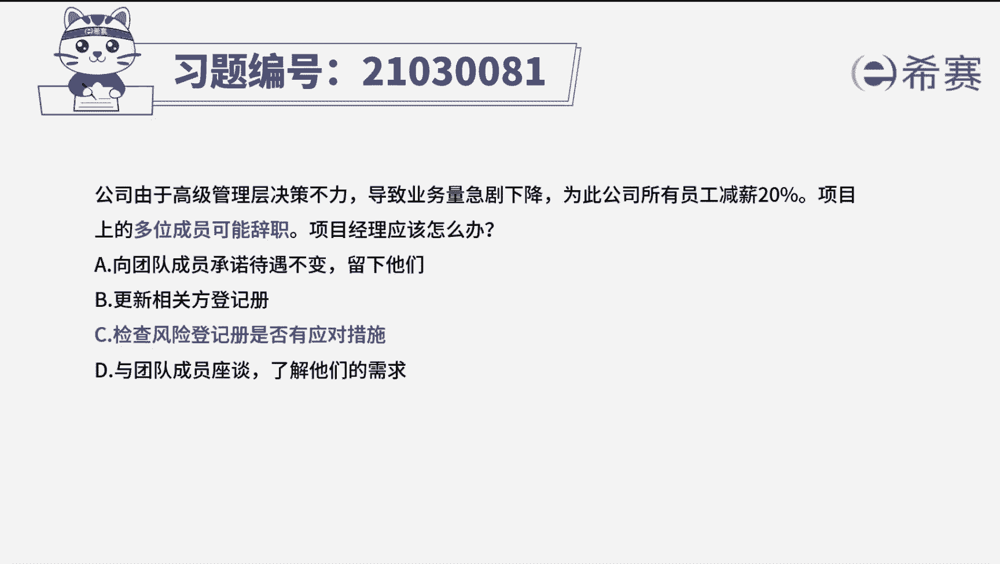
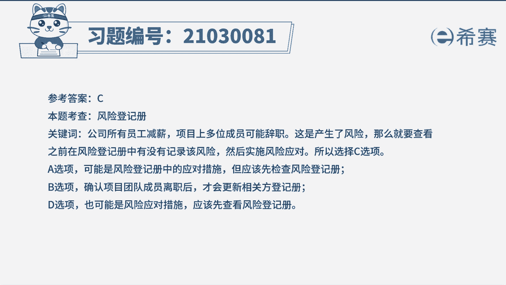
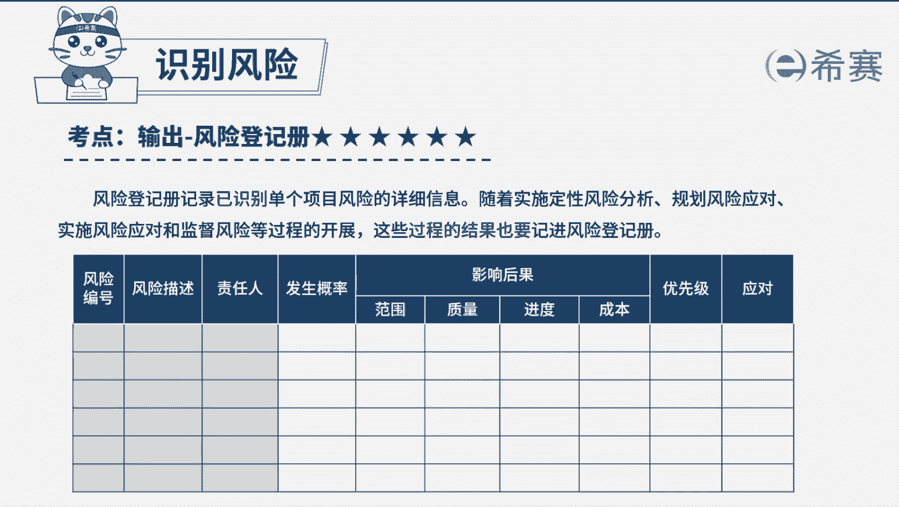

# 24年PMP模拟题-PMP付费模拟题100道免费视频新手教程-从零开始刷题 - P98：98 - 冬x溪 - BV1Fs4y137Ya

公司由于高级管理层决策不力，导致业务量急剧下降，为此公司所有员工减薪20%，项目上的多位成员可能辞职，项目经理应该怎么做，a向团队成员承诺待遇，不便留下他们，b更新相关方登记册。

c检查风险登记册是否有应对措施，d与团队成员座谈，了解他们的需求，好读完题目，我们先来看一下问题，项目经理应该怎么办，唉回到题干可以看到一些关键词，项目的多位成员可能辞职，这个可能非常的卡面。

说明这是识别到了风险，那对于新识别到的风险，我们需要去更新到风险登记册来制定应对策略，但是选项中没有这个选项，不着急，我们结合一下选项，我们的选项c最为合适啊，先去审查风险登记册中是否有对应的应对策略。

如果有，那就可以直接按登记侧重的策略，在风险发生时进行应对，如果没有的话，就需要进行更新，为我们新识别到的风险添加策略好，那么同时也来看看其他选项，选项a和d与团队成员座谈，而向他们承诺等。

这都是具体措施了，可能是风险登记册中的策略，但是唉我们首先应该先去看风险登记册，才能知道具体的侧面，相对来说选项c会更合适一点，好选项b目前还没有离职，就是相关方还未改变。

只有确定离职了才是相关方变动啊，那再去更新相关方登记册好。

那这道题我们就先讲解到这里，大家可以自行参考一下相关的文字解析。

整个题目讲解下来，我们可以知道本题考察的知识点，就是以识别的风险发生时。

