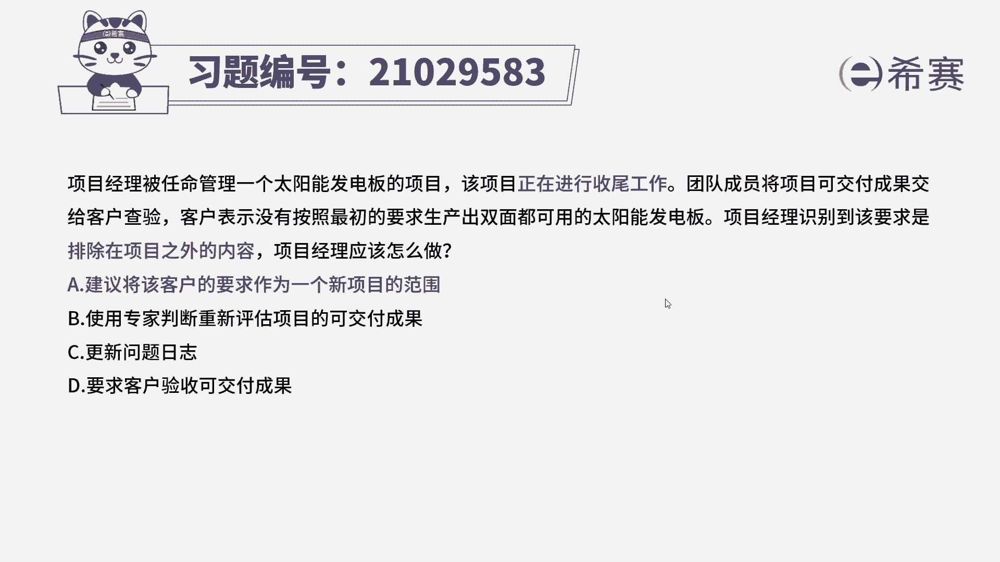
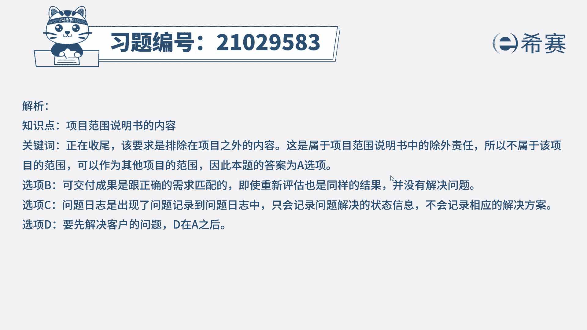
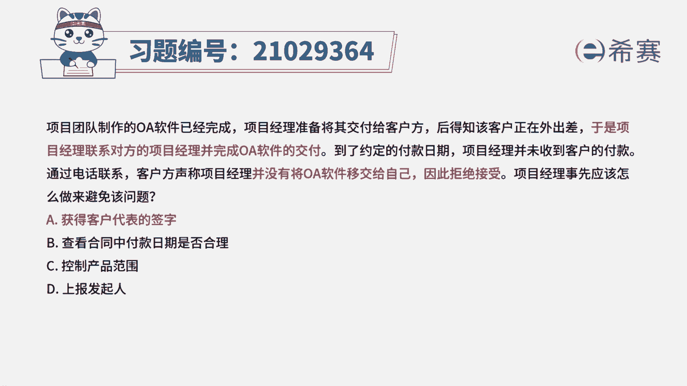

# 24年PMP模拟题-PMP付费模拟题100道免费视频新手教程-从零开始刷题 - P9：9 - 冬x溪 - BV1Fs4y137Ya

项目经理被任命管理一个太阳能发电板的项目，该项目正在进行收尾工作，团队成员将项目可交付成果交给客户查验，客户表示没有按照最初的要求，生产出双面都可用的太阳能发电板，项目经理识别到该要求。

是排除在项目之外的内容，项目经理应该怎么做，a建议将客户的要求作为一个新项目的范围，b使用专家判断，重新评估项目的可交付成果，c更新问题日志d要求客户验收可交付成果，回到题目，我们来看一下题目的关键词。

这个项目他现在已经到了收尾的阶段，客户认为他没有达到自己的需求，但是项目经理识别到该要求，它是排除在项目之外的内容，那这就是属于项目范围，说明书里面的除外责任不属于该项目的范围。

但是可以作为其他项目的范围，所以这道题我们正确选项是a选项，我们再来看一下其他三个选项，b选项可交付成果是跟正确的需求匹配的，即使重新评估需求，也还是同样的结果，并没有解决问题，c选项更新问题日志。

问题日志是出现了问题，我们就将问题记录到问题日志当中，但是他只会记录问题解决的状态，但是它不会提供相对应的解决方案，d要求客户验收可交付成果，那客户他都认为现在他是不满足自己的需求。

那我们自然是要先解决客户的问题，再去进行验收，所以a是这道题的最佳选项。

那这时这道题的文字解析，有需要的同学可以暂停看一下。

那这道题考察的试点是第五章，项目范围管理当中。

