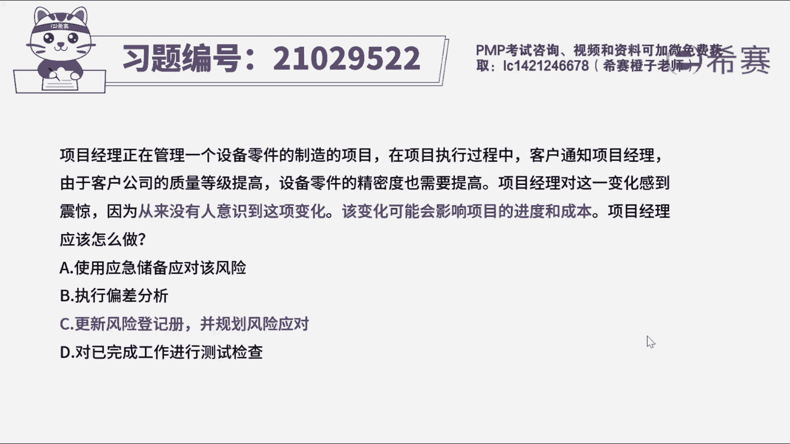
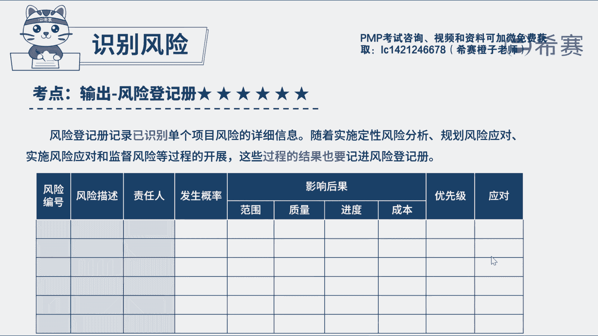

# 24年PMP模拟题-PMP付费模拟题100道免费视频新手教程-从零开始刷题 - P1：1 - 冬x溪 - BV1Fs4y137Ya

项目经理正在管理一个设备零件制造项目，在项目执行过程中，客户通知项目经理，由于客户公司的质量等级提高，设备零件的精密度也需要提高，项目经理正对这一变化感到很震惊，因为从来没有人意识到这项变化。

该变化可能会影响项目的进度和成本，项目经理应该做什么，a使用应急储备应对该风险，b执行偏差分析，c更新风险登记册，并规划风险应对，d对已完成工作进行测试检查，读完题目，我们先来看一下问题。

项目经理应该做什么，我们再回到题干中，可以看到，从来没有人意识到这项变化，该变化可能会影响项目的进度和成本，好之前从来没有人意识到，说明这是第一次识别到，而且这个可能非常的抢眼，既然是可能说明是风险。

那么对于第一次识别到的风险，应该更新风险登记册，然后再进行分析规划，因此本题最佳选项为c，更新风险登记册，并规划风险应对，再来看一下我们的错误选项，选项a使用应急储备应对该风险，当风险已经发生的时候。

可以用应急储备来应对，但此题题干中说的是轻识别到风险，而且该风险还没有发生，所以还不需要应对，再看选项b，偏差分析是将基准与实际结果进行比较，来确定绩效测量结果偏离基准的一个程度。

与本题中识别到的风险没什么关系，属于无关项，但是会有学员觉得题干中说了，客户公司的质量等级提高，零件的精密度也提高，这不是问题吗，应该需要进行分析啊，但是我们要知道问题是对项目实际产生的影响。

那题干说的是可能会影响项目的进度和成本，所以还没有具体产生影响，就比如目前你所在的城市有疫情，已有人确诊感染了新冠病毒，但是对你而言还只是一个风险，这是一样的道理，选项d这种做法是不恰当的。

完全没有在乎题干中识别到的风险，这种选项属于凑数的啊，一般可以直接排除好了，这道题我们就先讲解到这里，我们也可以看一下相关的文字解析。

整个题目讲解下来，我们可以知道，本题的考察知识点是项目风险管理。

