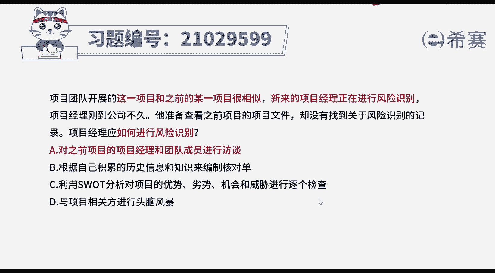
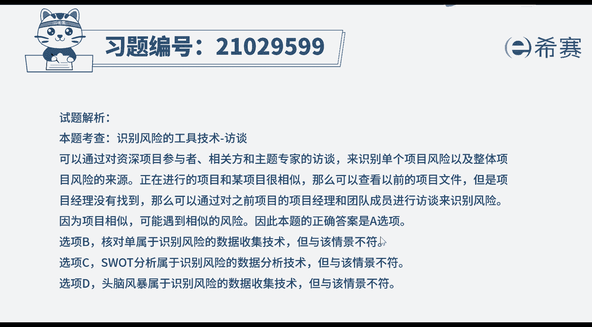
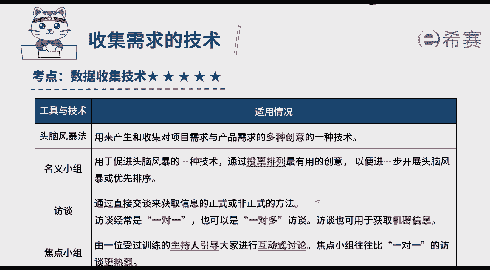

# 24年PMP模拟题-PMP付费模拟题100道免费视频新手教程-从零开始刷题 - P11：11 - 冬x溪 - BV1Fs4y137Ya

项目团队开展的这一项目，和之前的某一项目很相似，新来的项目经理正在进行风险识别，项目经理刚到公司不久，他准备查看之前项目的项目文件，却没有找到关于风险识别的记录，项目经理应如何进行风险识别。

a和之前项目的项目经理和团队成员进行访谈，b，根据自己积累的历史信息和知识来编制和对单，c利用swat分析对项目的优势，劣势，机会和危险进行逐个检查，d与项目相关方进行头脑风暴，好多题目先来看一下问题。

如何进行风险识别，然后看一下选项，基本上是一些工具技术，可以判断考察的是识别风险的工具技术，再回到题干，可以看到这一项目和之前的某一项目很相似，新来的项目经理正在进行风险识别。

而新项目经理又刚到公司不久，查找文件又没找到说明，通过文件去找之前项目的记录，没找到，针对这个情况，哪种做法最合适好，再来看四个选项，选项a和之前项目的项目经理和团队成员访谈，恰好回应了题干中所表述的。

既然有相似的项目没有找到记录，那么就可以找到之前项目的当事人，来帮助你识别风险与题干的情境比较符合，再看选项b，核对当是包括需要考虑的项目，行动或要点的清单，类似于我们去医院体检，给我们一个体检单。

体检上有很多我们需要检查的项目，检查完一下对应的医生打个勾，最终是否都体检完了，就看体检单上是否勾都打码呢，核对当常被用作一种提醒，但是题干情境中并没有哪条信息对应到核对当，所以选项b不合适。

再看选项c swat分析是对项目的优势，劣势机会和威胁进行检查，但是这题题干中并没有提到相关的信息，所以c也不符合当前题干的情境，再来看选项d，头脑风暴是收集创意的，可以用来识别风险。

但是题干中也没有表示需要收集创意，所以综合下来a最符合题干情境，很多同学会问b c d哪错了，不都是识别风险的工具吗，确实都是识别风险的工具技术，但是我们在做题的时候，看是否选项与题干更匹配。

而不是在追究选项本身是否有错，比如这个题，题干说了，这个项目和之前项目类似，那肯定是优先选择跟经验教学相关的选项。

好了，我们此题就先讲解到这里，大家可以自行参考一下相关的文字解析。

本题的考察知识点就是识别风险的工具技术，反弹。

反弹技术。