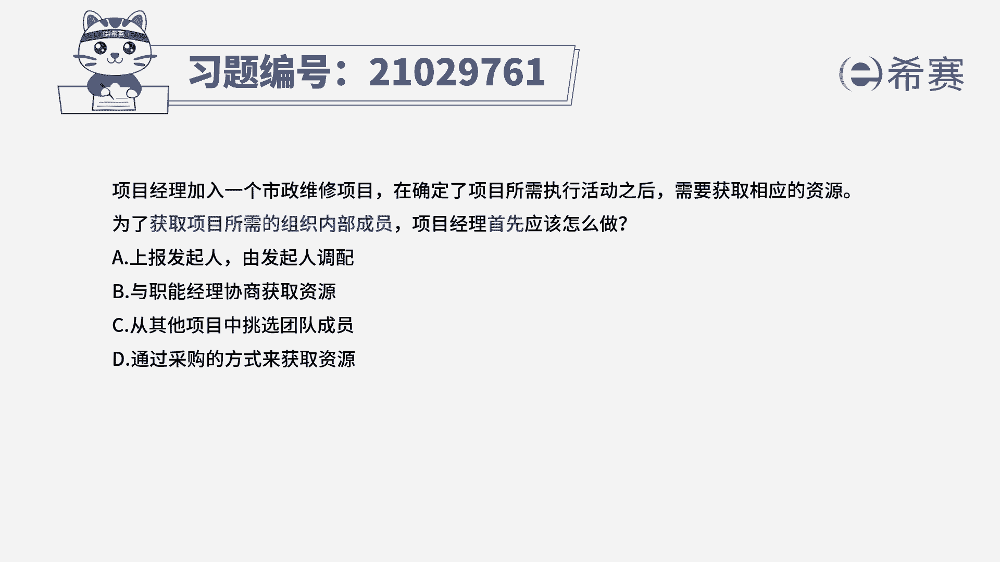
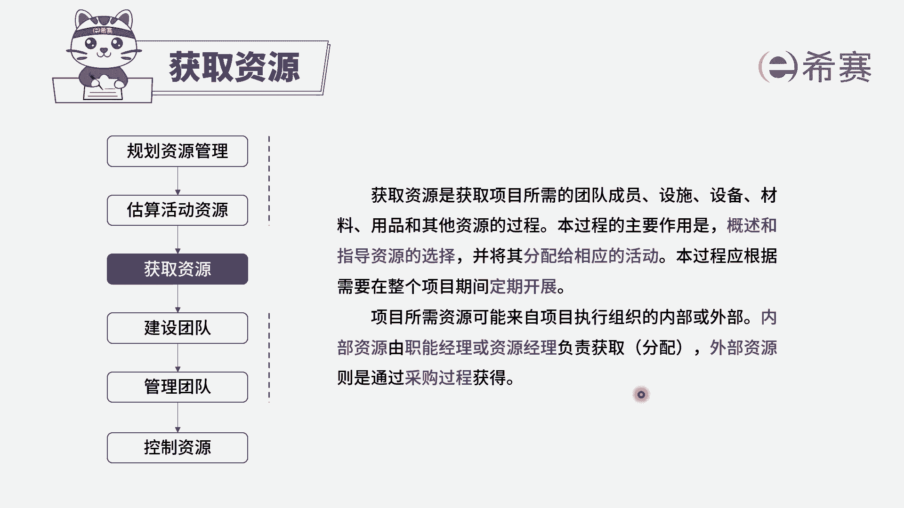
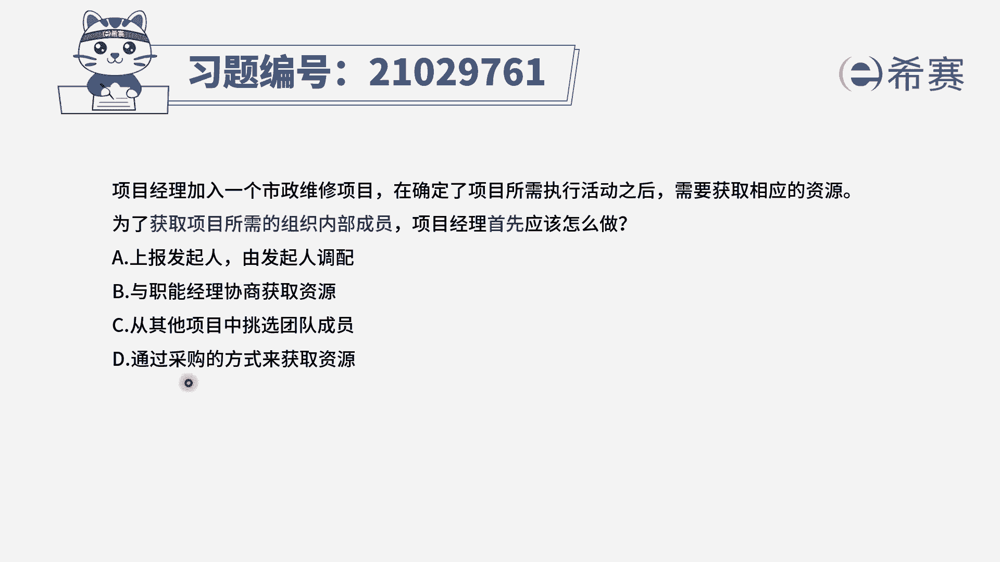
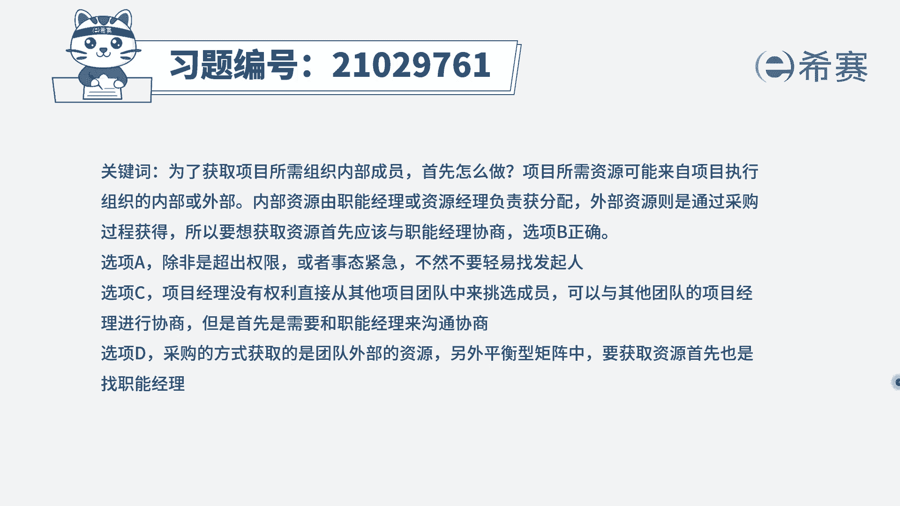

# 24年PMP模拟题-PMP付费模拟题100道免费视频新手教程-从零开始刷题 - P14：14 - 冬x溪 - BV1Fs4y137Ya

项目经理加入一个市政维修项目，在确定了项目所需执行活动之后，需要获取相应的资源，为了获取项目所需的组织内部成员，项目经理首先应该怎么做，a上报发起人，由发起人调配，b与职能经理协商获取资源。

c从其他项目中挑选团队成员，d通过采购的方式来获取资源，读完题目，我们可以找到题干中的关键句，题干是要获取项目所需的组织内部成员，问项目经理首先应该怎么做，也就是说如何去获取资源。

那我们就先来回顾一下获取资源的知识点，项目所需的资源可能来自项目执行组织的内部，或者外部，内部资源，是由职能经理或者是资源经理负责获取分配，而外部资源则是通过采购过程获得，我们了解了获取资源这个知识点。

我们再回过头看题目。

本题中说的是要获取项目所需的组织内部成员，根据我们刚刚所讲的知识点，内部资源是由职能经理或资源经理，负责获取分配的，现在问项目经理首先应该怎么做，那项目经理就可以去找职能经理去协商，获取相应的资源。

所以b选项就是正确的，我们再来看其他选项，我们先看a选项，a选项说的是上报发起人，这里只是获取资源的问题，不需要去上报，发起人，一般是项目经理权限之外解决不了的问题时，才会去选择上报发起人，所以a不选。

再看c选项，c选项说的是从其他项目中挑取团队成员，但是项目经理是没有权利，从其他项目中挑选团队成员的，所以c也不选，我们最后看d选项，对选项说的是通过采购的方式获取资源。

但是本题中说的是要获取组织内部成员，所以不需要通过采购的方式，采购的方式是要获取外部资源才会使用。

