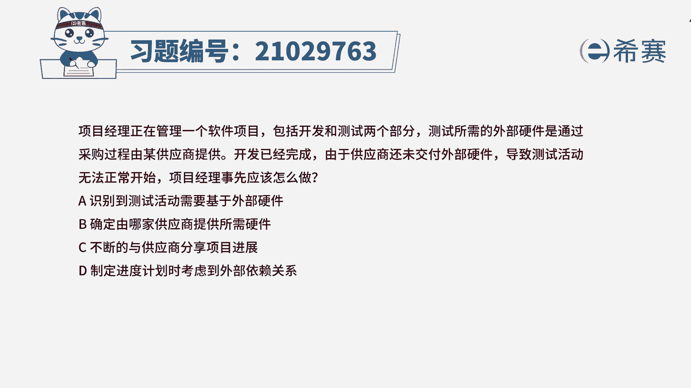
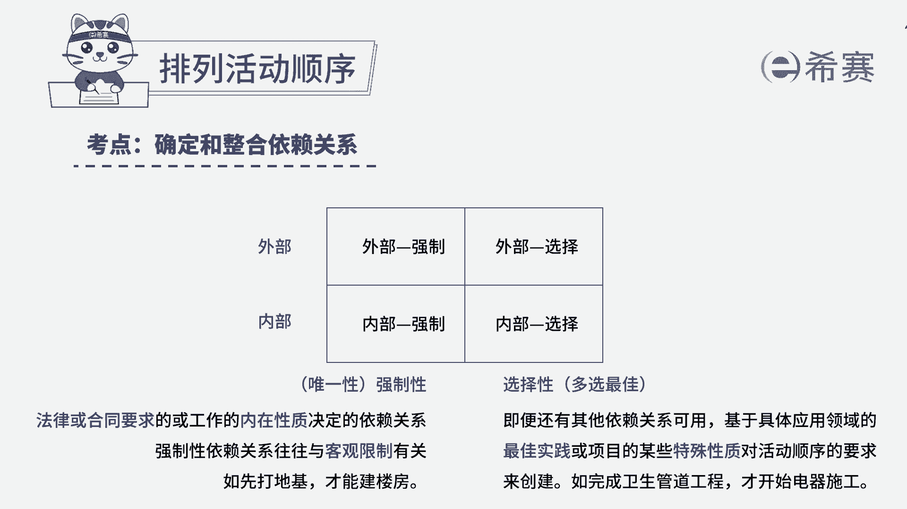
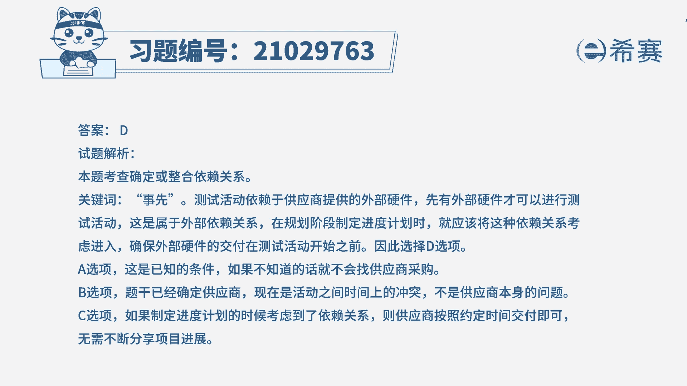

# 24年PMP模拟题-PMP付费模拟题100道免费视频新手教程-从零开始刷题 - P15：15 - 冬x溪 - BV1Fs4y137Ya

项目经理正在管理一个软件项目，包括开发和测试两个部分，测试所需的外部硬件是通过采购过程，由某供应商提供，开发已经完成，由于供应商还未交付外部硬件，导致测试活动无法正常开始，项目经理事先应该怎么做。

a识别到测试活动需要基于外部硬件，b确定由哪家供应商提供所需硬件，c不断地与供应商分享项目进展，d制定进度计划时，考虑到外部依赖关系，读完题目，我们可以找到题干中的关键句，题干说开发已经完成。

由于供应商还未交付外部硬件，导致测试活动无法正常开始，也就是说，测试活动要在供应商，交付了外部硬件之后才能进行，就是存在外部依赖关系，现在问项目经理事先应该怎么做，也就是说项目经理事先应该采取什么措施。

才能够避免测试活动无法正常开始的这种情况，那么项目经理事先就应该在制定进度计划时，就考虑到外部依赖关系，事先确保外部硬件在测试活动之前就能交付，从而避免测试活动无法正常开始的问题，所以d选项是符合的。

我们再看其他选项，先看a选项，a选项说的是题干中给出的已知条件，如果不知道测试活动基于外部硬件，就不会去找供应商进行采购了，所以不需要再去识别，所以a不选，再看b选项，题干表明已经确定了供应商。

只是因为活动顺序的冲突，导致测试活动无法开始，最后看c选项，如果提前考虑了外部依赖关系的话，就不需要再去花时间与供应商分享项目进展，供应商只需要按时交付即可，因此本题最佳的答案是d选项。

本题考察的知识点是项目进度管理中。

