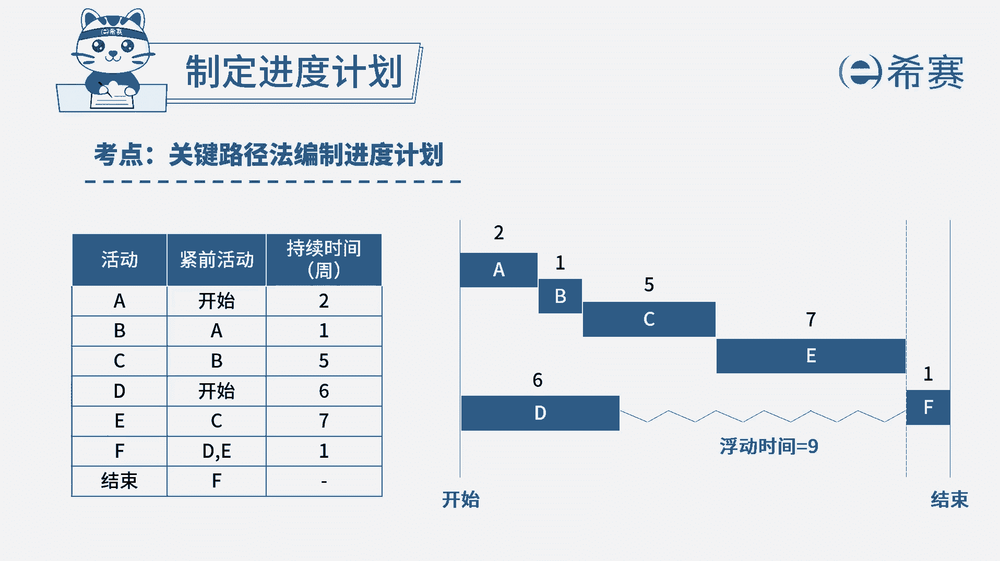

# 24年PMP模拟题-PMP付费模拟题100道免费视频新手教程-从零开始刷题 - P16：16 - 冬x溪 - BV1Fs4y137Ya

项目实施过程中，关键相关方通知项目经理，位于非关键路径上的某活动，项目经理首先应该怎么做，a核实该活动的浮动时间是否充足，b将该信息上报给发起人，c无需采取措施，因为是非关键路径，加快审批过程。

读完题目，我们可以找到题干中的关键句，题干说位于非关键路径上的某活动，问项目经理首先应该怎么做，既然是非关键路径，首先就应该对非关键路径上的浮动时间，进行核实，确保它不会影响到关键路径。

所以这是首要做的，因此a选项是符合的，我们再看其他选项，先看b选项，只有超过项目经理权限外解决不了的问题时，我们才会选择上报，遇到问题的时候，项目经理应该积极主动的去解决问题，不是直接去找发起人。

所以必不选加个c选项，虽然是非关键路径，但是非关键路径上有一定的浮动时间，如果产生较大偏差，就会影响到关键路径，所以也需要进行影响分析，况且项目经理直接不采取措施，也是一种消极的做法，所以c也不选。

最后看d选项，加快审批过程，所以地也不选，因此本题最佳的答案就是a选项。

本题考察的知识点是项目进度管理中。

