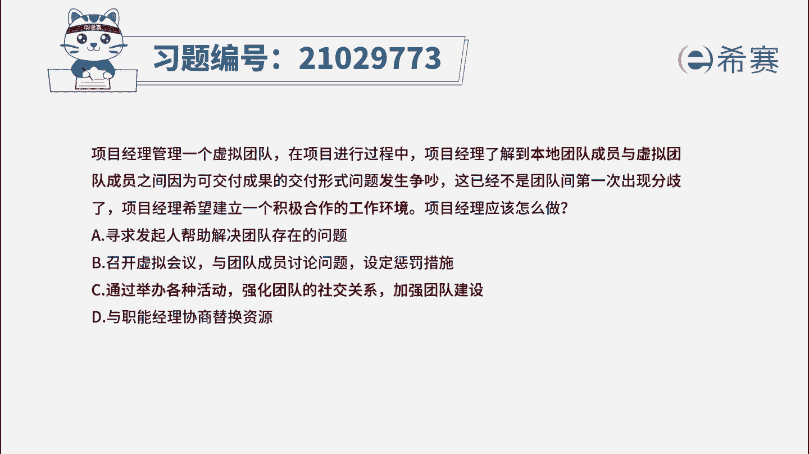
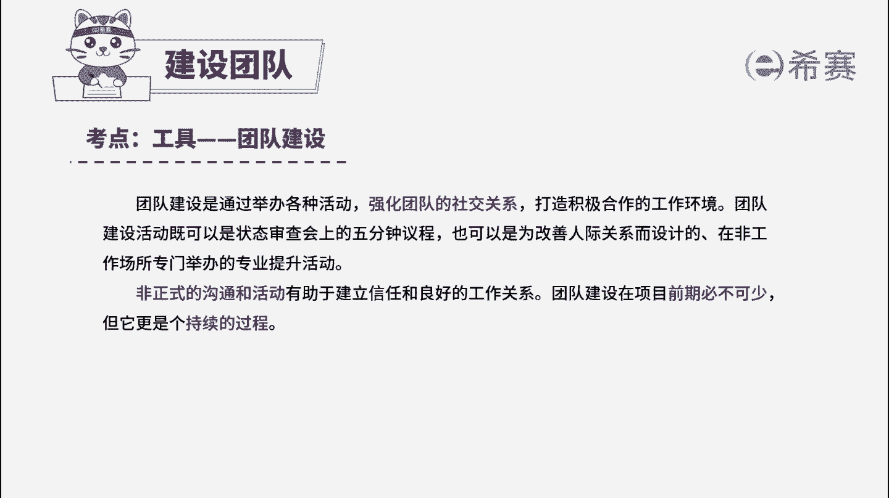

# 24年PMP模拟题-PMP付费模拟题100道免费视频新手教程-从零开始刷题 - P17：17 - 冬x溪 - BV1Fs4y137Ya

项目经理管理一个虚拟团队，在项目进行过程中，项目经理了解到，本地团队成员与虚拟团队成员之间，因为可交付成果的交付刑事问题发生争吵，这已经不是团队间第一次出现分歧了。

项目经理希望建立一个积极合作的工作环境，项目经理应该怎么做，寻求发起人帮助解决团队存在的问题，b召开虚拟会议，与团队成员讨论问题，设定惩罚措施，c通过举办各种活动，强化团队的社交关系，加强团队建设。

b与职能经理协商替换资源，读完题目，我们可以找到题干中的几个关键词，本地团队成员与虚拟团队成员之间，因为可交付成果的交付形式问题发生争吵，而且不是第一次出现分歧，项目经理希望建立一个积极合作的工作环境。

现在问项目经理应该怎么做，我们先看一下选项，a选项寻求发展的帮助，这里就属于上报的情况，但是一般出现了项目经理，用自身权限解决不了的问题时，才会选择上报，这里只是团队出现分歧，不需要做上报处理。

所以a选项属于一种非常消极的处理方式，项目经理应该积极主动的解决问题，所以a不选，我们看b选项，b选项说的是召开虚拟会议并设定惩罚措施，惩罚措施属于负向激励，并不能建立一个积极合作的环境。

只是强制性的要求团队成员去达到，所以b是解决不了问题的，再看c选项，c选项的表述其实就是指的团队建设，团队建设就是通过举办各种活动，强化团队的社交关系，打造积极合作的工作环境。

而且团队建设活动还可以帮助各团队成员，更加有效地协同工作，与题干中说的，希望建立一个积极合作的工作环境相符，所以c是可选的，最后我们看d选项，d选项说的是与职能经理替换资源。

本题中只是团队成员间出现分歧，替换资源的做法是不可取的，项目经理应该做的是，首先去解决分歧的问题，并建立一个积极合作的工作环境，一般只有出现资源不符合合同规定，或者出现其他违背道德法规相关的事情时。

才可能去考虑替换资源，所以d也是一种比较消极的做法，也不选，所以经过我们刚才的分析，a选项和d选项都是属于消极的做法，而b选项说的惩罚措施是属于负向激励，也不能解决根本问题。

所以本题最佳的答案就是c选项。

本题考察的知识点是项目资源管理中。

