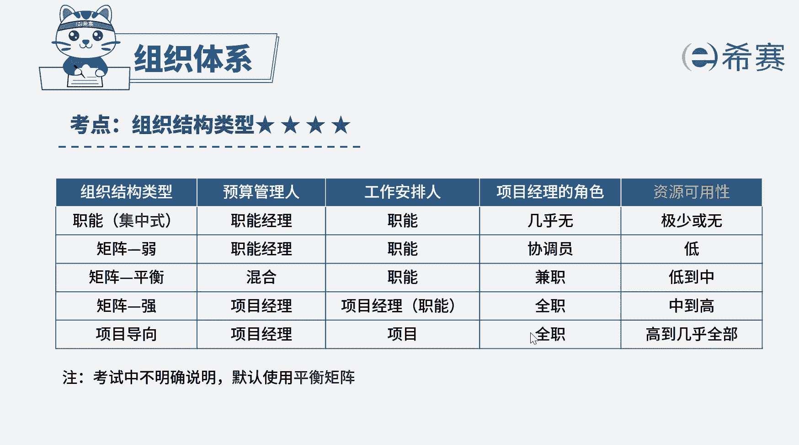

# 24年PMP模拟题-PMP付费模拟题100道免费视频新手教程-从零开始刷题 - P19：19 - 冬x溪 - BV1Fs4y137Ya

公司准备开展一个新项目，为了获得资源，项目经理必须征求只能经理真理的同意，上午他拿着所需资源的文件清单，来到了真理的办公室，找他进行签字，显然这家公司的组织结构是a项目型，b弱矩阵型。

c强矩阵型d职能型，好读完题目，找到题干中的关键词，要获得资源，项目经理必须征求职能经理的同意，问这是属于什么组织结构类型，组织结构类型有多种，它们主要区别在于权力的大小，以及对资源进行支配的权限大小。

选项a项目型，那对于项目型的组织结构，项目经理的权力很大，拥有绝对话语权，对资源完全具有支配权，项目经理是项目预算的管理者，选项b弱矩阵型，那对于弱矩阵型职能经理比项目经理权力大，对资源拥有支配权。

项目经理充当协调员的角色，职能经理是项目预算管理者，选项c强举阵型，那对于强矩阵型项目经理，权力比职能经理权力大，对资源具有支配权，项目经理是项目预算的管理者，d选项职能型，那对于职能型职能经理权力大。

对资源完全具有支配权，几乎不存在，项目经理这个角色，职能经理是项目预算管理者，本题中项目经理获得资源，必须要通过职能经理的同意，说明职能经理权利比项目经理大，ac选项不符合。

那若矩阵和职能矩阵中职能经理的权力都大，但职能型组织中几乎没有项目经理的存在，所以该题题干描述，更符合弱矩阵的组织结构特点，本题的正确选项为b选项，好啦我们这道题就先讲解到这里。

大家可以自行参考一下相关的文字解析。

整个题目讲解下来，我们可以知道，本题考察的知识点，就是几种组织结构类型的区分，通过权力的大小对资源的支配权。

