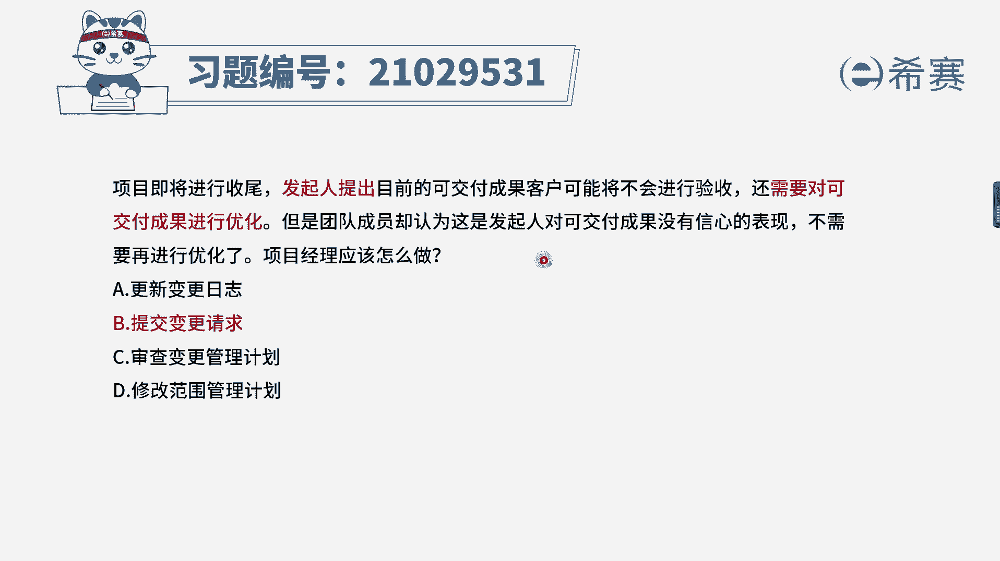
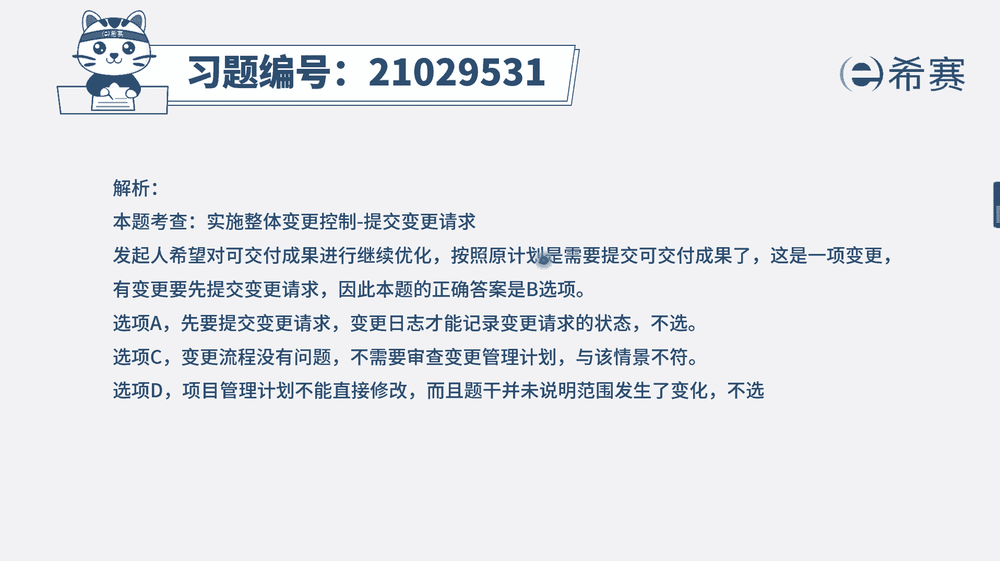
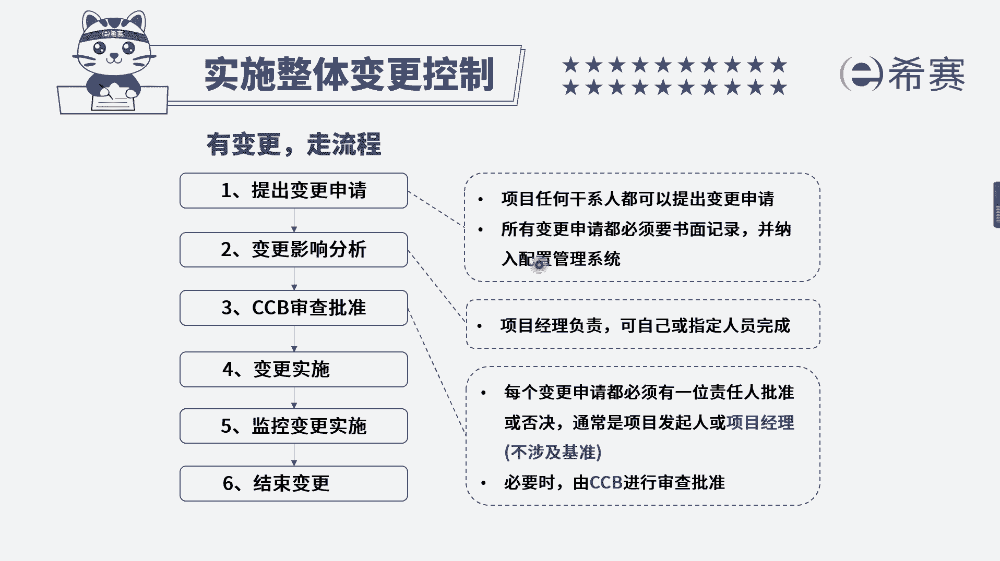

# 24年PMP模拟题-PMP付费模拟题100道免费视频新手教程-从零开始刷题 - P2：2 - 冬x溪 - BV1Fs4y137Ya

项目即将进行收尾，发起人提出目前的可交付成果，客户可能将不会验收，还需要对可交付成果进行优化，但是团队成员却认为，这是发起人对客交付成果没有信心的表现，不需要再进行优化了，项目经理应该怎么做。

选项a更新变更日志选项b，提交变更请求选项c审查变更管理计划选项d，修改范围管理计划，我们先来找一下题干的关键词，现在是项目即将进行收尾，也就是还没有收尾，没有验收，发起人提出要优化可交付成果。

但是团队却认为不需要再进行优化，那么到底需不需要优化呢，这并不是团队或者说发起人，某一方就可以决定的，我们应该分析影响，包括这样做到底是不是可行的，会对项目产生一些什么影响，有没有可选的方案。

有了方案之后再提交给ccv进行决策，所以说如果要做优化，肯定是有变更走流程，我们选择b选项来看一下其他几个选项，a选项更新变更日志，变更日志它是记录的变更的状态，咱们现在还没有提交变更请求呢。

所以说这个不是优先要做的，而c选项审查变更管理计划，变更管理计划记录的是变更的流程，如果我们是不知道变更流程是什么，这个时候才需要去审查变更管理计划，而d选项修改范围管理计划，这是一个干扰选项。

范围管理计划是范围管理的一个指南，文件指导我们如何去管理范围，不需要在这个时间节点上去进行修改。

跟题干的关联是不大的，好我们看一下文字解析部分。

本题考察的是项目整合管理。

