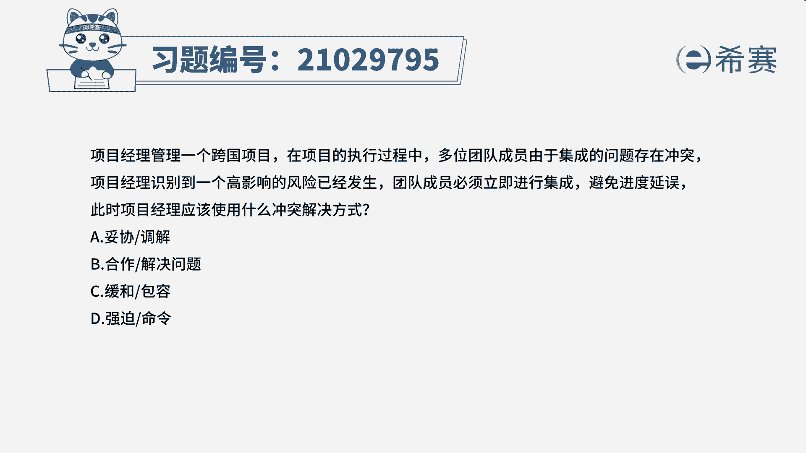
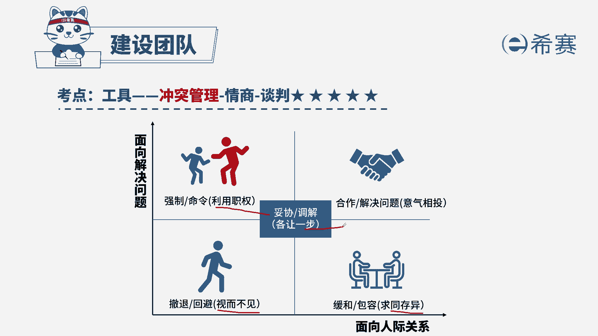
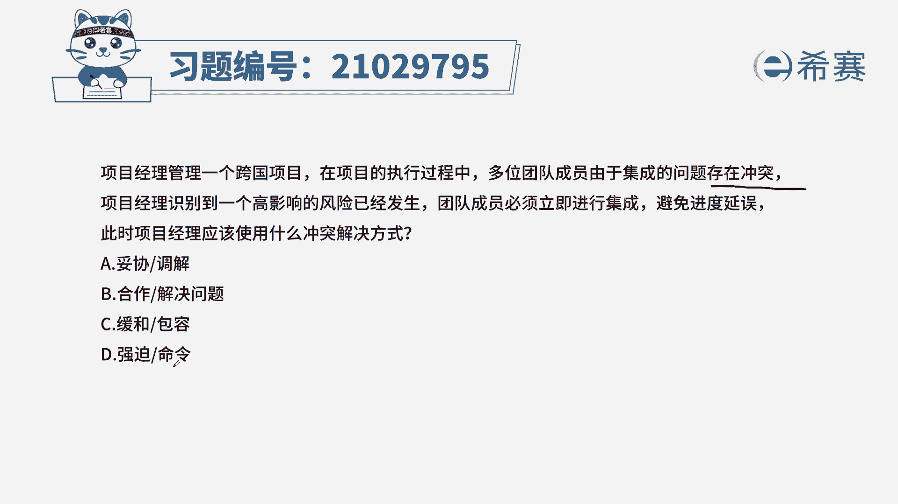

# 24年PMP模拟题-PMP付费模拟题100道免费视频新手教程-从零开始刷题 - P20：20 - 冬x溪 - BV1Fs4y137Ya

项目经理管理一个跨国项目，在项目的执行过程中，多委团的成员由于集成的问题存在冲突，项目经理识别到一个高影响的风险已经发生，团队成员必须立即进行集成，避免进度延误，此时项目经理应该使用什么冲突解决方式。

a妥协调解，b合作解决问题，c缓和包容d强迫命令，读完题目和选项，我们可以知道，这道题是在考察冲突管理的解决方式，所以我们先来回顾一下，我们所学到的五种冲突管理解决方式的特点。

我们先来看第一个强制命令，强制命令是利用职权，项目经理一般是直接去命令团队成员，去执行任务，而不会去听取团队成员的意见，再看合作解决问题，合作解决问题可以使冲突双方相互理解，合作已达成长期的协作。

解决问题可以得到双方都满意的结果，所以也是最有效的冲突管理解决方式，再看缓和包容，缓和包容的特点是求同存异，就是强调冲突中的一致性而非差异，再看撤退回避，车队回避是视而不见，就是说实际发生了冲突问题时。

不去采取任何措施去解决，是一种逃避行为，消极做法，最后看妥协调解，妥协调解就是各让一步是冲突，双方各退了一步，为了暂时或者是部分解决冲突，寻求能够让双方都在一定程度上满意的方案。

所以这种方法有时候可能导致双输的局面，因为双方的观点可能都没有被直接采纳。

我们清楚了这五种冲突方式的特点，我们再来看题目，先看题目的关键句，题干说由于集成问题存在冲突，现在团队成员必须立即进行集成，也就是说我们目前不管对于集成有什么冲突，你都必须去做，而且要马上立即去执行。

是比较强硬的做法，所以属于强迫命令的解决方式。

