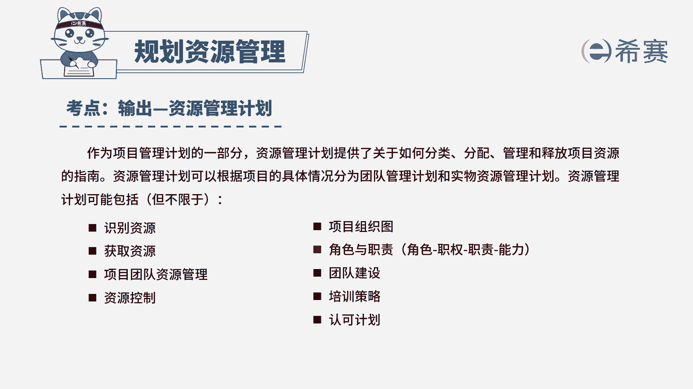

# 24年PMP模拟题-PMP付费模拟题100道免费视频新手教程-从零开始刷题 - P21：21 - 冬x溪 - BV1Fs4y137Ya

项目正处于执行阶段，项目新到了一批设备，团队成员却不知道如何使用，项目经理准备针对项目成员展开培训，为了确定项目成员的培训策略，项目经理应该首先审查什么，a项目培训计划。

b资源管理计划c项目章程d资源分解结构，读完题目，我们可以找到题干中的关键句，题干说的是处于执行阶段，现在项目经理要对团队成员展开培训，为了确定培训策略，首先应该审查什么，我们先来分析一下选项。

a选项说的是项目培训计划，这里说的项目培训计划看似跟题干很贴合，但是我们学过的十大子计划中，并没有项目培训计划这个表述，所以a是干扰项，不选，我们看b选项，资源管理计划，资源管理计划是如何分类分配。

管理和释放项目资源的指南，其中就包括了培训，即针对项目成员的培训策略的内容，而且题干问的是首先审查什么，这种情况一般都是要看指南性文件，所以b选项是符合的，我们再看c选项。

项目章程中的内容是项目正式启动前编制的，它是正式批准项目成立，并授予项目经理权利的文件，只有高层级的内容，并不包含具体的培训策略，所以c是不对的，最后我们看d选项，资源分解结构。

资源分解结构适用于指导项目的分类活动，是资源一类别和类型的层级展现，比如说资源类别包括了人力，材料，设备和用品，会介绍人力有哪些，材料设备有哪些等等，但是跟我们这里的培训策略是没有关系的。

因此我们本题最佳的答案就是b选项。

本题考察的知识点是项目资源管理中规划。

