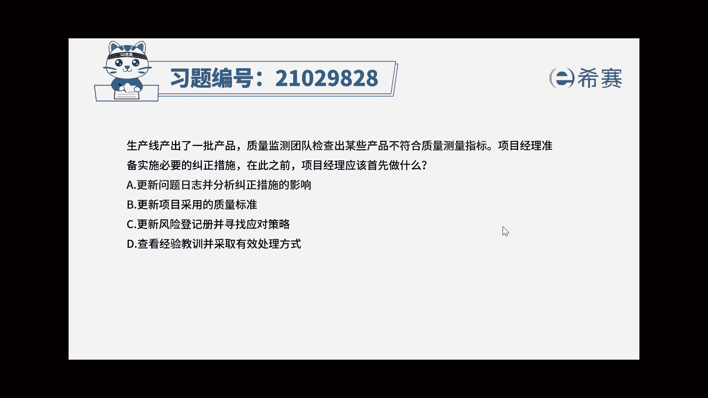
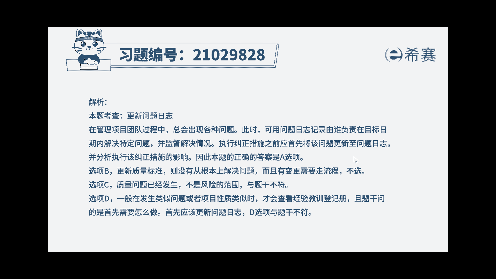
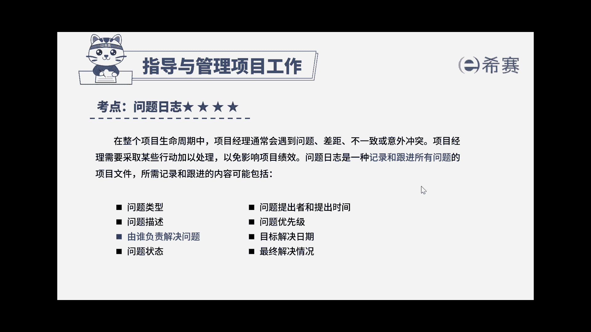

# 24年PMP模拟题-PMP付费模拟题100道免费视频新手教程-从零开始刷题 - P22：22 - 冬x溪 - BV1Fs4y137Ya

生产线产出了一批产品，质量检测团队，检查出某些产品不符合质量测量指标，项目经理准备实施必要的纠正措施，在此之前，项目经理应该首先做什么，更新问题日志并分析纠正措施的影响，b更新项目采用的质量标准。

更新风险登记册，并寻找应对策略，d查看经验教训，并采取有效处理方式，好读完题目，回到题干，可以看到一些关键词，质量检测团队发现了一些产品不合格，项目经理要在实时纠正措施之前首先做什么。

唉在管理项目团队过程中，总会出现各种问题，此时可用问题日志记录由谁负责，在目标日期内解决待定的问题，并监督解决情况啊，因此在执行纠正措施之前，应该首先将问题更新至问题日志，并分析执行该纠正措施的影响。

因此本题的正确答案应该是选项a，再来看看其他选项，选项b更新质量标准并没有从根本上解决问题，而且有变更需要走流程，不能直接更新诶，不选选项c，质量问题是已经发生，而风险是未发生的唉。

所以这道题与风险无关，不选选项d，一般在发生类似问题或者项目性质类似时，才会查看经验教训登记册，且题干问的是首先要做什么，那我们首先应该更新问题日志啊。

选项d与题干不相符，好了，这道题我们就先讲解到这里，大家可以自行参考一下相关的文字解析，整个题目讲解下来。

我们可以知道，本题考察的知识点是项目整合管理。

