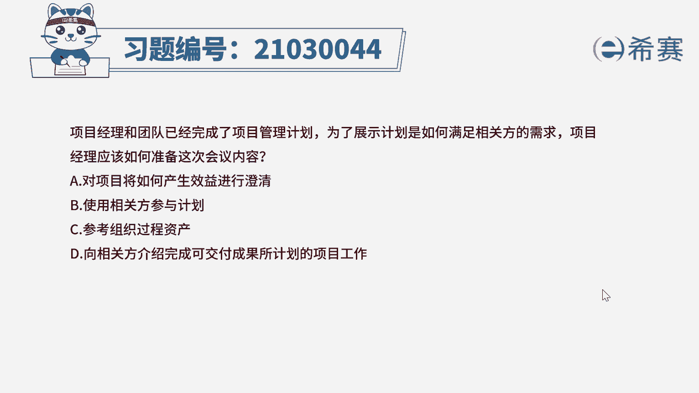
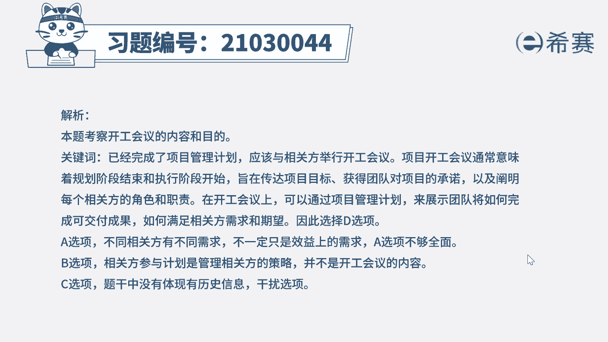
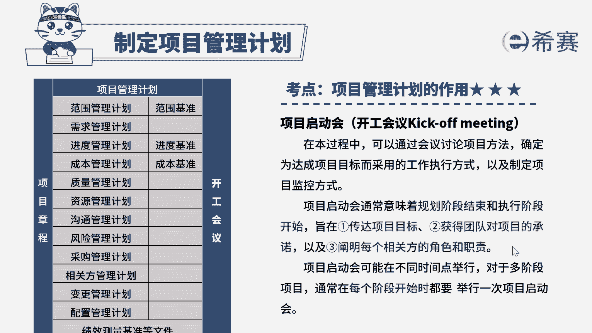

# 24年PMP模拟题-PMP付费模拟题100道免费视频新手教程-从零开始刷题 - P26：26 - 冬x溪 - BV1Fs4y137Ya

项目经理和团队已经完成了项目管理计划，为了展示计划是如何满足相关方的需求，项目经理应该如何准备这次会议内容，a对项目将如何产生效益进行澄清，b使用相关方参与计划，c参考组织过程资产，d向相关方介绍。

完成可交付成果所计划的项目工作，好读完题目，我们先来看一下问题，项目经理应该如何准备这次会议内容，诶，再回到题干，可以看到一些关键词已经完成了项目管理计划，那说明接下来的事情就应该与相关方进行。

开工会议，项目开工会议通常意味着规划阶段结束，和执行阶段开始，旨在传达项目目标，获得团队对项目的承诺，以及阐明每个相关方的角色和职责，在开工会议上，可以通过项目管理计划来展示团队将如何完成，可交付成果。

如何满足相关方需求和期望啊，因此这道题的答案直接定位到选项d好，我们再来看看其他选项，选项a不同相关方有不同需求，不一定只是效益上的需求，可能还要满足什么功能等需求，哎所以a选项不够全面，不选好选项。

b相关方参与计划是管理相关方的策略，并不是开工会议上的内容，选项c是一个干扰选项，题干中没有体现有历史信息，所以不用去参考组织过程资产啊，所以c选项直接排除好了。

我们这道题就先讲解到这里，大家可以自行参考一下相关的文字解析。

整个题目讲解下来，我们可以知道，本题考察的知识点就是项目整合管理，制定项目管理计划。

