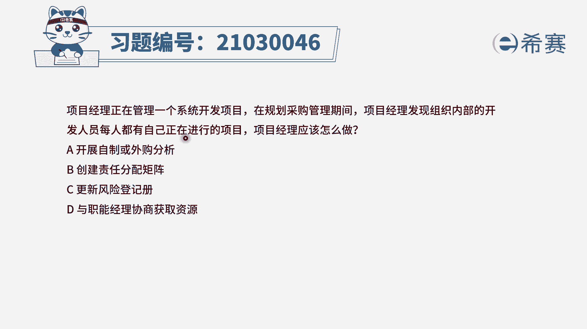
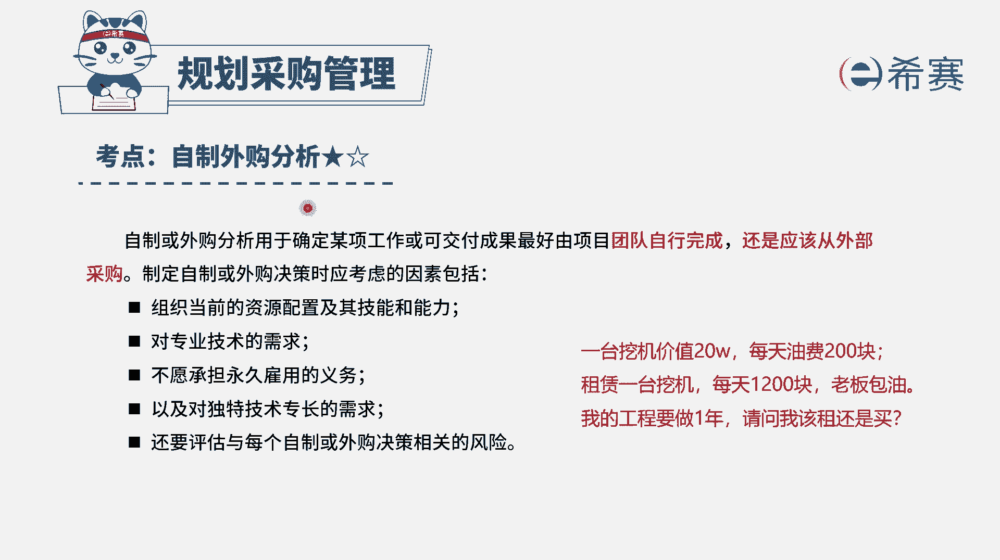
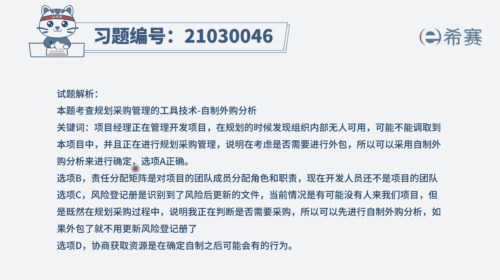
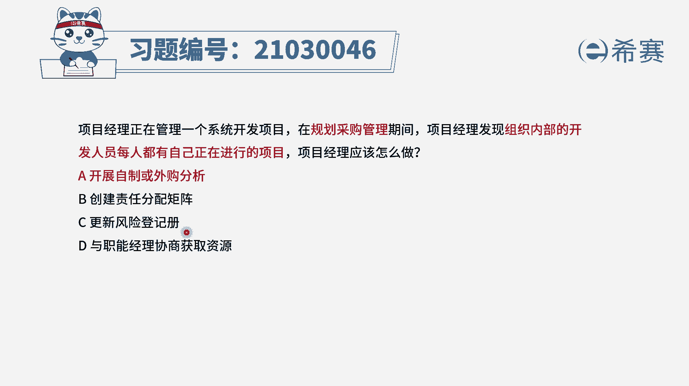

# 24年PMP模拟题-PMP付费模拟题100道免费视频新手教程-从零开始刷题 - P27：27 - 冬x溪 - BV1Fs4y137Ya

项目经理正在管理一个系统开发项目，在规划采购管理期间，项目经理发现组织内部的开发人员，每一个人都有自己正在进行的项目，那项目经理应该怎么办，现在你准备搞新项目，但是团队内部的人员都忙得不得了。

那到底要不要自己搞，还是请人搞，这应该是你要去考虑的一个问题对吧。

所以这个时候你会怎么办呢，你应该是要去做一个自制或外购分析，就是你要去通过分析来确定，到底自己做的好处有哪些，然后外部去采购的好处有哪些，从而去决定到底是团队自己完成还是外部完成。

因为目前团队内部其实很忙的，在很忙的情况下，是否能够友好地去完成它，然后保质保量的去完成，让团队能够有所提升，这都是需要去考虑的事情，所以这个答案就是自制或外购分析，也就是选项a其他几个选项。

我们来认识一下选项b创建责任分配矩阵，那通常是我们已经开展做这个项目的情况下，我们会把要做的这些工作内容，和我们的这些人力资源来去进行一个匹配，进行一个矩阵的匹配。

哪一些人他对某一个工作内容是要去负责完成，还是起到一个支持的作用，还是只要知识就可以了，当我们如果说发现有一些人，他对于责任不清晰的时候呢，都可以去查看这个责任分配矩阵选项c，更新风险登记册。

那更新风险能预测，它一般来讲是我们识别风险的时候，或者是对风险进行分析以后，或是规划风险应对以后，以及风险发生以后，都可以去更新风险政策，但是题干跟这个风险没有什么直接关系。

你可以说好像团队内部每一个人都很忙，忙不赢，这对于做项目本身是有风险，但是它更大条的是说这个项目到底该怎么做，到底是内部做还是外部做，所以更直接的倾向应该是a选项的这样一个，开展自制或外国分析。

而最后一个选项与职员经理来协商获取资源，那这种情况呢，你只有已经是确定好要做什么项目，同时又发现还缺人的时候，你才能够去获取资源，当你还没有确定下来的时候呢，你是不能够直接去要人的。

所以答案就是选a选项进行自制或外购分析，那详细解析。

