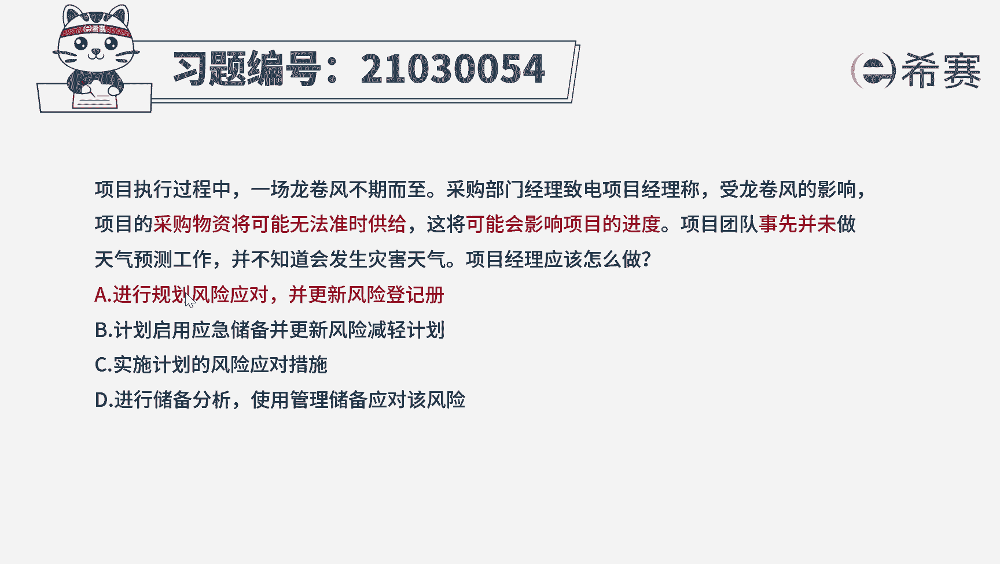
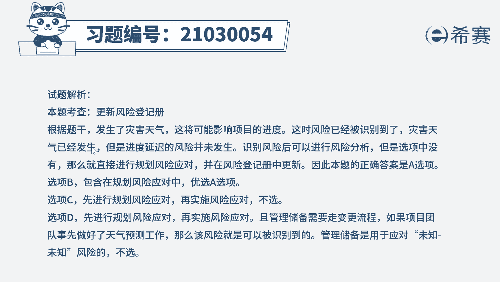
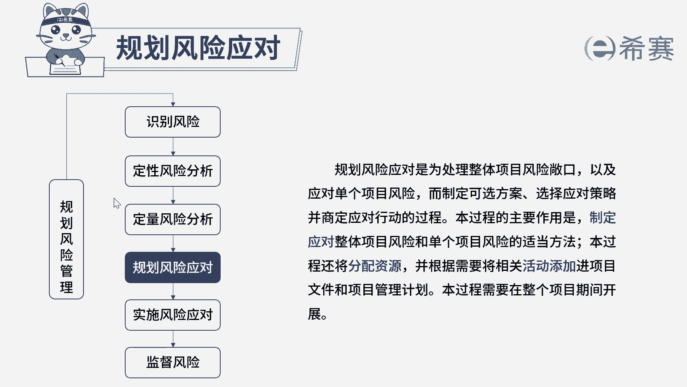

# 24年PMP模拟题-PMP付费模拟题100道免费视频新手教程-从零开始刷题 - P28：28 - 冬x溪 - BV1Fs4y137Ya

项目执行过程中，一场龙卷风不期而至，采购部门经理致电项目经理，称，受龙卷风的影响，项目的采购物资将可能无法准时供给，这将可能会影响项目的进度，项目团队事先并未做天气预测工作，并不知道会发生灾害天气。

项目经理应该怎么做，a进行规划风险应对并更新飞行单机测，b计划启用应急储备并更新风险减轻计划，c实施计划的风险应对措施，d进行储备分析，使用管理储备应对该风险好，读完题目，先来看一下问题。

项目经理应该怎么做，再回到题干中，可以看到采购的物资可能无法准时送达，这可能会影响到项目进度，这两个可能非常抢眼，说明是识别到了风险，而事先不知道这情况，说明之前未识别到该风险，这是第一次识别到识别。

筛选之后的第一步是应该更新风险登记册，然后再进行分析分析，但是选项中没有这样的选项，那我们就再往后推推，更新风险登记册，进行风险分析之后的步骤就是规划风险应对，所以我们最合适的选项就是a。

再来看一下其他选项，选项b它是被包含在选项a中的，没有a全面好学校c目前风险还未具体发生，只是识别到还不需要应对，而且是第一次识别到风险，没有可用的计划来实施选项，d管理储备是应对未知未知风险的。

现在是识别到风险，说明是已知的风险，所以这个选项不合适，而且管理储备的使用需要自变更流程，ccb同意之后才能使用，而不是我们项目经理想使用就可以使用好了，我们这道题就先讲解到这里。

大家可以自行参考一下相关的文字解析。

整个题目讲解下来，我们可以知道本题考察的知识点就是风险管理，识别风险之后。

