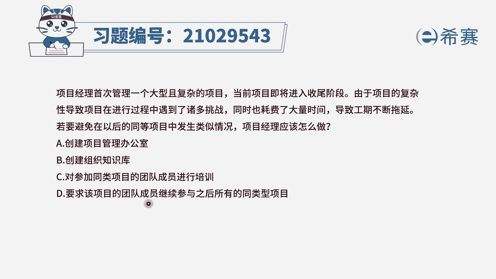
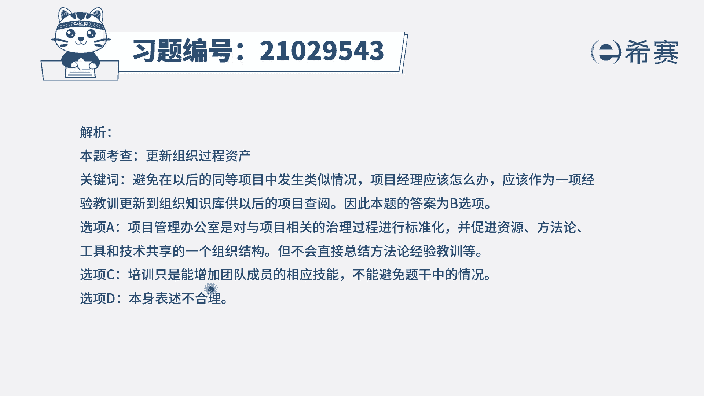
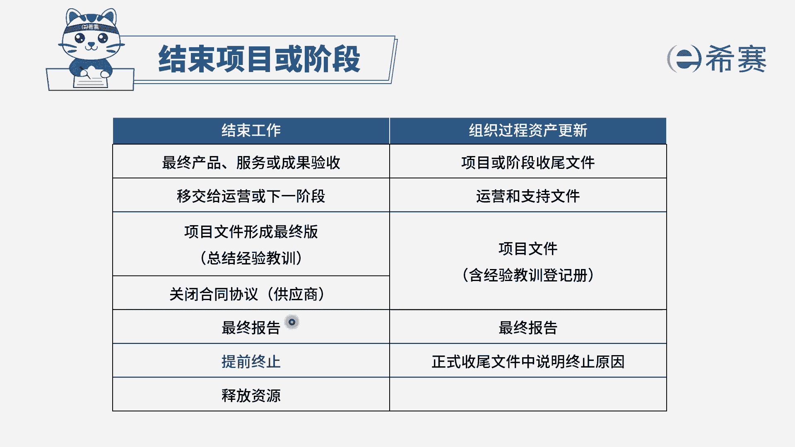

# 24年PMP模拟题-PMP付费模拟题100道免费视频新手教程-从零开始刷题 - P3：3 - 冬x溪 - BV1Fs4y137Ya

项目经理首次管理一个大型且复杂的项目，当前项目即将进入收尾阶段，由于项目的复杂性，导致项目在进行过程中遇到了诸多挑战，同时也耗费了大量时间，导致项目工期不断的拖延。

若要避免在以后的同等项目中出现类似的情况，项目经理应该怎么做，选项a创建项目管理办公室选项，b创建组织知识库选项，c对参加同类项目的团队成员进行培训，选项低要求该项目的团队成员继续参与之后。

所有的同类型项目，我们先来看关键词，现在的项目即将进入收尾，他在项目的开展过程中遇到了很多的挑战，而题干问的是，如果要避免在以后的同等项目中，发生类似的情况，避免其他项目发生类似情况。

说明我们需要把我们遇到的一些经验教训，挑战问题传递到组织中，其他项目中去，因此要做的就是更新组织过程，资产b选项是正确的，来看一下其他选项，a选项，创建项目管理办公室，项目管理办公室。

虽然确实可以传递这样一个经验教训，但是这里项目经理，他不应该去创建项目管理办公室，这并不是项目经理职责内需要去做的，而c选项要项目经理，对参加同类项目的团队成员进行培训。

项目经理他负责的是本项目的一个工作，不会涉及到给其他的项目进行一个培训，d选项要求该项目的团队成员继续参与之后，所有的同类型项目，这个选项是很不现实的，对不对，你不可能要求。

所有人永远都是做同一类型的项目，你肯定有很多项目是同时开展，并且这也不是项目经理他去安排的，所以综合分析下来，我们选择b选项，创建组织的知识库。

大家可以看一下文字解析部分。

本题考察的是结束项目或阶段。

