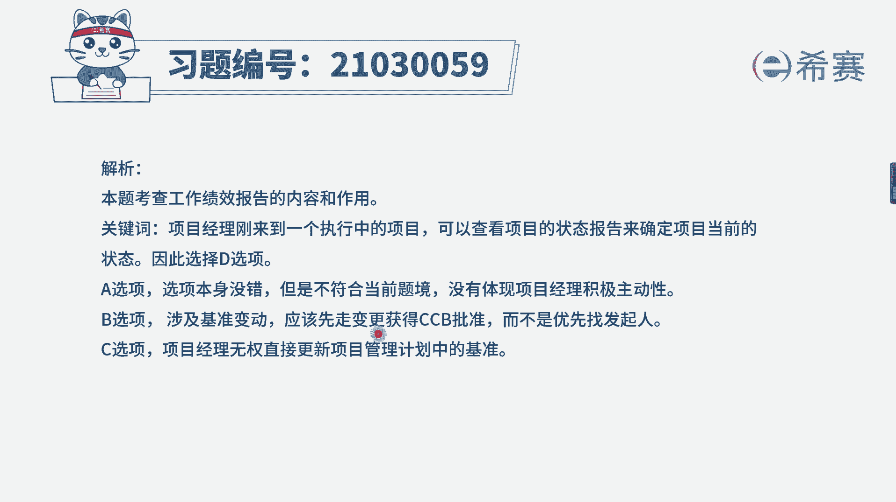
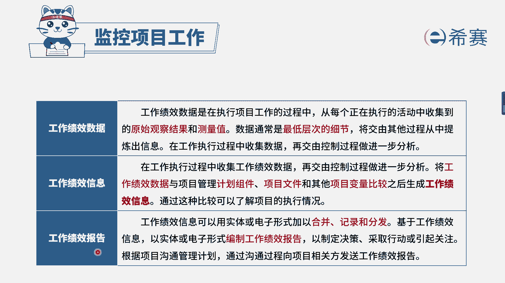

# 24年PMP模拟题-PMP付费模拟题100道免费视频新手教程-从零开始刷题 - P30：30 - 冬x溪 - BV1Fs4y137Ya

项目正处于实施阶段，由于组织结构发生变化，项目经理被分配到其他岗位，发起人为项目任命了一位新的项目经理，将在下周正式上任，为了了解项目信息，项目经理向相关方打听项目情况，得知项目正处于成本超支状态。

上任后，项目经理首先应该做什么，选项a向团队成员介绍自己选项，b请求发起人提供额外的预算选项，c更新项目管理计划，以纠正成本的偏差，选项d查看当前的项目绩效报告，已确定项目真实的状态。

我们来看一下关键词，现在是不是替换了一位新的项目经理，他了解项目信息是通过什么渠道，是向相关方打听打听，得知项目处于一个成本超支的状态，说明他得到的并不一定是实际情况。

只是说你从别人那里了解到的一个信息，那么上任后你首先要干嘛，我是不是应该知道到底他说的是不是真的，项目当前真实的一个状态到底是什么呢，所以我们应该去查看项目的绩效报告，确定项目的真实状态。

选择d选项来看一下其他选项，a选项说的是向团队成员介绍自己，其实这个选项它本身并没有错，因为你上任后，你是应该跟团队去认识，只是说他跟这个题目的关联性是比较弱的，因为题干他强调了。

你跟相关方打听了一个项目的状态，成本超支，所以说我们会对应选择，跟题干关联性更强的d选项，最后我们来简单看一下b c选项，b选项说的是请求发起人提供额外的预算，预算预算。

其实预算它是包含成本基准和管理储备的，只有当我们成本基准已经超支，并且管理储备用完了的情况下，才会去考虑额外的一个运算，在这个题目中，你首先做的肯定不是先去找他要运算，因为我们先要了解项目的一个状态。

对不对，而c选项更新项目管理计划，以纠正成本偏差，这个选项是错误的，项目经理是无权直接更新项目管理计划，去动这个成本的一个基准的。

因此本题正确答案为d选项，大家可以看一下文字解析部分。

本题考察的是监控项目工作考察的一个点，项目的实际绩效。

