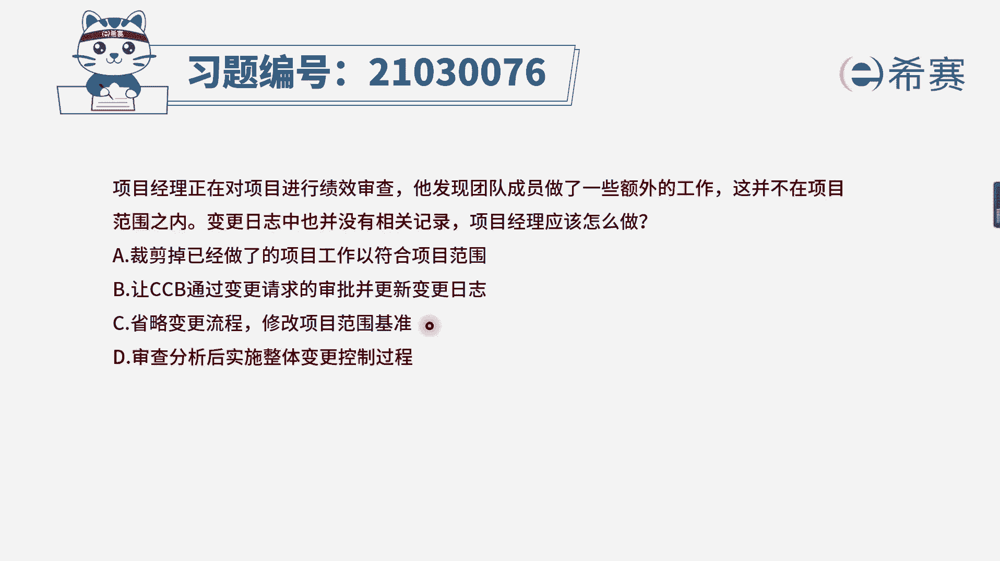
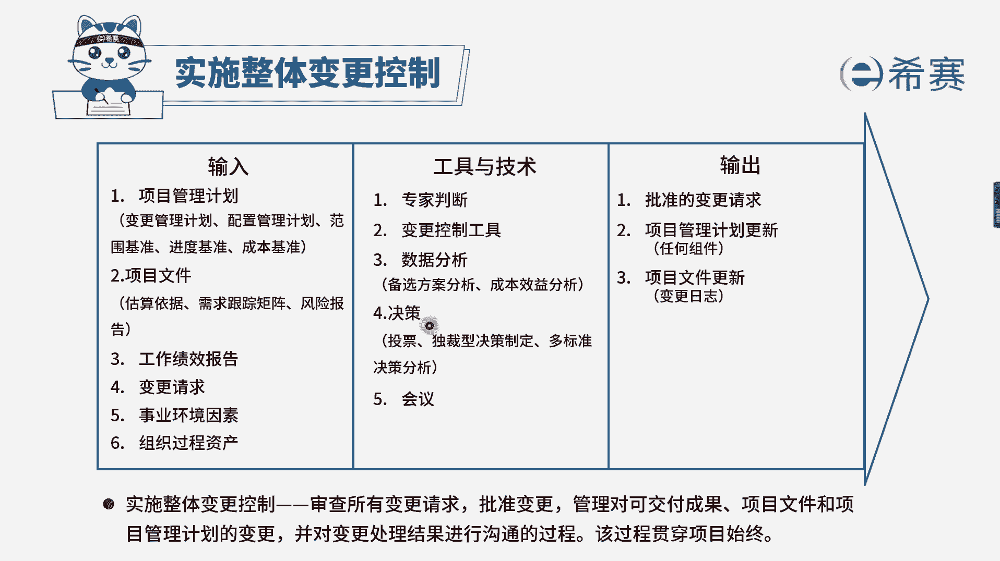

# 24年PMP模拟题-PMP付费模拟题100道免费视频新手教程-从零开始刷题 - P34：34 - 冬x溪 - BV1Fs4y137Ya

项目经理正在对项目进行绩效审查，他发现团队成员做了一些额外的工作，这并不在项目范围之内，变更日志中也没有相关的记录，项目经理应该怎么做，选项a裁剪掉已经做了的项目工作，以符合项目范围，选项b。

变更日志选项c省略变更流程，修改项目的范围，基准选项d审查分析后实施整体变更控制流程，现在看关键词，团队成员做了额外工作，不在范围内，并且变更日志没有记录，是不是典型的不变更流程的题目呀。

团队做了额外的工作，没有走变更流程，我们需要不变更流程，因此我们来分析一下选项，a选项是直接裁剪掉已经做的项目工作，这个做法肯定是不合适的，因为你已经做了，已经影响到了基准。

做了额外的事情肯定是要补变更流程的，而b选项和d选项，一个是去走实施整体变更控制流程，你觉得哪个说法好呢，肯定是d更好，对不对，到底要不要通过，决定权是在cc b而不是项目经理，b选项说法是不太合适的。

最后c选项省略变更流程，修改项目范围基准，这个一看就是错的，因为项目经理无权直接更新项目基准，因此综合分析下来，d选项是说法最正确的选项。

大家可以看一下文字解析，本题考察的是实施整体变更控制流程的相关内，容。

