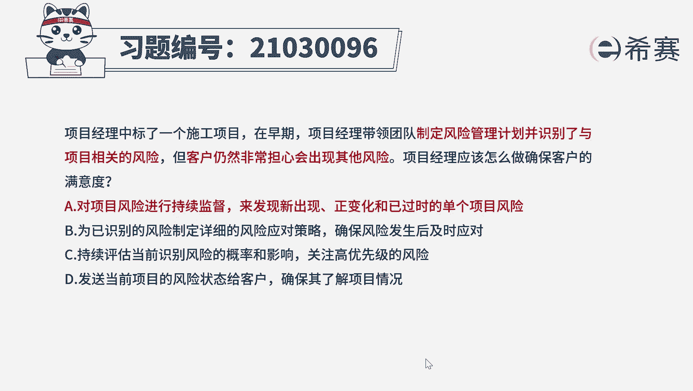

# 24年PMP模拟题-PMP付费模拟题100道免费视频新手教程-从零开始刷题 - P37：37 - 冬x溪 - BV1Fs4y137Ya

项目经理中标了一个施工项目，在早期项目经理带领团队制定风险管理计划，并识别了与项目相关的风险，但客户仍然非常担心会出现其他风险，项目经理应该怎么做，确保客户的满意度，a对项目风险进行持续监督。

来发现新出现正变化和已过时的单个项目风险，b未以识别的风险，制定详细的风险应对策略，确保风险发生后及时应对，c持续评估当前识别风险的概率和影响，关注高优先级的风险，d发现当前项目的风险状态。

给客户确保其了解项目情况好读完题目，我们先来看一下问题，项目经理应该怎么做，确保客户的满意度，我们再回到题干中，可以看到项目经理制定了风险管理计划，并且识别了风险，但是客户还是担心有新的风险。

这个时候就需要对风险进行监督，以便管理跟踪，以识别到的风险，以及去识别和分析新的风险，来解决客户的担忧，唉因此本题选项a为最佳选项，再来看一下其他选项，选项b和c都不太符合题意，不论是位以识别的风险。

制定详细的风险应对策略，还是持续评估当前识别风险的概率和影响，排优先级都是针对已识别的风险进行风险应对，并没有解决客户对于未来可能会出现的，新风险的担忧，唉，所以b和c我们就排除掉选项d。

直接发送风险状态给客户，让他了解项目情况，仅仅是去告知客户，并不能让客户满意，客户需要的是一个解决担忧的方案，而不是一个通知好了，我们这道题就先讲解到这里。

大家可以自行参考一下相关的文字解析。

整个题目讲解下来，我们可以知道本题考察的知识点，就是项目风险管理过程中，需要持续的去监督风险。

