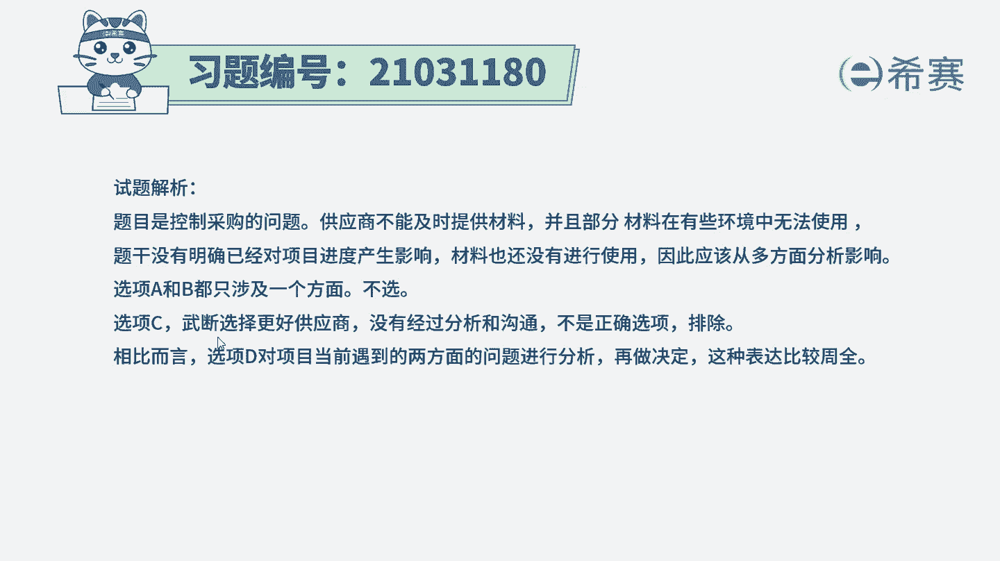

# 24年PMP模拟题-PMP付费模拟题100道免费视频新手教程-从零开始刷题 - P39：39 - 冬x溪 - BV1Fs4y137Ya

建造工程师告诉项目经理，一周前应该送达的工程材料，本周才送达，而且项目经理发现，部分材料在有些环境中无法使用，项目经理应该怎么做，更新质量管理计划b，更新项目进度计划，c更换一家供应商，d执行风险分析。

读完题目，回到题干，我们来看一下这道题目，它的关键词是什么，一周前就应该送达的工程材料，本周才送达，部分的材料还没有办法使用，应该怎么办，现在材料它是延迟送达部分还不能够使用，题干当中他没有指明这些。

他对项目造成了什么影响，那首先就要分析这种情况，他会对项目造成一个什么样的影响，它会不会影响到项目的进度和质量，然后再去考虑解决措施，所以这道题正确选项应该是d选项，执行风险分析。

先执行一个全面的风险风险，再去确定下一步的一个行动措施，我们再看一下三个选项，a选项更新质量管理计划，更新质量管理计划，它只能够针对部分的材料，没有办法使用的这个问题。

但是他没有响应材料延期送达的这个问题，它不够全面，所以我们步入d选项，再看到b选项，更新项目进度计划，它其实是跟a选项这两个是类似的一个选项，他也只能够解决材料延期的这个问题。

他没有解决到无法使用的这个问题，他们两个都是一个互补的一个情况，也不够全面，再看c选项，更换一家供应商，更换供应商应该双方进行沟通之后，然后综合分析多方面评估之后，才得出来一个方案。

而不是直接武断的进行更换，所以c选项也不合适，那这道题最佳选项就是d选项。

执行风险分析，这是这道题的文字解析，有需要的同学可以暂停看一下。

